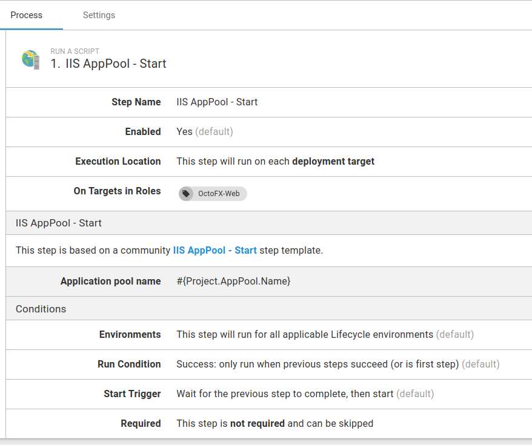
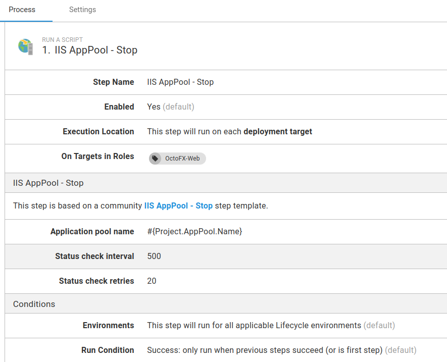
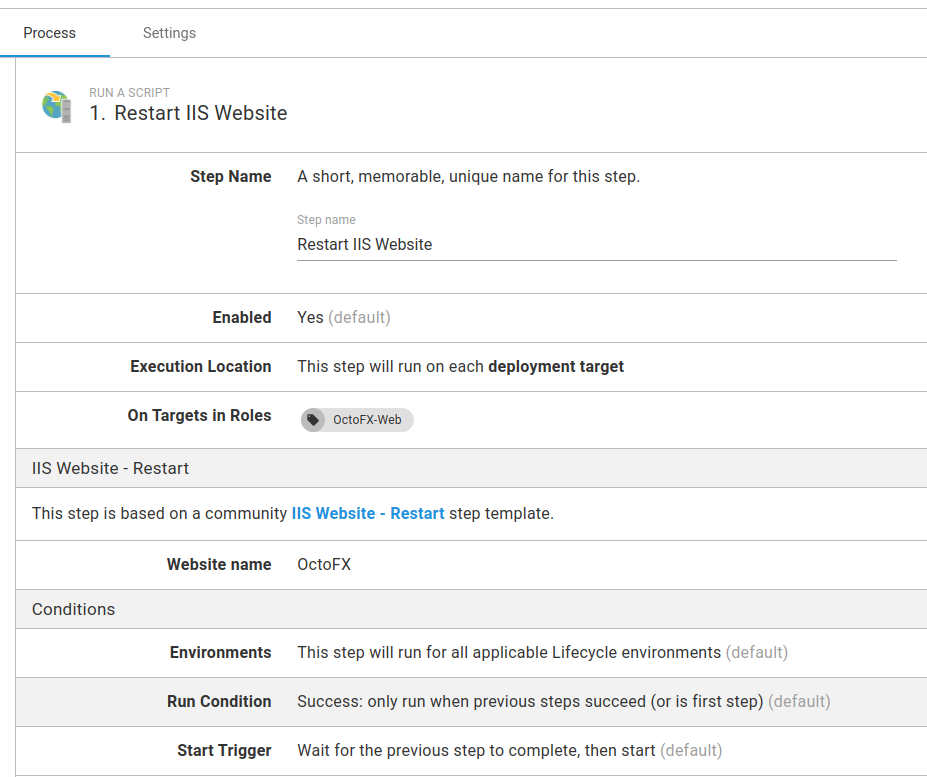
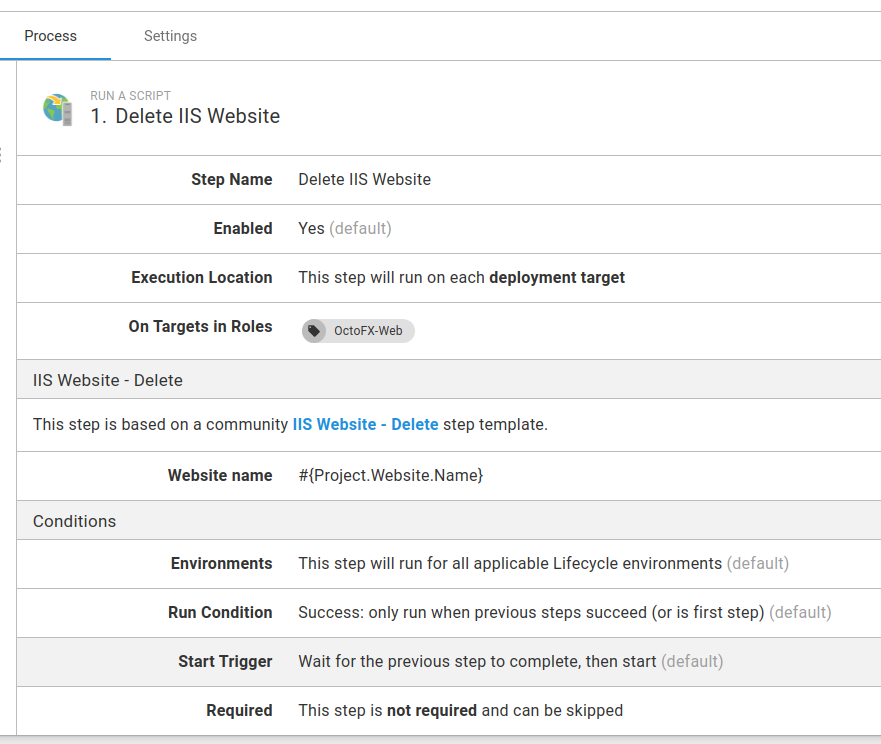

Managing [IIS](https://docs.microsoft.com/en-us/iis/get-started/introduction-to-iis/iis-web-server-overview) can often be challenging in an environment where you have a large estate of machines, and with a requirement to carefully control who can access those machines.

With Operation Runbooks, you can create a runbook as part of a routine operations task to manage your IIS websites deployed on  [deployment targets](/docs/octopus-concepts/deployment-targets.md), without ever needing someone to log in.

There are different types of maintenance you can perform on an IIS website. The next few sections outline how to achieve some of the more common tasks you can perform with a runbook using step templates from our [community library](/docs/deployment-process/steps/community-step-templates.md):

- Starting an Application Pool, using the step template: [IIS AppPool - Start](https://library.octopus.com/step-templates/9db77671-0fe3-4aef-a014-551bf1e5e7ab/actiontemplate-iis-apppool-start).
- Stopping an Application Pool, using the step template: [IIS AppPool - Stop](https://library.octopus.com/step-templates/3aaf34a5-90eb-4ea1-95db-15ec93c1e54d/actiontemplate-iis-apppool-stop).
- Restarting a Website, using the step template: [IIS Website - Restart](https://library.octopus.com/step-templates/6a17bd83-ef96-4c22-b212-91a89ca92fe6/actiontemplate-iis-website-restart).
- Deleting a Website, using the step template: [IIS Website - Delete](https://library.octopus.com/step-templates/a032159b-0742-4982-95f4-59877a31fba3/actiontemplate-iis-website-delete).

## Creating the runbook

To create a runbook to manage your IIS websites:

1. From your project's overview page, navigate to {{Operations, Runbooks}}, and click **ADD RUNBOOK**.
1. Give the runbook a Name and click **SAVE**.

Next, follow the instructions below according to the IIS maintenance task you wish to perform.

## Start App-Pool

In this example, you will be starting an IIS [Application Pool](https://docs.microsoft.com/en-us/iis/configuration/system.applicationhost/applicationpools/) using a step template from our [community library](/docs/deployment-process/steps/community-step-templates.md) called [IIS AppPool - Start](https://library.octopus.com/step-templates/9db77671-0fe3-4aef-a014-551bf1e5e7ab/actiontemplate-iis-apppool-start). 

To add this step to a runbook:

1. Add the community step template called **IIS AppPool - Start**, and give the step a name.
1. Choose the *Execution Location* on which to run this step.
1. Fill out the only required parameter: **Application Pool name**. 

:::hint
It's recommended to use [variables](/docs/projects/variables/index.md) where appropriate, rather than entering values directly in the step parameters.
:::

Optionally configure any [conditions](/docs/deployment-process/conditions/index.md) for the step, click **Save**, and you have a runbook step to start an IIS Application Pool.

## Stop App-Pool

In this example, you will be stopping an IIS [Application Pool](https://docs.microsoft.com/en-us/iis/configuration/system.applicationhost/applicationpools/) using a step template from our [community library](/docs/deployment-process/steps/community-step-templates.md) called [IIS AppPool - Stop](https://library.octopus.com/step-templates/3aaf34a5-90eb-4ea1-95db-15ec93c1e54d/actiontemplate-iis-apppool-stop). 

To add this step to a runbook:

1. Add the community step template called **IIS AppPool - Stop**, and give the step a name.
1. Choose the *Execution Location* on which to run this step.
1. Fill out all of the required parameters in the step, using [variables](/docs/projects/variables/index.md) where appropriate:

| Parameter  | Description | Example |
| ------------- | ------------- | ------------- |
| Application Pool Name | The name of the application pool in IIS. | AppPool-01 |
| Status check interval | The delay in milliseconds, between each attempt to query the application pool to see if has stopped. | 500 |
| Status check retries | The number of retries before an error is thrown. | 10 |

Configure any other settings for the step and click **Save**, and you have a runbook step to stop an IIS Application Pool.

## Restart website

In this example, you will be restarting an IIS Website using a step template from our [community library](/docs/deployment-process/steps/community-step-templates.md) called [IIS Website - Restart](https://library.octopus.com/step-templates/6a17bd83-ef96-4c22-b212-91a89ca92fe6/actiontemplate-iis-website-restart). 

To add this step to a runbook:

1. Add the community step template called **IIS Website - Restart**, and give the step a name.
1. Choose the *Execution Location* on which to run this step.
1. Fill out the only required parameter: **Website name**, using a variable if appropriate.

Configure any other settings for the step and click **Save**, and you have a runbook step to restart an IIS website.

## Delete website

In this example, you will be deleting an IIS Website using a step template from our [community library](/docs/deployment-process/steps/community-step-templates.md) called [IIS Website - Delete](https://library.octopus.com/step-templates/a032159b-0742-4982-95f4-59877a31fba3/actiontemplate-iis-website-delete). 

To add this step to a runbook:

1. Add the community step template called **IIS Website - Delete**, and give the step a name.
1. Choose the *Execution Location* on which to run this step.
1. Fill out the only required parameter: **Website name**, using a variable if appropriate.

Configure any other settings for the step and click **Save**, and you have a runbook step to delete an IIS website.

## Optional Approvals

You can also include additional steps to your runbook to include another layer of protection, such as a [manual intervention](/docs/deployment-process/steps/manual-intervention-and-approvals.md) step for business approvals. 

## Samples

We have a [Target - Windows](https://g.octopushq.com/TargetWindowsSamplesSpace) Space on our Samples instance of Octopus. You can sign in as `Guest` to take a look at these examples and more Runbooks in the `OctoFX` project.

## Learn more

- Generate an Octopus guide for [IIS and the rest of your CI/CD pipeline](https://octopus.com/docs/guides?destination=IIS).
- [PowerShell and IIS: 20 practical examples blog post](https://octopus.com/blog/iis-powershell).
