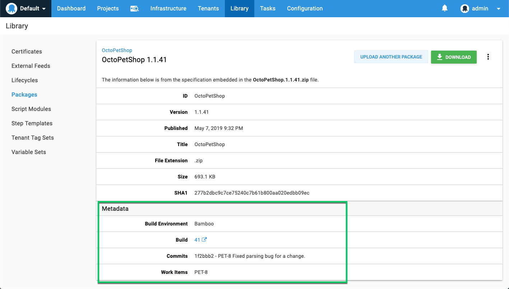

It is often useful to have information flow from your build server, and be associated with packages, releases, and deployments in Octopus.  
The build information is associated with a package, and includes:

- Build URL: A link to the build which produced the package  
- Commits: Details of the source commits related to the build 
- Issues: Issue references parsed from the commit messages 

## Passing Build Information to Octopus

Build information is passed to Octopus as a file, using a custom format.  The recommended way to supply the build information is to add the _Build Information_ step from the Octopus Deploy plugin to your build server. 

:::hint
**Build Server support**
The Build Information step is currently available in the official Octopus [TeamCity](/docs/packaging-applications/build-servers/teamcity.md) and [Bamboo](/docs/packaging-applications/build-servers/bamboo.md) plugins. Support for other build servers is coming soon. 

Check our [downloads page](https://octopus.com/downloads) for our latest build server plugins.
:::

The TeamCity version of the _Build Information_ step is shown below.


## Viewing Build Information

The build information for a package can be viewed on any release which contains the package.


For packages pushed to the Octopus built-in repository, the build information can also be viewed on the package version details in {{Library, Packages}} 



## Using Build Information in Release Notes

The build information associated with packages is available to be used in [release notes](/docs/deployment-process/releases/release-notes.md) (and [release notes templates](/docs/deployment-process/releases/release-notes.md#Release-Notes-Templates)) as Octopus variables.

The packages in a release are available as a collection which can be [iterated over](/docs/deployment-process/variables/variable-substitutions.md#VariableSubstitutionSyntax-Repetition).  e.g.

### Packages

```
#{each package in Octopus.Release.Package}
    This release contains #{package.PackageId} #{package.Version}
#{/each}
```

A particular package can be selected by indexing on the package ID:
 
```
#{Octopus.Release.Package[Acme.Web].Version}
```

The variables available for packages are:

| Name | Example|
| -------------------- | -------|
|`PackageId`| `#{package.PackageId}` | 
|`Version`| `#{package.Version}` | 
|`Commits`| This is a collection.  See below. | 
|`WorkItems`| This is a collection.  See below. | 

### Commits

On each package, the commits associated with that package are available as a collection which can be iterated over. e.g.:

```
#{each package in Octopus.Release.Package}
    #{each commit in package.Commits}
        - [#{commit.CommitId}](#{commit.LinkUrl}) - #{commit.Comment}
    #{/each}
#{/each}
```

A particular commit can be selected by indexing on the commit ID (when using git the commit ID is the commit hash):

```
package.Commits[685afd4161d085e6e5f56a66e72e2298e402b114].Comment
```

The variables available for commits are:

| Name | Example|
| -------------------- | -------|
|`CommitId`| `#{commit.CommitId}` | 
|`LinkUrl`| `#{commit.LinkUrl}` | 
|`Comment`| `#{commit.Comment}` | 

### Issues / Work items

If the Octopus instance has one or more of the Issue Tracker integrations enabled, the commit messages will be parsed for issues. Any issues found will be displayed with the build information, and also available as variables:

```
#{each issue in package.WorkItems}
    - [#{issue.Id}](#{issue.LinkUrl})
#{/each}
```

A particular issue can be selected by indexing on the ID:

```
package.WorkItems[4465].LinkUrl
```

The variables available for issues are:

| Name | Example|
| -------------------- | -------|
|`Id`| `#{issue.Id}` | 
|`LinkUrl`| `#{issue.LinkUrl}` | 

There is also a distinct list of issues across all packages available in:  

```
#{each workItem in Octopus.Release.WorkItems}
- [#{workItem.Id}](#{workItem.LinkUrl}) - #{workItem.Description}
#{/each}
```

## Using Build Information in Deployments

TODO