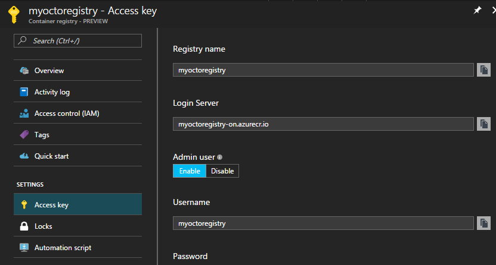

## Azure container services

Microsoft Azure provides a v2 image registry available through the [Azure Container Registry](https://azure.microsoft.com/en-au/services/container-registry/) offering which currently in preview.

## Setting up a registry

Select **Azure Container Registry** from the Azure marketplace and select **create** to create a new registry.

Provide the unique registry name that all your repositories (packages) will be stored in.

Make sure you select **Enable** under the **Admin user** option. This is what will expose the credentials that are needed by Octopus to connect to the API.

Once the service has been provisioned, go to the Container Registry details and load the **Access Key** blade. The login server indicates the HTTPS url that needs to be supplied into the Octopus Registry feed. In the case above this will be `https:\\myoctoregistry-on.azurecr.io`.
With the Admin user toggle enabled, you will be provided with username and password credentials that should be copied into your Octopus Deploy feed. The password can be regenerated at any time so long as you keep your Octopus instance updated with the new credentials.

Save and test your registry to ensure that the connection is authorized successfully.
