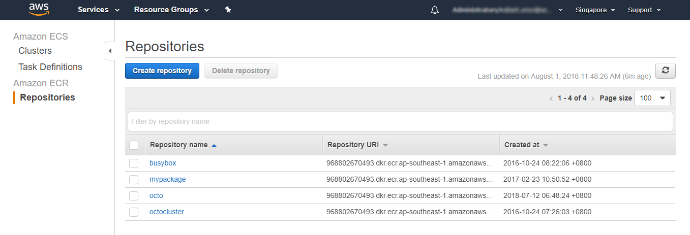
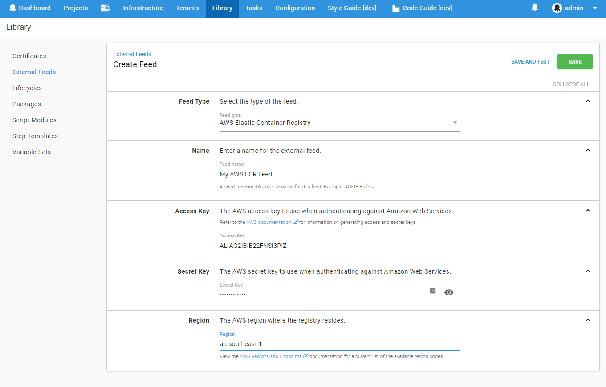

## Amazon - EC2 Container Service

AWS provides a v2 Docker Image registry and is available through their [EC2 Container Service](https://aws.amazon.com/ecs/) offering. From **Octopus 2018.8.0**, support for EC2 Container registries is provided as a special feed type itself.

### Setting up an AWS Elastic Container Registry
From the AWS Services dashboard go to `EC2 Container Service`.

 

Under the `Repositories` area you need to create a repository to match the what in Octopus-speak would be the PackageId. This should map to your distinct application image. If you attempt to push an image during your build process to this registry without first creating the corresponding repository you will receive an error.



With the repository configured, ensure that you also have an [AWS IAM](https://aws.amazon.com/iam/) user available that has at a minimum the permissions `ecr:GetAuthorizationToken`, `ecr:DescribeRepositories`, `ecr:DescribeImages` and `ecr:ListImages`. This user is the account which Octopus will use to retrieve the docker login token which is then used to perform the appropriate docker commands.

Further links for getting your AWS registry set up are available in their [online docs](http://docs.aws.amazon.com/AmazonECR/latest/userguide/what-is-ecr.html)

### Adding AWS ECR Feed to Octopus
 Create a new Octopus Feed and select the `AWS Elastic Container Registry` Feed type. With this selected will need to provide the credentials configured above, as well as the region at which the registry was created. In AWS you are able to maintain separate repositories in each region.



Save and test your registry to ensure that the connection is authorized successfully.

### Previous version of Octopus Deploy
The first class AWS ECR feed type was provided in **Octopus 2018.8.0** to handle the ephemeral authorization credentials provided by AWS that [only last 12 hours](http://docs.aws.amazon.com/AmazonECR/latest/userguide/Registries.html). If you are using an earlier version of Octopus Deploy, you will need to use a standard Docker Feed type.

After configuring your registry in AWS as outlined above you will need to obtain the Docker Feed credentials by manually invoking a command via the AWS cli. Details for setting this up can be found in the [AWS installation guides](http://docs.aws.amazon.com/cli/latest/userguide/installing.html). With the cli installed, run (with the appropriate region)
```
aws ecr get-login --region ap-southeast-1
```
and it will return the credentials you will need to authenticate your Docker Engine client with the AWS registry. e.g.
```
docker login -u AWS -p AQECAHid...j/nByScM -e none https://96802670493.dkr.ecr.ap-southeast-1.amazonaws.com
```

These are also the credentials that are needed by Octopus Deploy to access the exposed API (which are passed to your Docker Engine at deploy time). Take the username, password and url provided in this command and add them to Octopus Deploy in your Docker feed configuration.


Note that this approach means that you will more than likely need to reset these credentials often.
