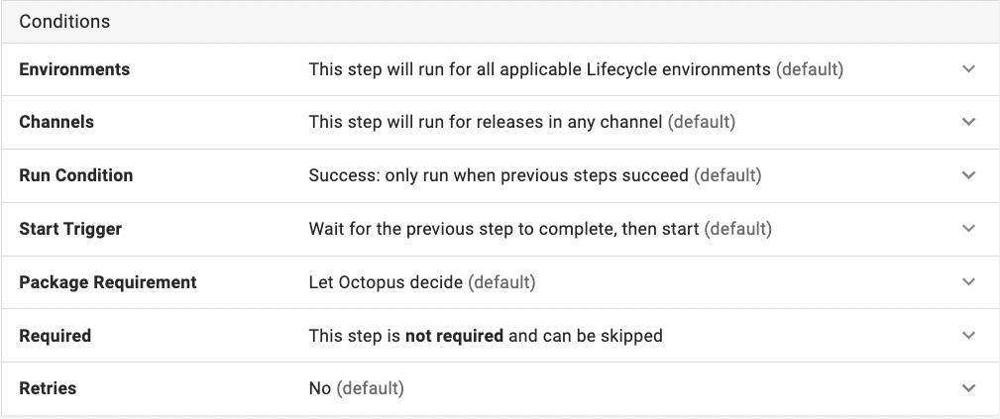

For each [step](/docs/deployment-process/steps/index.md) that you define in your [deployment processes](/docs/deployment-process/index.md), you can set conditions for greater control over the step's execution. You can set conditions to:

- Run the step on specific environments or skip specific environments.
- Specify which channels the step should run on.
- Limit when the step runs based on the status of a previous step.
- Run steps in parallel with a previous step.
- Specify whether the step runs before or after package acquisition.
- Make the step a required step that cannot be skipped.



Some of these options will only appear if they're available. For instance, the [channels](/docs/releases/channels/index.md) option is only visible if you have created one or more channels.

## Environments

You can choose which [environments](/docs/infrastructure/environments/index.md) steps apply to:

- Run for all applicable [lifecycle](/docs/releases/lifecycles/index.md) environments (default).
- Run only for specific environments.
- Skip specific environments.

By default, steps will run on all environments specified in the lifecycle for the project, but you can choose environments to run on or skip.

## Channels

If you have created one or more [channels](/docs/releases/channels/index.md), you can specify whether a step runs only when deploying a release through specific channels (e.g., a Script step that only runs for deployments through certain channels to configure extra telemetry).

## Run condition

Run condition lets you specify that a step should run:

- Only if the previous step succeeded.
- Only if the previous step failed.
- Always run.
- When a variable expression evaluates to true.

### Variable expressions

You can use the following expression to run a step only when the deployment is successful and when a variable evaluates to true:

```
#{unless Octopus.Deployment.Error}#{Variable}#{/unless}
```

You can achieve the opposite effect by swapping `unless` with `if`:

```
#{if Octopus.Deployment.Error}#{Variable}#{/if}
```

It's also possible to check the status of specific [steps and actions](/docs/projects/variables/system-variables.md#Systemvariables-DeploymentStatusTrackingdeploymentstatus).

### Machine-level variable expressions

You can use a step's machine-level output variables to achieve machine-level variable expressions.

For example, assuming you're setting an output variable in a script step (Step01) that runs on several machines (Web01 and Web02) as follows:

```
# Step01
$machineToSucceed = "Web01"
$shouldCurrentMachineSucceed = $OctopusParameters["Octopus.Machine.Name"] -eq $machineToSucceed
Set-OctopusVariable -name "ShouldRun" -value "$shouldCurrentMachineSucceed"
```

That can be used in a variable expression on a subsequent step:

```
#{if Octopus.Action[Step01].Output[Web01].ShouldRun == "True"}True#{/if}
```

The currently-running machine could be substituted in this expression:

```
#{if Octopus.Action[Step01].Output[#{Octopus.Machine.Name}].ShouldRun == "True"}True#{/if}
```

This will evaluate to `True` on Web01 and `False` on Web02.

Machine-level variable expressions are also supported in [rolling deployments](/docs/deployments/patterns/rolling-deployments.md) using child steps.

## Start trigger

If you have more than one step in your deployment process, the Start Trigger option lets you choose between:

- Running steps in parallel.
- Wait for the previous step to complete, then start.

When you review a process with two steps that run in parallel, you'll notice two arrows linking the steps that run in parallel.

### Maximum parallelism

To help your Octopus Server remain stable, we have defaulted the maximum number of steps you can run concurrently in any given deployment to `10`. You can configure any number of steps to run in parallel, and Octopus will roll through them as quickly as possible, but it will only run `10` of them at any one time by default.

#### Overriding maximum parallelism

If you really want to change this behavior, you can! Set the `Octopus.Action.MaxParallelism` variable at the project-level to change how many steps will execute in parallel. This variable value controls:

1. The maximum number of steps which will execute at the same time during your deployment.
2. The maximum number of deployment targets any step will be executed across at the same time.

This acts like a window, where Octopus will roll through your parallel steps, and parallel deployment targets, up to `Octopus.Action.MaxParallelism` at any one time.

### Steps in parallel on the same deployment target

For safety reasons, by default, Octopus runs only one step at the same time on a single deployment target. If you want to run multiple steps on a deployment target in parallel, [you'll need to enable that behavior](/docs/administration/managing-infrastructure/run-multiple-processes-on-a-tentacle-simultaneously.md).

### Steps which depend on each other

Watch out not to run steps that depend on each other in parallel. If **Step2** depends on the success of **Step1**, it might not be the best idea to run them in parallel, but one after the other only if **Step1** was successful.

### Other ways to improve deployment time

We have written a comprehensive guide on [deployment performance](/docs/deployment-process/performance.md) which covers many other aspects which affect your deployment time in addition to running steps in parallel.

## Package requirement

The package requirement condition allows you to specify when package acquisition should occur. By default, a deployment will acquire packages immediately before the first step that uses a packages. This option can be used to explicitly indicate if a step should run before or after package acquisition.

There are three options to choose from:

- Let Octopus Decide (default): Packages may be acquired before or after this step runs. Octopus will determine the best time.
- After package acquisition: Packages will be acquired before this step runs.
- Before package acquisition: Packages will be acquired after this step runs.

This option is hidden when it does not make sense, for example, when a script step is configured to run after a package step (packages must be acquired by this point).

## Required

By default, deployment steps can be skipped when creating a deployment. Marking a step as Required prevents the step from being skipped.
