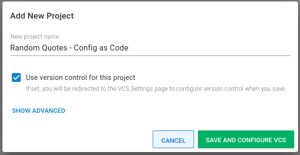

Version-control is configured per project and is accessed via the **{{ Settings, Version Control }}** link in the project navigation menu. This page will walk through how to configure a project to be version-controlled.

## Enable the Configuration as Code feature.

First, you will need to ensure the Configuration as Code feature is enabled in Octopus. You can access this feature under **{{ Configuration, Features, Configuration as Code }}**.

## Creating a new version-controlled project

To get a feel for the config-as-code feature, you may want to create a new project that you can test with before committing to permanently converting an existing project. This project's deployment process will be stored in a git repository when configured.

Click the **New Project** button and select **Use version control for this project.**

Once you click the save button, you'll be sent to the version control screen to configure your version control settings. Enter the URL for your git repository, the name of the default branch, your username and password / personal access token. 

Learn more about [git credentials in Octopus Deploy](/docs/projects/version-control/config-as-code-reference.md).

Next, add the directory you would like Octopus to store the deployment process. You can have multiple deployment processes in the same repository if they all use a different sub-directory. E.g. `.octopus/acme`

## Configuring an existing project to be version-controlled

:::warning
Converting a project to use version control is a one-way change. No project that has converted to version control can be converted back. Please make sure you want to do this and perhaps clone your project to test how it works so you know what to expect before converting important projects.
:::

With the release of config-as-code, you can perform a one-way conversion of existing projects to leverage version control. 

Select the project you would like to convert and click {{Version Control}} under the **Settings** section in the project navigation menu. 
Enter the connection information for your Git repository. You need to provide the URL for your git repository, the name of the default branch, username and password / personal access token (or Anonymous for an open repository) 
Provide the directory you would like Octopus to store the deployment process.

Learn more about [git credentials in Octopus Deploy](/docs/projects/version-control/config-as-code-reference.md).

:::hint
You can have multiple deployment processes in the same repository if they all use a different sub-directory.
:::

Once you press the **Configure** button, a modal window will appear to confirm this change and give you the option to provide a summary and description for the first commit or cancel the conversion.

Your project is now configured with Version Control. You can see this change reflected on the Process page, where you can change branches. You can also confirm this in your Git repository. The `.octopus` directory will not be created, and it should contain your _deployment_process.ocl_, _deployment_settings.ocl_, and _schema_version.ocl_ files. 

## Not everything is saved to version control

The Configuration as Code feature is per-project. Currently, only the deployment process and settings are saved to version control. Eventually, it will include variables and runbooks. 

Even after variables and runbooks are added, a number of project-level and instance-level settings will not be stored in version control.

Learn more about [what is stored in version control](/docs/projects/version-control/config-as-code-reference.md).

## Using a project with version control enabled

In general, modifying a project via the Octopus UI with version control enabled is the same as modifying a project configured to save changes to SQL Server. There are some minor differences.

Learn more about [Editing a project with version control enabled](/docs/projects/version-control/editing-a-project-with-version-control-enabled.md).
