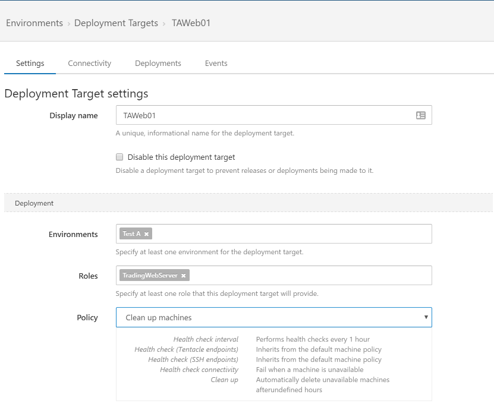
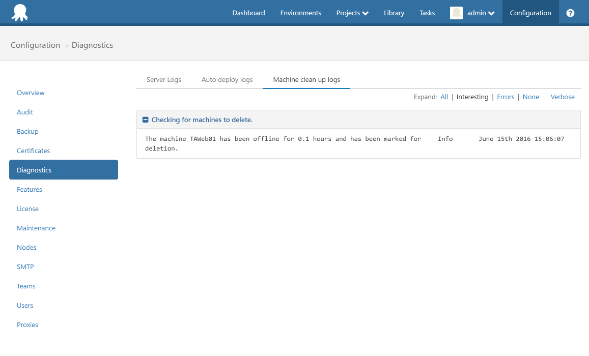

:::hint
The features discussed in this guide are available in Octopus 3.4 and newer.
:::

Octopus can automatically remove unwanted machines from environments based on their health status.  This is useful when an environment is scaled down and orphaned deployment targets remain in Octopus.  Automatic environment clean up can be configured through machine policies.

## Machine policies {#Cleaningupenvironments-Machinepolicies}

!partial <menu>

In this example we will create a machine policy to automatically delete machines when they become unavailable.

## Creating a machine policy for environment cleanup {#Cleaningupenvironments-Creatingamachinepolicyforenvironmentcleanup}

1. Navigate to the *Machine policies* screen
2. Create a new machine policy by selecting **Add machine policy**:

3. Name the machine policy "Clean up machines"
4. Change the setting "Clean up unavailable machines" to "Automatically delete unavailable machines".  By selecting this option and setting the time to 0, any machines that fail a health check and become unavailable will be deleted:

5. Save the machine policy

6. Assign the machine policy to a machine by selecting a machine and using the *Policy* drop down to select the machine policy:

7. Turn the machine off and run a health check.

In Octopus versions prior to 4.2 a separate scheduled task ran periodically and removed machines from Octopus.  As of Octopus version 4.2, machine deletion happens as part of health checks.

:::hint
Read more about [machine policies](/docs/infrastructure/environments/machine-policies.md)
:::

## Troubleshooting automatic environment clean up {#Cleaningupenvironments-Troubleshootingautomaticenvironmentcleanup}

!partial <troubleshoot>

