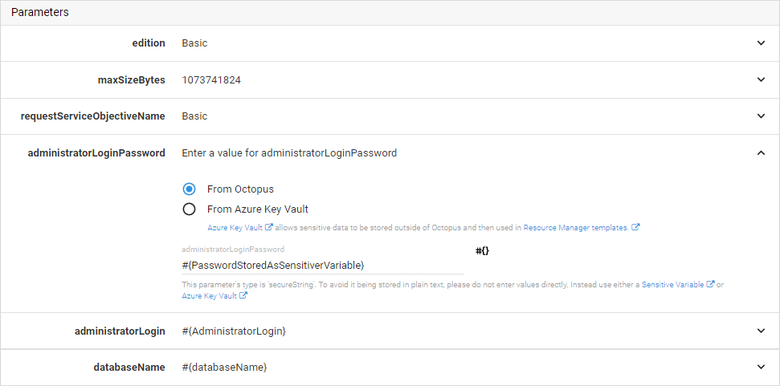
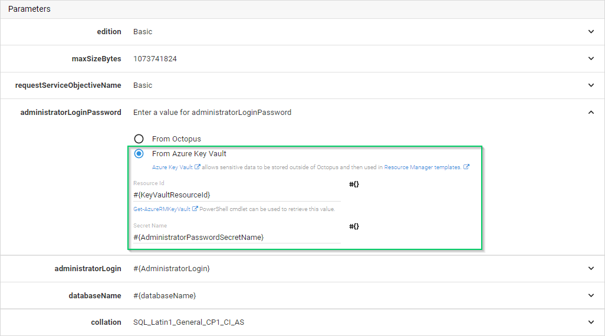

Azure Resource Manager (ARM) support was introduced in **Octopus 3.3**.

Azure Key Vault support was introduced in **Octopus 3.3.25**.

From [Authoring Azure Resource Manager Templates](https://azure.microsoft.com/en-us/documentation/articles/resource-group-authoring-templates/):

> Azure applications typically require a combination of resources (such as a database server, database, or website) to meet the desired goals. Rather than deploying and managing each resource separately, you can create an Azure Resource Manager template that deploys and provisions all of the resources for your application in a single, coordinated operation.

Octopus Deploy supports deploying Azure Resource Manager (ARM) templates via the *Deploy an Azure Resource Manager template* step type. For information about adding a step to the deployment process, see the [add step](/docs/deployment-process/steps/index.md) section. The instructions there apply equally to a runbook process too.

:::hint
Before creating the step, you must have created an [Azure Service Principal Account](/docs/infrastructure/deployment-targets/azure/index.md#azure-service-principal)
:::


## Creating the Resource Group step {#DeployusinganAzureResourceGroupTemplate-CreatingtheResourceGroupStep}


Select the **Account** and **Resource Group** to be used.

:::hint
Only Azure *Service Principal* accounts will be available for selection. Management Certificate accounts can not be used with Azure Resource Manager.
:::

The **Deployment Mode** may be either [Incremental or Complete](https://azure.microsoft.com/en-in/documentation/articles/resource-group-template-deploy/#incremental-and-complete-deployments).

The **Template Source** can be either JSON entered directly into the step, or a file contained in a package.

### Template entered as JSON  {#DeployusinganAzureResourceGroupTemplate-TemplateEnteredasJSON}

By selecting *Source Code* as the *Template Source*, you can enter your template directly as JSON.

The JSON will be parsed, and your parameters will appear dynamically as fields in the *Parameters* section.

The parameter fields will show text boxes or select-lists as appropriate.  You can enter values directly, or bind the parameters to Octopus Variables (e.g. see the *siteName* parameter in the image above).

:::success
Octopus will perform [variable-substitution](/docs/projects/variables/variable-substitutions.md) on the JSON template.

Although you can use variables directly in the template, it is more idiomatic to use parameters, and plug the variables into those (as seen above). This will allow you to use or test your template outside of Octopus Deploy.
:::



### Sensitive data {#DeployusinganAzureResourceGroupTemplate-SensitiveData}

:::warning
Parameters marked as [secure strings](https://azure.microsoft.com/en-us/documentation/articles/resource-group-authoring-templates/) represent sensitive data and it is important to make sure they aren't stored in plain text form.
:::

The field displayed when "From Octopus" option is selected stores data as plain text so sensitive data shouldn't be typed directly into it.  Instead, the value of the parameter should be provided either via a [Sensitive Variable](/docs/projects/variables/sensitive-variables.md) if the value is stored in Octopus or via [Azure Key Vault](https://azure.microsoft.com/en-us/documentation/articles/resource-manager-keyvault-parameter/) if the value is stored outside of Octopus. Azure Resource Group Templates provide [out of the box integration with Azure Key Vault](https://azure.microsoft.com/en-us/documentation/articles/resource-manager-keyvault-parameter/).



### Template contained in a package {#DeployusinganAzureResourceGroupTemplate-TemplateContainedinaPackage}

By selecting *File inside a Package* as the *Template Source*, you can select a package which will contain your template and parameter JSON files.


The Template Path and Parameters Path fields should contain the relative path to these files within the package.

:::success
Octopus will perform [variable-substitution](/docs/projects/variables/variable-substitutions.md) on both the Template and Parameter files.
:::

#### Parameter file format {#DeployusinganAzureResourceGroupTemplate-ParameterFileFormat}

The Parameter JSON file can be in one of two formats:

- With Schema
- Without Schema

**Example with Schema**

```json
{
    "$schema": "http://schema.management.azure.com/schemas/2015-01-01/deploymentTemplate.json",
    "contentVersion": "1.0.0.0",
    "parameters": {
        "collation": {
            "value": "SQL_Latin1_General_CP1_CI_AS"
        },
        "administratorLoginPassword": {
            "value": "#{PasswordStoredAsSensitiveVariableInOctopus}"
        },
        "administratorLogin": {
            "value": "#{Login}"
        },
        "databaseName": {
            "value": "#{DatabaseName}"
        },
        "anotherSecretStoredInAzureKeyVault": {
            "reference": {
                "keyVault": {
                    "id": "#{KeyVaultResourceId}"
                },
                "secretName": "SecretName"
            }
        }
    }
}
```

**Example without Schema**

```json
{
    "collation": {
        "value": "SQL_Latin1_General_CP1_CI_AS"
    },
    "administratorLoginPassword": {
        "value": "#{PasswordStoredAsSensitiveVariable}"
    },
    "administratorLogin": {
        "value": "admin"
    },
    "databaseName": {
        "value": "#{DatabaseName}"
    },
    "anotherSecretStoredInAzureKeyVault": {
        "reference": {
            "keyVault": {
                "id": "#{KeyVaultResourceId}"
            },
            "secretName": "SecretName"
        }
    }
}

```

### Accessing ARM template output parameters {#DeployusinganAzureResourceGroupTemplate-AccessingARMtemplateoutputparameters}

Any [outputs](https://azure.microsoft.com/en-us/documentation/articles/resource-group-authoring-templates/#outputs) from the ARM template step are made available as [Octopus output-variables](/docs/projects/variables/output-variables.md) automatically. For example, an output `Foo` would be available as:

```powershell
Octopus.Action[Arm Template Step Name].Output.AzureRmOutputs[Foo]
```
Note, you need to replace **Arm Template Step Name** with the name of your ARM step template. 

### Using linked templates {#DeployusinganAzureResourceGroupTemplate-Usinglinkedtemplates}

Azure Resource Manager supports the concept of [linking templates](https://docs.microsoft.com/en-us/azure/azure-resource-manager/resource-group-linked-templates). In this model you create a "master" template which links to other templates and parameters files via URI. This can be a really useful way to break your ARM templates into manageable components. In this case you would configure Octopus to deploy your "master" template, and the Azure Resource Manager will download any linked templates and parameters files as required to complete the deployment.

:::hint
**Linked templates must be publicly accessible via URI**
Please be aware that the URI you configure for the linked templates and parameters files must be publicly accessible by the Azure Resource Manager. For example: [https://www.contoso.com/AzureTemplates/newStorageAccount.json.](https://www.contoso.com/AzureTemplates/newStorageAccount.json.)

Learn more about [linked templates](https://docs.microsoft.com/en-us/azure/azure-resource-manager/resource-group-linked-templates) and refer to [this discussion](http://help.octopus.com/discussions/questions/7652-azure-resource-management-templates) for more details.
:::

## Learn more

- Generate an Octopus guide for [Azure and the rest of your CI/CD pipeline](https://octopus.com/docs/guides?destination=Azure%20websites).

