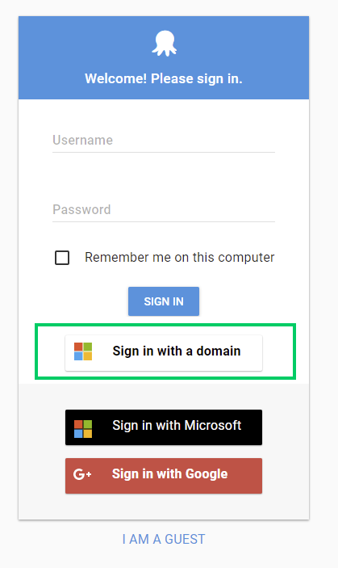
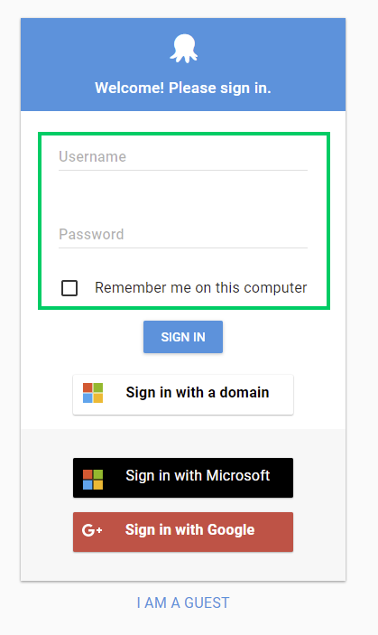
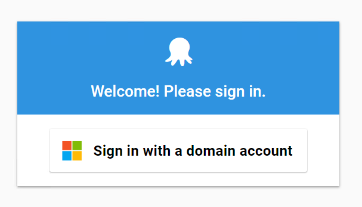

Octopus Deploy can authenticate users using Windows credentials. Windows AD authentication can be chosen during installation of the Octopus Server, or later through the configuration.

:::hint
**Domain user required during setup**
When setting AD Authentication, either via the Octopus setup wizard or running the commands outlined below to switch to AD authentication mode, make sure you are signed in to Windows as a domain user. If you are signed in as a local user account on the machine (a non-domain user) you won't be able to query Active Directory, so setup will fail.
:::

## Active Directory Sign-In options {#ActiveDirectoryauthentication-ActiveDirectorysigninoptions}
If you are using Active Directory Authentication with Octopus, there are two ways to sign in.

1. Integrated authentication
2. Forms-based

## Authentication Schemes
By default, Active Directory Authentication will use NTLM as the Authentication Scheme. In many circumstances, you can also configure Octopus to use Kerberos for authentication. 

## Integrated authentication {#ActiveDirectoryauthentication-Integratedauthentication}
The easiest way to sign in when using Active Directory is to use Integrated Authentication. 
This allows a one-click option to *Sign in with a domain account* as pictured below.



This will instruct the Octopus Server to issue a browser challenge. NTLM Authentication doesn't require much configuration except for allowing NTLM to be used in your network. This is on by default.


**Changing authentication schemes - Command Line** {#ActiveDirectoryAuthentication-AuthenticationSchemeChange}

```bash
Octopus.Server.exe configure --webAuthenticationScheme=IntegratedWindowsAuthentication
```


Setting `IntegratedWindowsAuthentication` will mean that Octopus will attempt to [use Kerberos Authentication](#ActiveDirectoryAuthentication-UsingNegotiate) instead. [Read about other supported values](https://msdn.microsoft.com/en-us/library/system.net.authenticationschemes(v=vs.110).aspx).

:::hint
**How it works**
Octopus is built on top of HTTP.sys, the same kernel driver that IIS is built on top of. You may be familiar with "Integrated Windows Authentication" in IIS; this is actually provided by HTTP.sys. This means that Octopus supports the same challenge-based sign-in mechanisms that IIS supports, including Integrated Windows Authentication.

When the link is clicked, it redirects to a page which is configured to tell HTTP.sys to issue the browser challenge. The browser and HTTP.sys negotiate the authentication just like an IIS website would. The user principal is then passed to Octopus. Octopus will then query Active Directory for other information about the user.
:::


### Kerberos vs NTLM security for AD Authentication {#ActiveDirectoryAuthentication-NTLMvKerberos}

It is possible to use explicitly select either `NTLM`, `Negotiate` or `IntegratedWindowsAuthentication` authentication for Active Directory authentication. Using `Negotiate` or `IntegratedWindowsAuthentication` will use Kerberos authentication. In some cases this may result in `NTLM` connections based on the nature of the connecting client.

This table describes the options you can choose in Octopus, and the protocols that may be used to authenticate your users as a result.

|     Octopus Option              |    Protocols Used     |
|---------------------------------|-----------------------|
| NTLM                            |         NTLM          |
| Negotiate                       |      Kerberos, NTLM   |
| IntegratedWindowsAuthentication |      Kerberos, NTLM   |

Without some additional configuration, AD authentication, whether forms-based or integrated, will usually fail to negotiate the use of `kerberos` authentication and instead choose `NTLM`.

### Supported Setups for Active Directory Authentication {#ActiveDirectoryAuthentication-SupportedAuthentication}

Octopus Deploy supports various options for Active Directory Authentication.

:::hint
Not all high availability and Active Directory configurations are supported. There are limitations on the use of Kerberos in high availability scenarios. This is due to a requirement to [use a machine level SPN in order to allow Kerberos to work](#ActiveDirectoryAuthentication-ConfiguringKerberos) with our web server.
:::

|     Octopus Option              | Single Octopus Server | High-Availability |
|---------------------------------|-----------------------|-------------------|
| NTLM                            |         Yes           |       Yes         |
| Negotiate                       |         Yes           |       No          |
| IntegratedWindowsAuthentication |         Yes           |       No          |

:::hint
 **Service Accounts and Kerberos**
From Octopus version 2020.1.0 and above, an upgrade to .Net Core 3.1 and usage of the HTTP.sys library, the Octopus Deploy Service running with Domain Service Account credentials, does not have the ability to read the HttpContext.User.Identity.Name property which is used for Kerberos authentication. There is a requirement to run the Octopus Deploy Service as Local System in order to allow for Kerberos to successfully Authenticate. You can read more about this here: https://github.com/OctopusDeploy/Issues/issues/6602
:::

### Configuring Kerberos Authentication for Active Directory {#ActiveDirectoryAuthentication-ConfiguringKerberos}

Here's a simple checklist to help you on your way to allowing Kerberos Authentication.

1. Change the Authentication Scheme.
2. Set the Octopus Deploy HTTP/S Bindings to use a Fully Qualified Domain Name (FQDN) or NETBIOS name as per your usage.
3. Add the Octopus Deploy URL to the [list of Trusted Sites](/docs/security/authentication/active-directory/index.md#ActiveDirectoryAuthentication-AddingtrustedSitesviaGPO).
4. Allow Automatic logon via a browser.
5. Set the appropriate SPNs.
6. Enable AES256 encryption for Kerberos tickets.
  


- A valid Service Principal Name (SPN) for the `HTTP` service class for each Octopus host NETBIOS name. If you are accessing your Host via its FQDN then you will need to also add an FQDN also for the `HTTP` service class. (Please Note: Whether you've configured your Octopus host to use `HTTP` or `HTTPS`, you will only need to set an `HTTP` SPN.)
- Included FQDNs of all Octopus Deploy Hosts and Octopus clusters within your trusted sites or Intranet zones.
- Client Machines configured to allow auto logon with current user name and password.


**SPN Configuration**

Set an `HTTP` service class SPN for the NETBIOS name and FQDN of your OD hosts. For example, if you are hosting `od.mydomain.local` from server `octoserver1` you will require the following registered service principal names for your server:
```
HTTP/od
HTTP/od.mydomain.local
```
These can be registered by running the following commands in an elevated command prompt or PowerShell session:

```
setspn.exe -S HTTP/od octoserver1
setspn.exe -S HTTP/od.mydomain.local octoserver1 
```

:::note
**HA Clusters**
If you are running a HA Octopus Deploy environment, Kerberos authentication is not currently supported. Please refer to our section on [Supported Setups for Active Directory Authentication](#ActiveDirectoryAuthentication-SupportedAuthentication)
:::

For more information about configuration of SPNs [please see this microsoft support article](https://support.microsoft.com/en-us/help/929650/how-to-use-spns-when-you-configure-web-applications-that-are-hosted-on).

**Internet Security Configuration - Adding Octopus to the Trusted Zone**

The aim here is to allow the current user's logon credentials to be sent through to Octopus and authenticated against the SPNs. It is important to remember that a URI is considered to be in the "Internet Zone" whenever it contains a `.`. 

```Internet Zone
http://host.local
http://192.168.x.x
http://127.0.0.1
http://octopus.yourdomain.com
http://clusterurl.yourdomain.com

Intranet Zone
http://host
http://local
```

Accessing a host via the NETBIOS name will mean that the "Intranet zone" rules will be applied. **This can be overruled by adding the NETBIOS name to "Trusted Sites" list**. (More detail [here](https://support.microsoft.com/en-au/help/303650/intranet-site-is-identified-as-an-internet-site-when-you-use-an-fqdn-o)). 

The recommend way to configure this, is to add all potential URIs that will be used to access Octopus, to the "Trusted Sites" list.
This can be done in several ways including via Group Policy, scripting or via [internet security settings menu](https://www.computerhope.com/issues/ch001952.htm). 


**Internet Security Configuration - Allow Automatic logon via browser**

All **client machines** will need to be configured to allow automatic logon. We can set this option on all sites added to the trusted sites zone. This can be done via Group Policy, scripting or via the internet security settings menu. 

To enable the option via the Internet Security Settings
**Internet Explorer** go to {{ Tools > Internet Options > Security }} tab, Select "Trusted Zones" then **Custom level...**.
**Windows 10/Windoows Server** Search for "Internet Options" or {{ open Control Panel > Network and Internet > Internet Options}}.

In the **Security Settings - Internet Zone** window, go to {{ User Authentication > Logon }} and select **Automatic logon with current username and password**.


### Adding Trusted Sites via Group Policy Object {#ActiveDirectoryAuthentication-AddingtrustedSitesviaGPO}

To set trusted sites via GPO:

1. Open the **Group Policy Management Editor**.
1. Go to {{User Configuration > Policies > Administrative Templates > Windows Components > Internet Explorer > Internet Control Panel > Security Page }}.
1. Select the **Site to Zone Assignment List**.
1. Select **Enabled** and click Show to edit the list. Zone value 2 is for trusted sites.
1. Click **OK** then **Apply** and **OK**.


### Allowing Auto Logon via Group Policy Object {#ActiveDirectoryAuthentication-AllowingAutoLogon}

1. Open the **Group Policy Management Editor**.
1. Go to {{ User Configuration > Policies > Administrative Templates > Windows Components > Internet Explorer > Internet Control Panel > Security Page}}.
1. Select the **Logon Options**.
1. Select **Enabled** and click the drop-down menu that has appeared.
1. Select **Automatic logon with current username and password**.
1. Click **OK** 

That is all the is needed for kerberos to be used as the logon method when using intergrated sign-in or Forms-based authentication.


## Forms-based authentication with Active Directory {#ActiveDirectoryauthentication-Forms-basedauthenticationwithActiveDirectory}
Octopus alllows users to sign in by entering their Active Directory credentials to login. This is useful if users sometimes need to authenticate with a different account than the one they are signed in to Windows as, or if network configuration prevents integrated authentication from working correctly.



:::hint
**How it works**
Using this option, the credentials are posted back to the Octopus Server, and Octopus validates them against Active Directory by invoking the Windows API `LogonUser()` function. If that is successful, Octopus will then query Active Directory for information about the user.

Keep in mind that if your Octopus Server isn't [configured to use HTTPS](/docs/security/exposing-octopus/expose-the-octopus-web-portal-over-https.md), these are posted in plain text (just like signing in to any other website).
:::

If the Octopus Server and its users are on the **same domain**, it is sufficient to provide a simple username in this field, for example *paul**.*User Principal Names, of the form *user@domain.com* are also accepted in this scenario.

If the server and its users are on different domains, or **many domains** are in use, the *DOMAIN\user* username format must be provided for users who are not a member of the domain the server is in.

See below for more details and examples related to Trusted Domains.

:::hint
Users will receive the error "**Username not found.  UPN format may not be supported for your domain configuration."** if they have entered a UPN and their details could not be located in the domain. This could occur because the UPN really doesn't exist, or it exists in a domain other than the one the Octopus Server is in (which as stated above is not supported).
:::

Forms-based authentication can also be disabled:

**Disabling HTML form sign-in**

```bash
Octopus.Server.exe configure --allowFormsAuthenticationForDomainUsers=false
```

This will result in integrated sign in being the only option:



## Switching between username/password and Active Directory Authentication {#ActiveDirectoryauthentication-SwitchingbetweenusernamepasswordandActiveDirectoryauthentication}

It is possible to reconfigure an existing Octopus Server to use a different authentication mode.

### Select Active Directory authentication {#ActiveDirectoryauthentication-ToselectActiveDirectoryauthentication}

To switch from username/password authentication to Active Directory authentication, use the following script from an administrative command prompt on the Octopus Server:

**Selecting Active Directory authentication**

```bash
Octopus.Server.exe configure --activeDirectoryIsEnabled=true
Octopus.Server.exe configure --usernamePasswordIsEnabled=false
Octopus.Server.exe admin --username=YOURUSERNAME
```

The text `YOURUSERNAME` should be your Active Directory account name, in either **user@domain** or **domain\user** format (see [Authentication Providers](/docs/security/authentication/index.md)).

### Select username/password authentication {#ActiveDirectoryauthentication-Toselectusernamepasswordauthentication}

To switch from Active Directory authentication to username/password authentication, use the following script from an administrative command prompt on the Octopus Server:

**Switching to username/password authentication**

```bash
Octopus.Server.exe configure --activeDirectoryIsEnabled=false
Octopus.Server.exe configure --usernamePasswordIsEnabled=true
Octopus.Server.exe admin --username=YOURUSERNAME
```

### Specify a custom container {#ActiveDirectoryauthentication-Tospecifyacustomcontainer}

In **Octopus 2.5.11** and newer you can specify a custom container to use for AD Authentication. This feature addresses the issue of authenticating with Active Directory where the Users container is not in default location and permissions prevent queries as a result. Specifying the container will result in the container being used as the root of the context. The container is the distinguished name of a container object. All queries are performed under this root which can be useful in a more restricted environment. This may be the solution if you see a "The specified directory service attribute or value does not exist" error when using Active Directory authentication.

**Setting a custom container**

```bash
Octopus.Server.exe configure --activeDirectoryContainer "CN=Users,DC=GPN,DC=COM"
```

Where `"CN=Users,DC=GPN,DC=COM"` should be replaced with your Container.

### Trusted domains {#ActiveDirectoryauthentication-TrustedDomains}

Using Trusted Domains is supported by Octopus Deploy.  Users from the domain the Octopus Server is a member of will always be allowed to log in.  Users from domains that the Octopus Server's domain trusts will also be able to log in.

The following diagram illustrates a typical configuration when there is a two way trust between the domains.


In this configuration the Octopus Server is executing as a service account from the same domain that the machine is a member of. When logging in, users from DomainA can use their AD username or UPN whereas users from DomainB must use *DOMAIN\user* username format. This is required so that the API calls Octopus makes can locate the domain controller for the correct domain (DomainB in this example).

Another common scenario is to have a one way trust between the domains. This configuration is illustrated in the following diagram


In this example, DomainA trusts DomainB. Given that both domains trust users from DomainB, the Octopus service should be configured to run as an account from DomainB. If the service was configured to run as an account from DomainA then users from DomainB wouldn't be able to log in and Octopus wouldn't be able to query group information from DomainB.

Learn about [configuring Teams to utilize Trusted Domains](/docs/security/users-and-teams/external-groups-and-roles.md).
