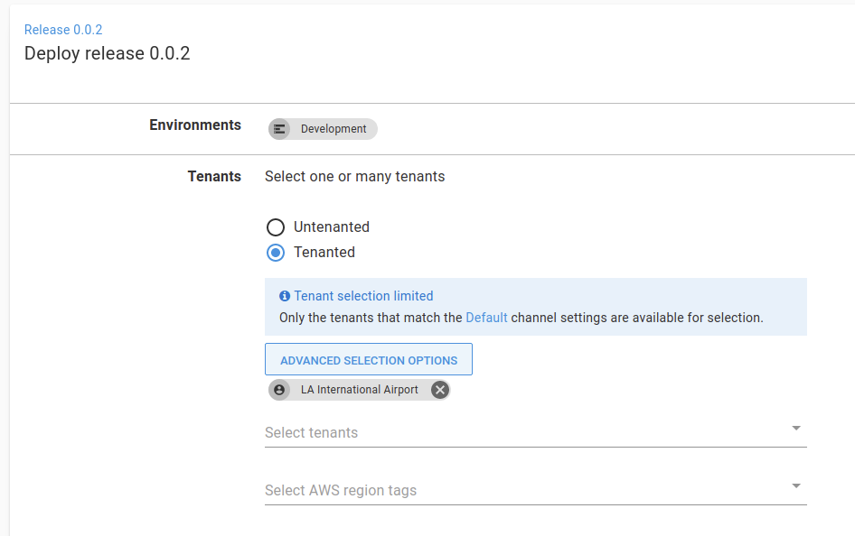
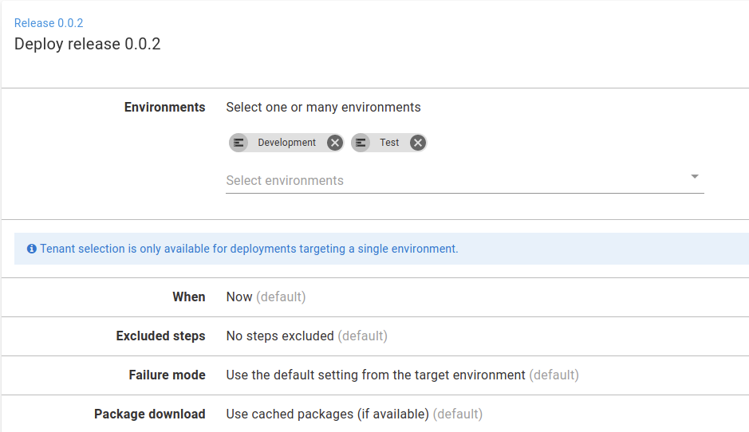

Each project can control its interaction with tenants. By default the multi-tenant deployment features are disabled. You can allow deployments with/without a tenant, which is a hybrid mode that is useful when you are transitioning to a fully multi-tenant project. There is also a mode where you can require a tenant for all deployments, which disables untenanted deployments for that project.

You can change the setting for tenanted deployments for a project by navigating to the project's settings and changing the selected option under **Multi-tenant Deployments**:

It's also possible to enable tenanted deployments when [connecting a tenant to a project](/docs/tenants/tenant-creation/connecting-projects.md) from the tenant screen:

## Tenanted and Untenanted deployments {#tenanted-and-untenanted-deployments}

On the deployment screen, if you you choose **Tenanted** from the **Tenants** option, you are performing a **tenanted deployment** - deploying a release of a project to an environment for one or more tenants. 

When you perform a tenanted deployment, the selected tenant can impact the entire process, including which steps are run, which variable values are used, and which deployment targets are included, all depending on your deployment design.

Also, note Octopus will create a deployment per-tenant. This means if you select 20 tenants, Octopus will create 20 separate deployments: one for each tenant. Each of those deployments will execute in its own task.

When you choose **one or more environments** to deploy to, you are performing an **untenanted deployment** - this is the same kind of deployment Octopus has always performed where you deploy a release of a project to an environment there is no tenant for the deployment. There will be no tenant influence on the deployment process.

When you first enable multi-tenant deployments, you won't have any tenants, and we don't want that to stop you from deploying your existing projects. Perhaps you are using an environment-per-tenant model and will migrate to tenants over some time, so some deployments will start to have a tenant while others do not.