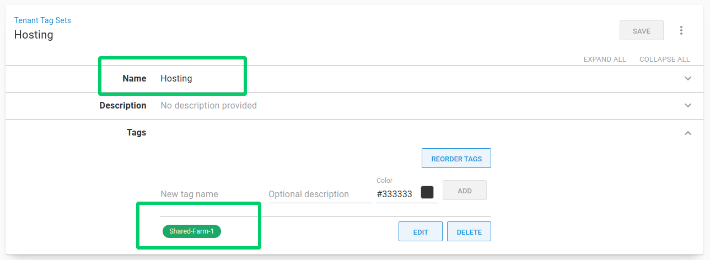

The hosting model for your infrastructure with tenants will vary depending on your application, customers, and sales model. Here we'll cover two of the most common implementations:

- [Dedicated hosting](#dedicated-hosting): You have dedicated deployment targets for each customer.
- [Shared hosting](#shared-hosting): You create farms or pools of servers to host all of your customers, achieving higher density.

You can design and implement both **dedicated** and **shared** multi-tenant hosting models in Octopus using [environments](/docs/infrastructure/environments/index.md), [deployment targets](/docs/infrastructure/index.md), and [tenant tags](/docs/tenants/tenant-tags.md).

## Tenanted and untenanted deployments {#tenanted-and-untenanted-deploys}

Although we focus on tenanted deployments in this section, untenanted deployments deserve some explanation with regards to hosting. Untenanted deployments provide a way for you to start introducing tenants into your existing Octopus configuration. An untenanted deployment is the default in Octopus; a deployment to an environment *without* a tenant. Octopus decides which deployment targets to include in a deployment like this:

- **Tenanted deployments** will use **matching tenanted deployment targets**.
- **Untenanted deployments** will only use **untenanted deployment targets**.

Learn more about the differences between [tenanted and untenanted deployments](/docs/tenants/index.md#tenanted-and-untenanted-deployments).

## Configuring targets for tenanted deployments {#configuring-targets-tenanted-deploy}

By default, deployment targets in Octopus Deploy aren't configured for tenanted deployments.  To configure the target for tenanted deployments, navigate to **{{Infrastructure, Deployment Targets}}**

Click on the deployment target you wish to configure for tenanted deployments. In the **{{Restrictions, Tenanted Deployments}}** section, you can choose the kinds of deployments the target can be involved in

- **Exclude from tenanted deployments** (default) - the deployment target will never be included in tenanted deployments.
- **Include only in tenanted deployments** - the deployment target will only be included in deployments to the associated tenants. It will be excluded from untenanted deployments.
- **Include in both tenanted and untenanted deployments** - The deployment target will be included in untenanted deployments, and deployments to the associated tenants.

### Choose tenants for target {#choose-tenants-for-target}

To choose the tenants to associate with a deployment target navigate to the **{{Restrictions, Associated Tenant}}** section of the deployment target. You can select the tenants to allow to deploy to individually, or you can choose from any of the configured [tenant tags](/docs/tenants/tenant-tags.md).

:::hint
We generally recommend keeping tenanted and untenanted deployment targets separate, particularly in Production. You could use the same deployment targets for other environments but it's better to avoid this situation.
:::

## Dedicated hosting {#dedicated-hosting}

Dedicated hosting ensures the applications for some tenants are completely isolated from those of other tenants. You may want to do this to provide security or performance guarantees that would be problematic in a shared hosting model. To implement dedicated hosting, you need to create the dedicated servers and indicate which tenant will be hosted on those servers.

### Step 1: Configure the dedicated deployment targets {#configure-dedicated-deployment-targets}

To configure deployment targets as dedicated hosts for one or more tenants:

1. Go to **{{Infrastructure,Deployment Targets}}** and find the deployment targets that will be used to host the applications for the tenant. 
1. Configure each deployment target as a dedicated host for the tenant:
   

### Step 2: Deploy {#dedicated-hosting-deploy}

The final step is to deploy a connected project for this tenant and see the results. You will see how Octopus includes these specific deployment targets in that tenant's deployments, creating an isolated hosting environment for that tenant.

## Shared hosting {#shared-hosting}

Shared hosting allows you to host the applications of multiple tenants on the same machines to reduce hosting costs by increasing density. To implement shared hosting, you need to create a shared server farm and indicate which tenants will be hosted on that farm. 

This is very similar to the dedicated hosting scenario. Instead of choosing a single-tenant, you use a tenant tag to indicate these servers will be hosting applications for multiple tenants.

### Step 1: Create a Hosting tag set {#shared-hosting-create-tagset}

Firstly let's create a tag set to identify which tenants should be hosted on which shared server farms:

1. Go to **{{Library,Tenant Tag Sets}}** and create a new tag set called **Hosting**.
1. Add a tag called **Shared-Farm-1** and set the color to green to help identify tenants on shared hosting more quickly:
   

### Step 2: Configure the shared server farm {#shared-hosting-configure-shared-farm}

Now let's configure some shared servers in a farm:

1. Go to **{{Infrastructure,Deployment Targets}}** and find the deployment targets that will be used to host the applications for these tenants.
1. Select the **Shared-Farm-1** tag:

These deployment targets will now be included in deployments for any tenants matching this filter; that is, any tenants tagged with **Hosting/Shared-Farm-1**.

### Step 3: Configure the Tenants to deploy onto the shared server farm {#shared-hosting-configure-tenants}

Now let's select some tenants that should be hosted on **Shared-Farm-1**:

1. Create some new tenants (or find existing ones) and tag them with **Shared-Farm-1**:

### Step 4: Deploy {#shared-hosting-deploy}

The final step is to deploy a connected project for one of these tenants and see the results. You will see how Octopus includes any matching deployment targets in that tenant's deployments, creating a shared hosting environment for your tenants.

