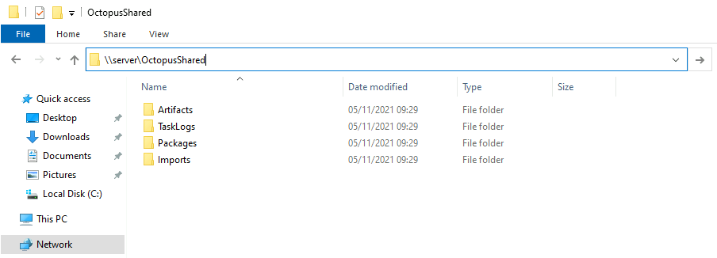
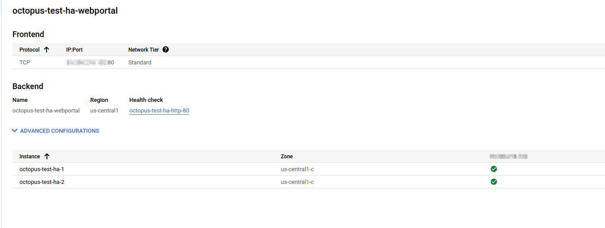
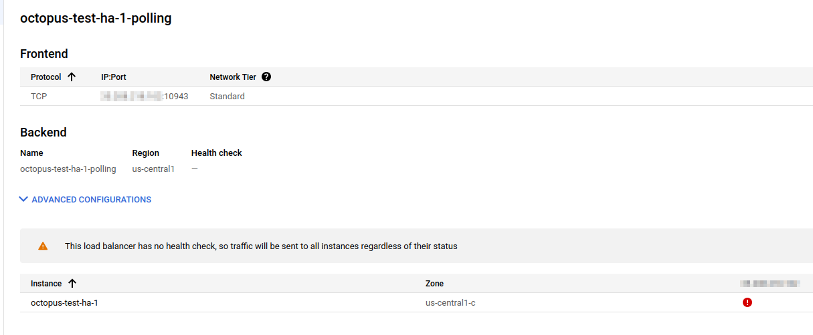

This section walks through the different options and considerations for the components required to set up Octopus High Availability in [Google Cloud Platform (GCP)](https://cloud.google.com/gcp).

## Setting up Octopus: High Availability 

This guide assumes that all of the servers used for your Octopus High Availability instance are hosted in GCP and are running Windows Server.

**Some assembly required**

Octopus High Availability is designed for mission-critical enterprise scenarios and depends heavily on infrastructure and Microsoft components. At a minimum:

- You should be familiar with SQL Server failover clustering, [Cloud SQL](https://cloud.google.com/sql), or have DBAs available to create and manage the database.
- You should be familiar with SANs, [Google Filestore](https://cloud.google.com/filestore), or other approaches to sharing storage between servers.
- You should be familiar with load balancing for applications.

:::hint
**IaaS vs PaaS:**
If you are planning on using [IaaS](https://en.wikipedia.org/wiki/Infrastructure_as_a_service) exclusively in GCP and don't intend to use their PaaS offerings (such as Cloud SQL), then the [On-Premises](/docs/administration/high-availability/design/octopus-for-high-availability-on-premises.md) guide might be a better approach for you as management of your virtual machines, Domain Controllers, SQL Database Servers, and load balancers will be your responsibility.
:::

### Compute

For a highly available Octopus configuration, you need a minimum of two Virtual Machines running Windows Server (ideally `2016+`) in GCP. 

Each organization has different requirements when it comes to choosing the right Virtual Machine to run Octopus on. Review the range of [GCP Compute instance machine families](https://cloud.google.com/compute/docs/machine-types) and select the type most suitable for your requirements. If you're still unsure the [General purpose](https://cloud.google.com/compute/docs/general-purpose-machines) machine family is a good option to start with as they are machines designed for common workloads, optimized for cost and flexibility.

!include <high-availability-compute-recommendations>

Google's Compute Engine also provides [machine type recommendations](https://cloud.google.com/compute/docs/instances/apply-machine-type-recommendations-for-instances). These are automatically generated based on system metrics over time from your virtual machines. Resizing your instances can allow you to use resources more efficiently.

!include <octopus-instance-mixed-os-warning>

### Database

Each Octopus Server node stores project, environment, and deployment-related data in a shared Microsoft SQL Server Database. Since this database is shared, it's important that the database server is also highly available. To host the Octopus SQL database in GCP, there are two options to consider:

- [SQL Server Virtual Machine instances](https://cloud.google.com/compute/docs/instances/sql-server/creating-sql-server-instances)
- [Cloud SQL PaaS](https://cloud.google.com/sql/docs/sqlserver/create-instance)

!include <high-availability-database-recommendations>
- [Cloud SQL Database](https://cloud.google.com/sql/sqlserver)

!include <high-availability-db-logshipping-mirroring-note>

### Shared storage

!include <high-availability-shared-storage-overview>

--- 

**Google Cloud Shared Storage Options**

Octopus running on Windows works best with shared storage accessed via the [Server Message Block (SMB) protocol](https://docs.microsoft.com/windows/win32/fileio/microsoft-smb-protocol-and-cifs-protocol-overview).

Google Cloud offers its own managed file storage option known as [Filestore](https://cloud.google.com/filestore), however it's only accessible via the [Network File System (NFS) protocol](https://en.wikipedia.org/wiki/Network_File_System) (v3).

For SMB storage, Google have partenered with NetApp to offer [NetApp Cloud Volumes](https://cloud.google.com/architecture/partners/netapp-cloud-volumes). This is a fully managed, cloud-based solution that runs on a Compute Engine virtual machine and uses a combination of persistent disks (PDs) and Cloud Storage buckets to store your NAS data.

:::hint
Typically, NFS shares are better suited to Linux or macOS clients, although it is possible to access NFS shares on Windows Servers. NFS shares on Windows are mounted per-user and are not persisted when the server reboots. It's for these reasons that Octopus recommends using SMB storage over NFS when running on Windows Servers.
:::

You can see the different file server options Google Cloud has in their [File Storage on Compute Engine](https://cloud.google.com/architecture/filers-on-compute-engine) overview.

#### NetApp Cloud Volumes

:::hint
To successfully create a NetApp Cloud SMB Volume in Google Cloud, you must have an Active Directory service that can be used to connect to the SMB volume. Please see the [creating and managing SMB volumes](https://cloud.google.com/architecture/partners/netapp-cloud-volumes/creating-smb-volumes) for further information. It's also worth reviewing the [security considerations for SMB access](https://cloud.google.com/architecture/partners/netapp-cloud-volumes/security-considerations) too.
:::

Once you have configured your NetApp Cloud SMB Volume, the best option is to mount the SMB share and then create a [symbolic link](https://en.wikipedia.org/wiki/Symbolic_link) pointing at a local folder, for example `C:\OctopusShared\` for the Artifacts, Packages, TaskLogs, and Imports folders which need to be available to all nodes.

Before installing Octopus, follow the steps below *on each* Compute engine instance to mount your SMB share.

1. In the Google Cloud Console, go to the [Volumes](https://console.cloud.google.com/netapp/cloud-volumes/volumes) page.

2. Click the SMB volume for which you want to map an SMB share.

3. Scroll to the right, click **More** (`...`), and then click **Mount Instructions**.

4. Follow the instructions in the **Mount Instructions for SMB window** that appears.

5. Create folders in your **SMB share** for the Artifacts, Packages, TaskLogs, and Imports.

   

6. Create the symbolic links for the Artifacts, Packages, TaskLogs, and Imports folders.

   Run the following PowerShell script, substituting the placeholder values with your own:

   ```powershell

   # (Optional) add the auth for the symbolic links. You can get the details from the Cloud Volume mount instructions.
   cmdkey /add:your-smb-share-address /user:username /pass:XXXXXXXXXXXXXX

   # Create the local folder to use to create the symbolic links within.
   $LocalFolder="C:\OctopusShared"
   
   if (-not (Test-Path -Path $LocalFolder)) {
      New-Item -ItemType directory -Path $LocalFolder    
   }

   $SmbShare = "\\your-smb-share\share-name"
   
   # Create symbolic links
   $ArtifactsFolder = Join-Path -Path $LocalFolder -ChildPath "Artifacts"
   if (-not (Test-Path -Path $ArtifactsFolder)) {
       New-Item -Path $ArtifactsFolder -ItemType SymbolicLink -Value "$SmbShare\Artifacts"
   }

   $PackagesFolder = Join-Path -Path $LocalFolder -ChildPath "Packages"
   if (-not (Test-Path -Path $PackagesFolder)) {
       New-Item -Path $PackagesFolder -ItemType SymbolicLink -Value "$SmbShare\Packages"
   }

   $TaskLogsFolder = Join-Path -Path $LocalFolder -ChildPath "TaskLogs"
   if (-not (Test-Path -Path $TaskLogsFolder)) {
       New-Item -Path $TaskLogsFolder -ItemType SymbolicLink -Value "$SmbShare\TaskLogs"
   }

   $ImportsFolder = Join-Path -Path $LocalFolder -ChildPath "Imports"
   if (-not (Test-Path -Path $ImportsFolder)) {
       New-Item -Path $ImportsFolder -ItemType SymbolicLink -Value "$SmbShare\Imports"
   }
   ```
   :::hint
   Remember to create the folders in the SMB share before trying to create the symbolic links.
   :::

Once you've completed those steps, [install Octopus](/docs/installation/index.md) and then when you've done that on all nodes, run the [path command](/docs/octopus-rest-api/octopus.server.exe-command-line/path.md) to change the paths to the shared storage:

```powershell
& 'C:\Program Files\Octopus Deploy\Octopus\Octopus.Server.exe' path `
--artifacts "C:\OctopusShared\Artifacts" `
--nugetRepository "C:\OctopusShared\Packages" `
--taskLogs "C:\OctopusShared\TaskLogs" `
--imports "C:\OctopusShared\Imports"
```

:::hint
Changing the path only needs to be done once, and not on each node as the values are stored in the database.
:::

#### Filestore using NFS

Once you have [created a Filestore instance](https://cloud.google.com/filestore/docs/creating-instances), the best option is to mount the NFS share using the `LocalSystem` account, and then create a [symbolic link](https://en.wikipedia.org/wiki/Symbolic_link) pointing at a local folder, for example `C:\OctopusShared\` for the Artifacts, Packages, TaskLogs, and Imports folders which need to be available to all nodes.

Before installing Octopus, follow the steps below *on each* Compute engine instance to mount your NFS share.

1. Install NFS on the Windows VM 

   On the Windows VM, open PowerShell as an administrator, and install the NFS client:

   ```powershell
   # Install the NFS client
   Install-WindowsFeature -Name NFS-Client 
   ```

   Restart the Windows VM instance as prompted, then reconnect.

2. Configure the user ID used by the NFS client

   In PowerShell, run the following commands to create two new registry entries, `AnonymousUid` and `AnonymousGid`:

   ```powershell
   New-ItemProperty -Path "HKLM:\SOFTWARE\Microsoft\ClientForNFS\CurrentVersion\Default" `
    -Name "AnonymousUid" -Value "0" -PropertyType DWORD

   New-ItemProperty -Path "HKLM:\SOFTWARE\Microsoft\ClientForNFS\CurrentVersion\Default" `
    -Name "AnonymousGid" -Value "0" -PropertyType DWORD
   ```
3. Restart the NFS client service

   ```cmd
   nfsadmin client stop

   nfsadmin client start
   ```
4. Create a batch file (`.bat` or `.cmd`) to mount the NFS share.

   ```cmd
   net use X: \\your-nfs-share\share-name
   ```

   Substituting the placeholders with your own values:

   - `X:` with the mapped drive letter you want
   - `your-nfs-share` with either the host name or IP address of the Filestore instance
   - `share-name` with the Filestore instance share name

5. Create a Windows Scheduled Task to run at system startup to mount the NFS share using the batch file.
      
   Below is an example scheduled task for mounting an NFS volume. Remember to substitute `C:\OctoHA\MountNfsShare.cmd` with the path to your batch file and ensure the task is set to run as `LocalSystem`. 

   ```xml
   <?xml version="1.0" encoding="UTF-16"?>
   <Task version="1.4" xmlns="http://schemas.microsoft.com/windows/2004/02/mit/task">
     <RegistrationInfo>
       <URI>\OctopusDeploy - mount nfs volume</URI>
     </RegistrationInfo>
     <Triggers>
       <BootTrigger>
         <Enabled>true</Enabled>
       </BootTrigger>
     </Triggers>
     <Principals>
       <Principal id="Author">
         <UserId>S-1-5-18</UserId>
         <RunLevel>HighestAvailable</RunLevel>
       </Principal>
     </Principals>
     <Settings>
       <MultipleInstancesPolicy>IgnoreNew</MultipleInstancesPolicy>
       <DisallowStartIfOnBatteries>true</DisallowStartIfOnBatteries>
       <StopIfGoingOnBatteries>true</StopIfGoingOnBatteries>
       <AllowHardTerminate>true</AllowHardTerminate>
       <StartWhenAvailable>false</StartWhenAvailable>
       <RunOnlyIfNetworkAvailable>false</RunOnlyIfNetworkAvailable>
       <IdleSettings>
         <StopOnIdleEnd>true</StopOnIdleEnd>
         <RestartOnIdle>false</RestartOnIdle>
       </IdleSettings>
       <AllowStartOnDemand>true</AllowStartOnDemand>
       <Enabled>true</Enabled>
       <Hidden>true</Hidden>
       <RunOnlyIfIdle>false</RunOnlyIfIdle>
       <DisallowStartOnRemoteAppSession>false</DisallowStartOnRemoteAppSession>
       <UseUnifiedSchedulingEngine>true</UseUnifiedSchedulingEngine>
       <WakeToRun>false</WakeToRun>
       <ExecutionTimeLimit>PT1H</ExecutionTimeLimit>
       <Priority>5</Priority>
     </Settings>
     <Actions Context="Author">
       <Exec>
         <Command>C:\OctoHA\MountNfsShare.cmd</Command>
       </Exec>
     </Actions>
   </Task>
   ```
   
   You can add multiple Actions to a Scheduled task. If you want to be sure the NFS share is mounted *before* the Octopus Service is started, you can set the service **Startup Type** to `Manual`, and add the following command to run *after* the NFS share is mounted:

   ```cmd Command-line
   C:\Program Files\Octopus Deploy\Octopus\Octopus.Server.exe" checkservices --instances OctopusServer
   ```
   ```xml Scheduled Task XML Snippet
   <Exec>
     <Command>"C:\Program Files\Octopus Deploy\Octopus\Octopus.Server.exe"</Command>
     <Arguments>checkservices --instances OctopusServer</Arguments>
   </Exec>

   ```
   :::hint
   This is in effect the same when using the [watchdog](/docs/octopus-rest-api/octopus.server.exe-command-line/watchdog.md) command to configure a scheduled task to monitor the Octopus Server service.
   :::

6. Create folders in your **NFS share** for the Artifacts, Packages, TaskLogs, and Imports.

7. Create the symbolic links for the Artifacts, Packages, TaskLogs, and Imports folders.

   Run the following PowerShell script, substituting the placeholder values with your own:
   
   ```powershell
   # Create the local folder to use to create the symbolic links within.
   $LocalFolder="C:\OctopusShared"
   
   if (-not (Test-Path -Path $LocalFolder)) {
      New-Item -ItemType directory -Path $LocalFolder    
   }

   $NfsShare = "\\your-nfs-share\share-name"
   
   # Create symbolic links
   $ArtifactsFolder = Join-Path -Path $LocalFolder -ChildPath "Artifacts"
   if (-not (Test-Path -Path $ArtifactsFolder)) {
       New-Item -Path $ArtifactsFolder -ItemType SymbolicLink -Value "$NfsShare\Artifacts"
   }

   $PackagesFolder = Join-Path -Path $LocalFolder -ChildPath "Packages"
   if (-not (Test-Path -Path $PackagesFolder)) {
       New-Item -Path $PackagesFolder -ItemType SymbolicLink -Value "$NfsShare\Packages"
   }

   $TaskLogsFolder = Join-Path -Path $LocalFolder -ChildPath "TaskLogs"
   if (-not (Test-Path -Path $TaskLogsFolder)) {
       New-Item -Path $TaskLogsFolder -ItemType SymbolicLink -Value "$NfsShare\TaskLogs"
   }

   $ImportsFolder = Join-Path -Path $LocalFolder -ChildPath "Imports"
   if (-not (Test-Path -Path $ImportsFolder)) {
       New-Item -Path $ImportsFolder -ItemType SymbolicLink -Value "$NfsShare\Imports"
   }
   ```
   :::hint
   Remember to create the folders in the NFS share before trying to create the symbolic links.
   :::

Once you've completed those steps, [install Octopus](/docs/installation/index.md) and then when you've done that on all nodes, run the [path command](/docs/octopus-rest-api/octopus.server.exe-command-line/path.md) to change the paths to the shared storage:

```powershell
& 'C:\Program Files\Octopus Deploy\Octopus\Octopus.Server.exe' path `
--artifacts "C:\OctopusShared\Artifacts" `
--nugetRepository "C:\OctopusShared\Packages" `
--taskLogs "C:\OctopusShared\TaskLogs" `
--imports "C:\OctopusShared\Imports"
```

:::hint
Changing the path only needs to be done once, and not on each node as the values are stored in the database.
:::

### Load Balancing in Google Cloud

To distribute traffic to the Octopus web portal on multiple nodes, you need to use a load balancer. Google Cloud provides two options you should consider to distribute HTTP/HTTPS traffic to your Compute Engine instances.

* [External HTTP(S) Load Balancer](https://cloud.google.com/load-balancing/docs/https)
* [External TCP Network Load Balancer](https://cloud.google.com/load-balancing/docs/network)

If you are *only* using [Listening Tentacles](/docs/infrastructure/deployment-targets/tentacle/tentacle-communication.md#listening-tentacles-recommended), we recommend using the HTTP(S) Load Balancer.

However, [Polling Tentacles](/docs/infrastructure/deployment-targets/tentacle/tentacle-communication.md#polling-tentacles) aren't compatible with the HTTP(S) Load Balancer, so instead, we recommend using the Network Load Balancer. It allows you to configure TCP Forwarding rules on a specific port to each compute engine instance, which is [one way to route traffic to each individual node](#using-a-unique-port) as required for Polling Tentacles when running Octopus High Availability. 

To use Network Load Balancers exclusively for Octopus High Availability with Polling Tentacles you'd potentially need to configure multiple load balancer(s) / forwarding rules:

- One to serve the Octopus Web Portal HTTP traffic to your backend pool of Compute engine instances:

   

- One *for each* Compute engine instance for Polling Tentacles to connect to:

   

With Network Load Balancers, you can configure a health check to ensure your Compute engine instances are healthy before traffic is served to them:


!include <load-balancer-endpoint-info>

## Polling Tentacles with HA

!include <polling-tentacles-and-ha>

### Connecting Polling Tentacles

!include <polling-tentacles-and-ha-connecting>

#### Using a unique address

!include <polling-tentacles-connection-same-port>

#### Using a unique port

!include <polling-tentacles-connection-different-ports>

### Registering Polling Tentacles

!include <polling-tentacles-and-ha-registering>