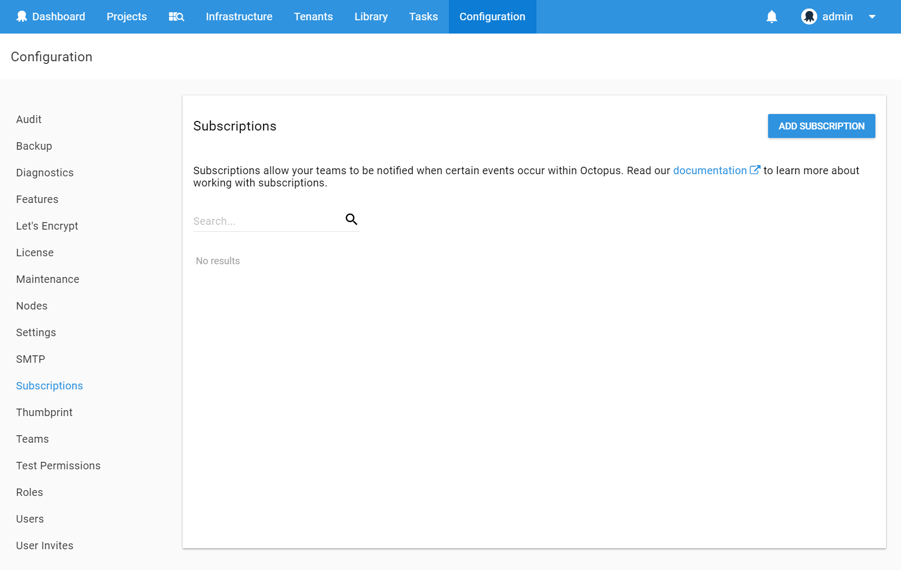
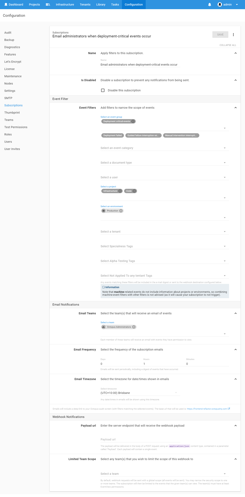

Subscriptions allow you to subscribe to events that are happening within Octopus, so you can be notified when events have occurred and react accordingly. Both **email** and **webhook** notifications are currently supported.

Subscriptions can be accessed from the `Configuration` menu.

:::hint
**Running on an Octopus version below 3.12?**
For earlier versions of Octopus, Subscriptions can be accessed from the **{{Configuration > Audit > Subscriptions}}** menu. See the version-selector of the documentation to jump to your specific Octopus version.
:::



## Email notifications {#Subscriptions-EmailNotifications}

Email notifications can be setup to send an email periodically to the users of one or more [teams](/docs/security/users-and-teams/). Emails will be sent periodically according to the frequency you specify, and the email will include a digest of events that have occurred (up to a maximum of 100 events). For example, this can be useful if your team has setup automated deployments with the [Elastic and Transient Environment](/docs/deployments/patterns/elastic-and-transient-environments/) features of Octopus and wish to be notified if an auto-deployment is ever blocked or has failed.

Emails may also include a link to your Octopus Audit screen, filtered to match the events delivered in the email. To include this link, you need to have set the publicly-accessible URL of your Octopus instance (see the **{{Configuration,Nodes,Configuration Settings}}** menu or the [Server Configuration](/docs/administration/managing-infrastructure/server-configuration/) documentation for more details).

## Example

<iframe width="560" height="315" src="https://www.youtube.com/embed/wtBrGaAMqfM" frameborder="0" allow="accelerometer; autoplay; encrypted-media; gyroscope; picture-in-picture" allowfullscreen></iframe>

Let's say you have some critical projects and you want your administrators to receive an email if something is wrong with these deployments. You can setup an email subscription to notify your teams when these critical events have occurred.

Consider the following example:



We can select the _Deployment-critical events_ group, which will automatically filter all deployment-critical events for us.

We can then select just the projects/environments we want to monitor. In this case: our _Infrastructure_ and _Code_ projects. Also, we only want to get notified when these critical events occur in our _Production_ environment.

So in this example, all users in the _Octopus Administrators_ team (with a valid email address) will receive an email notification for _Deployment-critical events_, in the _Infrastructure_ and _Code_ projects, that occurred in our _Production_ environment.

:::hint
**Dates and Timezone**
In this example, we have also configured the timezone drop-down so all dates shown in the emails will be in our preferred timezone.
:::

We can then hit _Save_ and this subscription will show up in our subscriptions list screen.

## Role permissions

Each email will be customized based on the user's roles, so they will only be emailed with events that they have permission to see. See the "Event Visibility and Permissions" section below for more details.


## Webhook notifications {#Subscriptions-WebhookNotifications}

Webhook notifications allow you to receive a JSON payload, posted to a specified URL when events have occurred. Webhook notifications will be sent **per event** (unlike email notifications that send a digest of events) and will include a payload with the following structure:

```powershell
{
  "Timestamp": "0001-01-01T00:00:00+00:00",
  "EventType": "SubscriptionPayload",
  "Payload": {
    "ServerUri": "http://my-octopus.com",
    "ServerAuditUri": "http://my-octopus.com",
    "Subscription": {},
    "Event": {},
    "BatchProcessingDate": "0001-01-01T00:00:00+00:00",
    "BatchId": "[guid]",
    "TotalEventsInBatch": "3",
    "EventNumberInBatch": "10"
  }
}
```

The `Payload` includes:

| Property                     | Hint | Description |
| ---------------------------- | ---- | ----------- |
| ServerUri                    | \* |  The Octopus Server that generated this webhook |
| ServerAuditUri               | \* | The URL to the Octopus Server's audit screen where this event may be found in more detail |
| Subscription                 | | The subscription object that triggered this webhook (including all filtering criteria so you can see exactly why you are receiving this webhook) |
| Event                        | | The event object that this webhook is responding to |
| BatchProcessingDate          | | The processing date for the current batch. For 'Single' payload types, the events will be sent in batches. The batch date is included here for your reference |
| BatchId                      | \** | A unique GUID given to the current batch of events being processed |
| TotalEventsInBatch           | \** | The total number of events, in the current batch of events being processed |
| EventNumberInBatch           | \** | The event number of this event, in the current batch of events being processed |

\* This property will be null unless the publicly-accessible URL has been set for your Octopus instance (see the **{{Configuration,Nodes,Configuration Settings}}** menu).

\** This property is available since version `3.12.5`

:::hint
**Consuming Events**
While we make every effort to ensure events are only ever sent *once* to a given email or webhook subscription, we can offer no guarantees and advise that you design your consuming API with this in mind.
:::


## Event visibility and permissions {#Subscriptions-EventVisibilityandPermissions}

Because certain teams may be restricted to only see certain events, subscriptions give you the ability to scope to one or more teams. Teams may be restricted to certain criteria, such as project(s) and/or environment(s). Combine these restrictions with team roles and you can successfully control which events get seen for a given subscription. See more information on [Managing Users and Teams](/docs/security/users-and-teams/) as well as our [User Roles](/docs/security/users-and-teams/user-roles/) documentation if you wish to learn more.

## Troubleshooting

Logs for subscriptions can be found in the `Configuration` menu under `Diagnostics` (see the `Subscription logs` tab). You can then click the `Verbose` flag to view all related information to help with troubleshooting.

## Email notification troubleshooting

If you are setting up email subscriptions for the first time and would like a good test SMTP server (before you involve your real SMTP servers), we have found [mailtrap.io](https://mailtrap.io/) to be extremely helpful. This can help you to see what the actual emails will look like once you involve your real SMTP servers.

## Webhook notification troubleshooting

If you are setting up webhook subscriptions for the first time and would like a simple test server where you can see the payloads that Octopus will actually send, we have found [RequestBin](https://requestbin.com/) to be extremely helpful.

For example, to test whether the subscription webhooks are sending correctly from Octopus, you could setup a temporary RequestBin, and use that URL in your subscription to confirm whether the payload is sending successfully from Octopus. This will also show you a real-time payload of what your API can expect to receive from an Octopus webhook subscription.

## Subscription events

The following is a list of all options for subscriptions including Event Groups, Events, and Document Types:

|EVENT GROUPS|
|---|
|Auto-deploy events|
|Auto-Deploy critical-events|
|Deployment events|
|Deployment critical-events|
|Machine events|
|Machine critical-events|
|Machine becomes available for deployment|
|Machine is no longer available for deployment|
|Certificate expiry events|
|Document events|
|API key expiry events|

|EVENTS|
|---|
|API key expired|
|API key expiry 10-day warning|
|API key expiry 20-day warning|
|Auto-deploy trigger blocked|
|Auto-deploy trigger succeeded|
|Certificate expired|
|Certificate expiry 10-day warning|
|Certificate expiry 20-day warning|
|Certificate private-key exported|
|Certificate replaced|
|Comment|
|Deployment failed|
|Deployment queued|
|Deployment resumed|
|Deployment started|
|Deployment succeeded|
|Document created|
|Document deleted|
|Document modified|
|Export complete|
|Guided failure interruption raised|
|Import complete|
|Machine cleanup failed|
|Machine created|
|Machine deleted|
|Machine deployment-related property modified|
|Machine disabled|
|Machine enabled|
|Machine found healthy|
|Machine found to be unavailable|
|Machine found to be unhealthy|
|Machine found to have warnings|
|Machine health changed|
|Manual intervention interruption raised|
|Task canceled|

|DOCUMENT TYPES|
|---|
|Account|
|Action Template|
|Action Template Version|
|Api Key|
|Artifact|
|Auto Deploy Queue Item|
|Build Information|
|Certificate|
|Channel|
|Community Action Template|
|Dashboard Configuration|
|Dashboard Item|
|Deleted Space|
|Deployment|
|Deployment Environment|
|Deployment History|
|Deployment Process|
|Deployment Summary|
|Event|
|Extension Configuration|
|Feed|
|Has Id|
|Indexed Package Summary|
|Interruption|
|Invitation|
|Latest And Count|
|Latest Successful Deployment To Machine|
|Library Variable Set|
|Lifecycle|
|Machine|
|Machine Policy|
|Name Only|
|Octopus Server Node| 
|Project|
|Project Group|
|Project Trigger|
|Proxy|
|Release|
|Runbook|
|Runbook Run|
|Runbook Run History|
|Runbooks Dashboard Item|
|Runbooks Snapshot|
|Server Task|
|Space|
|Subscription|
|Tag Set|
|Team|
|Tenant|
|Tenant Variable|
|Variable Set|
|Worker|
|Worker Pool|
|Worker Task Lease|
|User|
|User Role|
|Variable Set|
