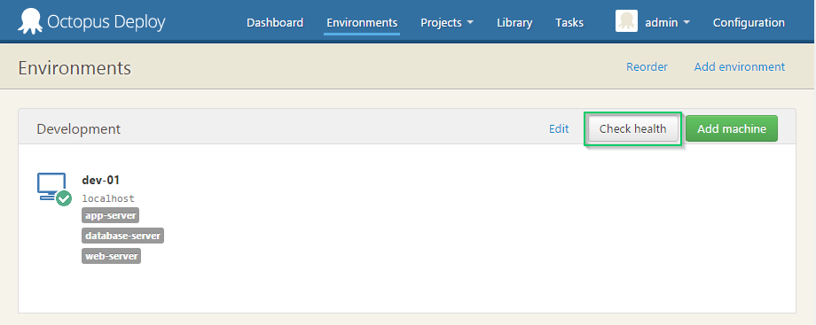
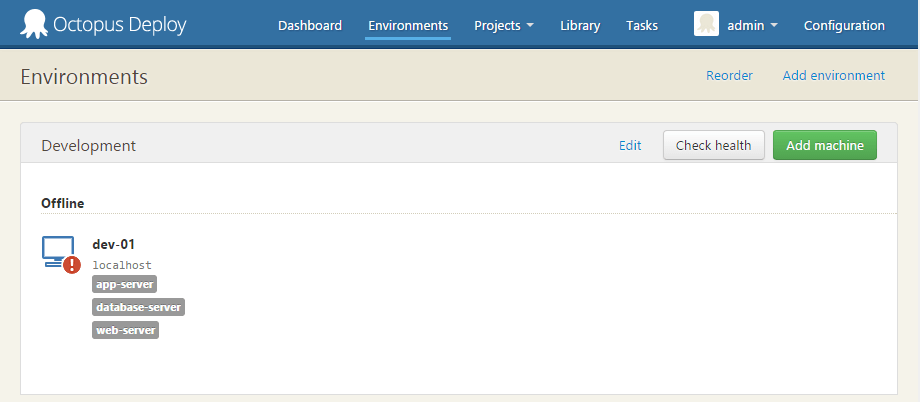
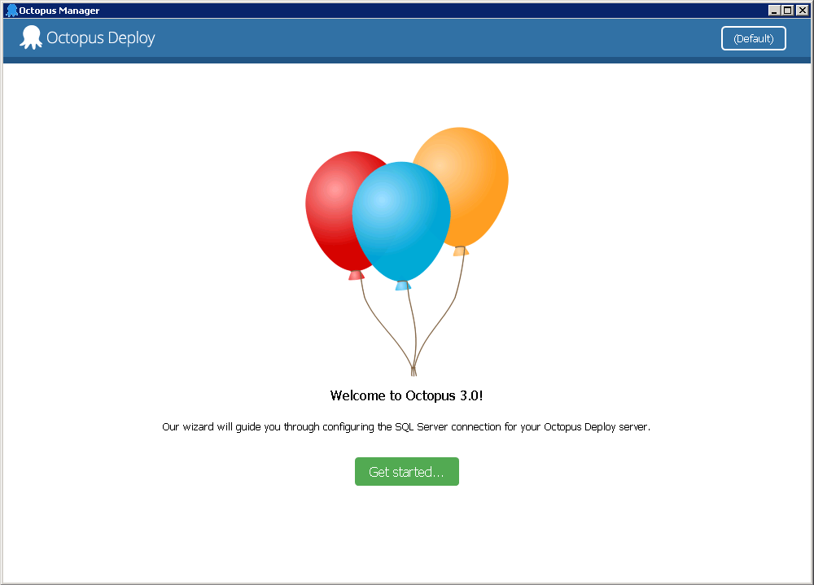
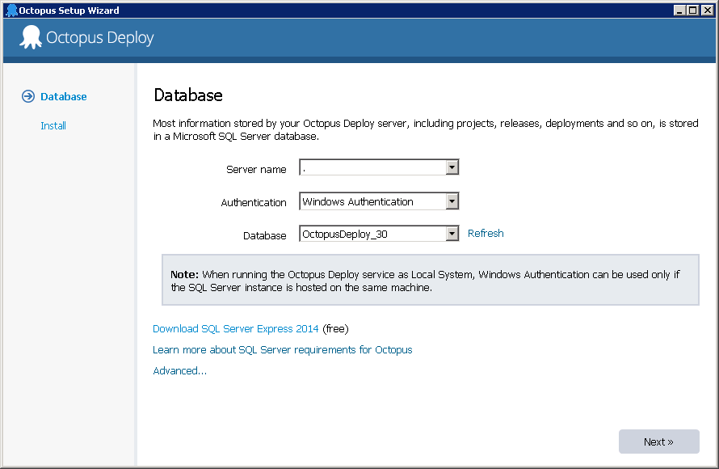
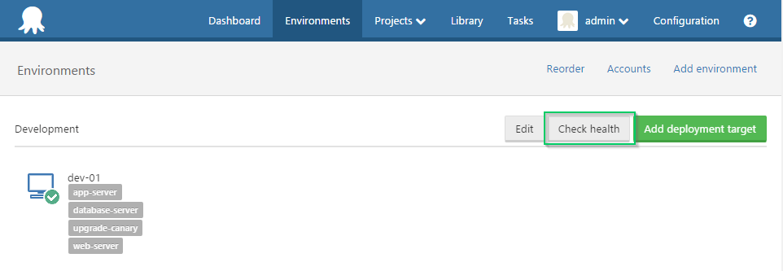

You can perform an in place upgrade from **Octopus 2.6.5** to **Octopus 2018.10 LTS**, but you need to upgrade your Tentacles first.

Due to the new communication method, you won't be able to communicate with your upgraded Tentacles until you upgrade your server. However, if you upgrade your server before all Tentacles are correctly updated, you will have to upgrade them manually, or roll your server back to **Octopus 2.6.5** and try again.

## Step by step {#Inplaceupgrade(installover2.6)-Stepbystep}

To perform an in-place upgrade, follow these steps carefully:

### 1. Back up your Octopus 2.6.5 database and Master Key {#Inplaceupgrade(installover2.6)-1.BackupyourOctopus2.6databaseandmasterkey}

See the [Backup and restore](/docs/administration/upgrading/legacy/upgrading-from-octopus-2.6.5-2018.10lts/backup-2.6.md)[ page for instructions on backing up your database.](/docs/administration/upgrading/legacy/upgrading-from-octopus-2.6.5-2018.10lts/backup-2.6.md)

### 2. Use Hydra to automatically upgrade your Tentacles {#Inplaceupgrade(installover2.6)-2.UseHydratoautomaticallyupgradeyourTentacles}

!include <using-hydra>

### 3. Verify the upgrade worked {#Inplaceupgrade(installover2.6)-3.Verifytheupgradehasworked}

When the Hydra task runs on a Tentacle machine, it should no longer be able to communicate with the **Octopus 2.6.5** server. You can verify this by navigating to the Environments page and clicking **Check Health**.

After successfully updating your Tentacles, you should see this check fail from your 2.6.5 server.

We recommend connecting to some of your Tentacle machines and examining the Octopus Tentacle binaries to ensure they have been upgraded. You should also ensure the service is running (even though it will not be able to communicate with the server).

:::hint
If you have multiple Tentacles running on the same server, an update to one will result in an update to **all** of them. This is because there is only one copy of the Tentacle binaries, even with multiple instances configured.
:::

### 4. Install Octopus 2018.10 LTS on your Octopus Server {#Inplaceupgrade(installover2.6)-4.InstallOctopus3.xonyourOctopusServer}

:::success
**Upgrade to the latest version**
When upgrading to **Octopus 2018.10 LTS** please use the latest version available. We have been constantly improving the **Octopus 2.6.5** to **Octopus 2018.10 LTS** data migration process whilst adding new features and fixing bugs.
:::

See the [Installing Octopus 2018.10 LTS](/docs/installation/) page for instructions on installing a new **Octopus 2018.10 LTS** instance.

After installing the MSI, you will be presented with an upgrade page.

Click "Get started..." and set up your database connection. You may need to grant permission to the `NT AUTHORITY\SYSTEM` account at this stage.

Click Next, and then Install to install the **Octopus 2018.10 LTS** server over the **Octopus 2.6.5** instance.

### 5. Restore the Octopus 2.6.5 database using the Migration Tool {#Inplaceupgrade(installover2.6)-5.RestoretheOctopus2.6databaseusingthemigrationtool}

After upgrading, the Octopus Manager will prompt to import your **Octopus 2.6.5** database. Click the *Import data...* button and follow the prompts to import your **Octopus 2.6.5** data.

See the [Migrating data from Octopus 2.6.5 to 2018.10 LTS](/docs/administration/upgrading/legacy/upgrading-from-octopus-2.6.5-2018.10lts/migrating-data-from-octopus-2.6.5-2018.10lts.md) page for more detailed instructions on importing your **Octopus 2.6.5** database backup into **Octopus 2018.10 LTS**.

:::hint
**Migration taking a long time?**
By default we migrate everything from your backup including historical data. You can use the `maxage=` argument when executing the migrator to limit the number of days to keep. For example: `maxage=90` will keep 90 days of historical data ignoring anything older.

To see the command syntax click the **Show script** link in the wizard.
:::

:::hint
**Using the built-in Octopus NuGet repository?**
If you use the built-in [Octopus NuGet repository](/docs/packaging-applications/package-repositories/) you will need to move the files from your **Octopus 2.6.5** server to your **Octopus 2018.10 LTS** server. They are not part of the backup.
In a standard **Octopus 2.6.5** install the files can be found under `C:\Octopus\OctopusServer\Repository\Packages`
You will need to transfer them to the new server to `C:\Octopus\Packages`. Once the files have been copied, go to {{Library>Packages>Package Indexing}} and click the `RE-INDEX NOW` button. This process runs in the background, so if you have a lot of packages it could take a while (5-20 mins) to show in the UI or be usable for deployments.
:::

### 6. Verify connectivity between the 2018.10 LTS server and your Tentacles {#Inplaceupgrade(installover2.6)-6.Verifyconnectivitybetweenthe3.xserverand3.xTentacles}

Log in to your new **Octopus 2018.10 LTS** server and run health checks on all of your environments. If the upgrade completed successfully, they should succeed.

If one or more health checks do not succeed after a few attempts, see the Troubleshooting section to identify possible issues.

### Optionally clean up your Octopus home folder

We leave some files used by **Octopus 2.6.5** in place so you can roll back if necessary. After the upgrade is complete these files will never be used again and can be safely deleted.

You can follow the instructions on this [page](/docs/administration/managing-infrastructure/server-configuration-and-file-storage\index.md#ServerconfigurationandFilestorage-CleanUp) to clean up files left over from your **Octopus 2.6.5** to **Octopus 2018.10 LTS** upgrade.
