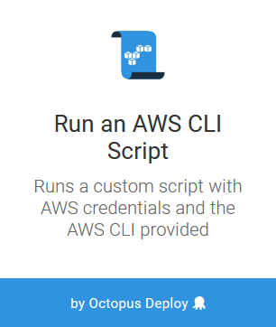
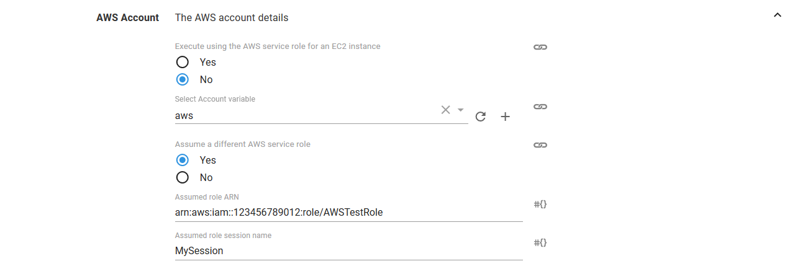
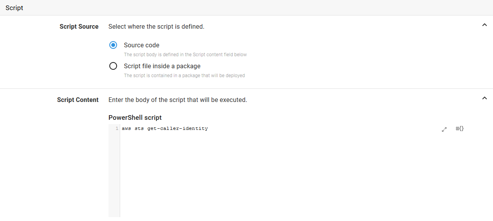
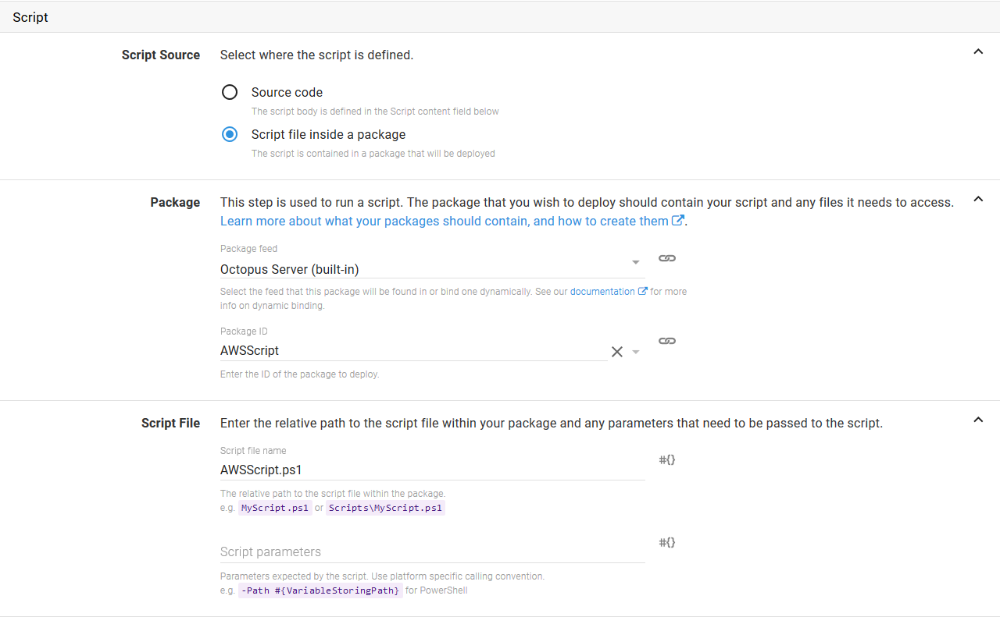

Octopus can help you to run scripts on targets within AWS.

These scripts typically rely on tools being available when they execute.

It is best that you control the version of these tools - your scripts will rely on a specific version that they are compatible with to function correctly.

The easiest way to achieve this is to use an [execution container](/docs/projects/steps/execution-containers-for-workers/) for your script step.

If this is not an option in your scenario, we recommend that you provision your own tools on your worker.

:::warning
Using the AWS tools bundled with Octopus Deploy is not recommended. Octopus bundles versions of the [AWS PowerShell modules](https://aws.amazon.com/powershell/) and [AWS CLI](https://aws.amazon.com/cli/). These were originally provided as convenience mechanisms for users wanting to run scripts against AWS targets. The versions bundled are now out of date, and we will not be updating them further.

From **Octopus 2021.2**, a warning will also appear in the deployment logs if the AWS tools bundled with Octopus Deploy are used in a step.
:::

When executing scripts against AWS, Octopus Deploy will configure an environment that authenticates you using the AWS account that was configured for the step.

The proceeding instructions can be followed to configure the `Run an AWS CLI Script` step.

## Create an AWS account

The instructions at [Creating an AWS Account](/docs/infrastructure/accounts/aws/index.md#create-an-aws-account) detail the procedure for creating an account in Octopus.

## Create a AWS account project variable

AWS accounts are included in a project through a project variable of the type `Amazon Web Services Account`:


The `Add Variable` window is then displayed and lists all the AWS accounts.

Select the account that was created in the previous step to assign it to the variable:


## Add AWS script step

Add the `Run an AWS CLI Script` step to the project, and provide it a name:



### AWS section

Select the variable that references the `Amazon Web Services Account` under the `AWS Account` section or choose to execute using the service role assigned to the EC2 instance:


The supplied account can optionally be used to assume a different AWS service role. This can be used to run the AWS commands with a role that limits the services that can be affected:



The default AWS region in which to execute AWS CLI commands is defined in the `Region` section:


## Script section

PowerShell scripts run by the `Run an AWS CLI Script` step have access to the AWS CLI executable `aws.exe` on the path, as well as having the AWS PowerShell modules if they are present on the worker. In addition the environment variables `AWS_ACCESS_KEY_ID`, `AWS_SECRET_ACCESS_KEY`, `AWS_DEFAULT_REGION` are configured to authenticate you with AWS. The `AWS_SESSION_TOKEN` environment variable is also configured if the script was run against an assumed role, or if the AWS service role for the EC2 instance running the script (i.e. the Octopus Server) was used.

This means you can run scripts using a mix of the AWS CLI and PowerShell commands:

```
# This will write out information on the Get-AWSPowerShellVersion CmdLet.
get-command Get-AWSPowerShellVersion | fl *

Write-Host "Get caller identity with the AWS CLI"
Write-Host "aws sts get-caller-identity"
aws sts get-caller-identity

Write-Host "Get the version of the Powershell module"
Write-Host "Get-AWSPowerShellVersion"
Get-AWSPowerShellVersion

Write-Host "Get caller identity using the AWS PowerShell modules"
Write-Host "Get-STSCallerIdentity"
Get-STSCallerIdentity | Select-Object -Property *
```

Scripts can be run from two different locations: source code added to the step, or a script from a package.

### Source code

The first option is to add the script source code to the step directly. This is done by selecting the `Source code` option, and entering the source code into the text box in the `Script Content` section.



### Package

The second option is to run a script from a package. This is done by selecting the `Script file inside a package` option, selecting the package, and entering the name of the file within the package to run as a PowerShell script.



## Running Scripts in Octopus Cloud

Octopus Cloud uses a special type of worker pool called a [Dynamic Worker Pool](/docs/infrastructure/workers/dynamic-worker-pools/). Octopus provides these, and you cannot easily install custom versions of the AWS tools on them.

To use your own version of the AWS CLI or AWS Powershell cmdlets when using Dynamic Worker Pools, please do the following:

- Configure your step to use a Dynamic Worker pool that supports [execution containers](/docs/projects/steps/execution-containers-for-workers/).
- Configure your step to run in an execution container with a [compatible docker image](/docs/projects/steps/execution-containers-for-workers/index.md#which-image) that contains the versions of the AWS CLI or AWS Powershell cmdlets that you would like to use.
