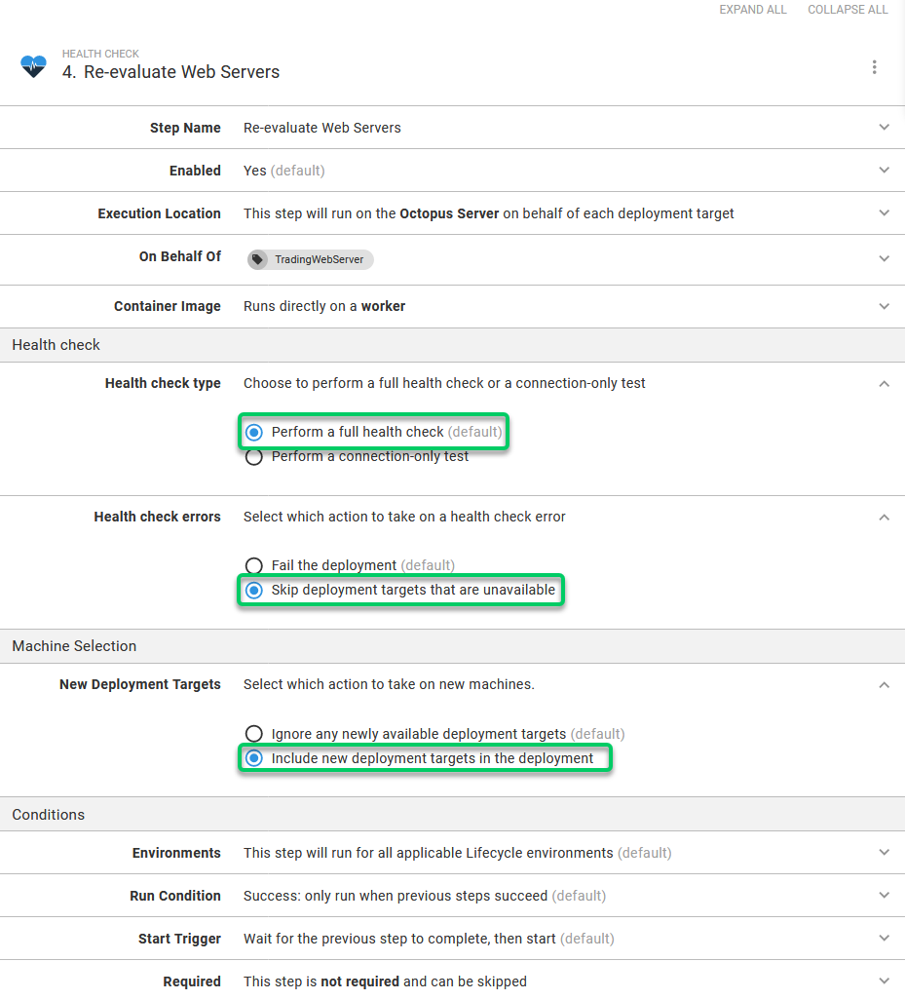
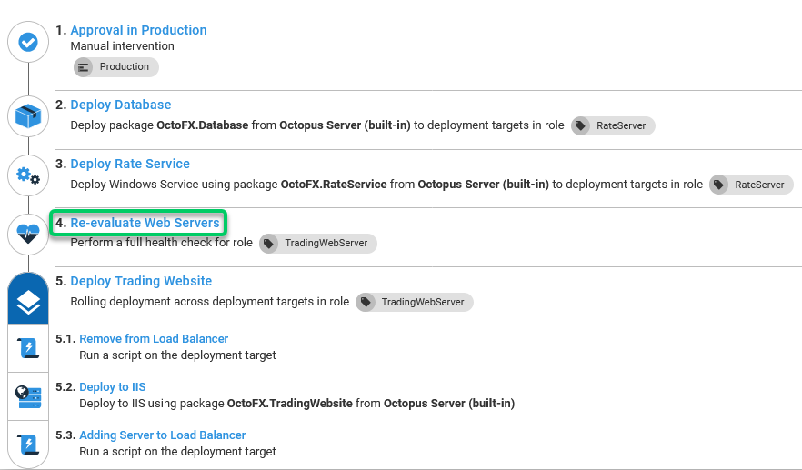

Transient deployment targets are targets that are intermittently available for a deployment.  They frequently join and leave the network causing their deployment availability to become unpredictable. They might be:

- Auto-scale instances that are provisioned and terminated.
- Laptops that are taken home at night.
- Client servers that go down for maintenance.

A typical Octopus deployment requires that all deployment targets are available when the deployment starts and will remain available while the deployment is in progress.  Elastic Environments provides mechanisms for deploying to targets that may become unavailable while a deployment is in progress. You can also run a [health check](/docs/projects/built-in-step-templates/health-check.md) during a deployment, and based on those results opt to add or remove machines from the deployment.

## Deploying to Targets That Become Unavailable During a Deployment {#Deployingtotransienttargets-Deployingtotargetsthatbecomeunavailableduringadeployment}

This example uses the OctoFX project that does a deployment to two roles: **RateServer** and **TradingWebServer**. We have decided to auto-scale the machines in the **TradingWebServer** role and want to continue deploying the web site to the available machines, ignoring any machines that are no longer available, perhaps due to being scaled down.

1. Navigate to the OctoFX project overview page.
2. Select the **Settings** option and expand the **Deployment Target** section.
3. Under *Unavailable Deployment targets* click **Skip** and select the roles that can be skipped, in our example (**TradingWebServer**). If no roles are selected, then any deployment target may be skipped.
4. Create and deploy a release to an environment where deployment targets in the **TradingWebServer** role are unavailable. They will be automatically removed from the deployment.

:::success
To ensure that a machine which has been skipped is kept up to date, consider [keeping deployment targets up to date](/docs/deployments/patterns/elastic-and-transient-environments/keeping-deployment-targets-up-to-date.md).
:::

## Including and Excluding Targets During a Deployment {#Deployingtotransienttargets-Includingandexcludingtargetsduringadeployment}

In this example, OctoFX will deploy to **RateServer** and then run a Health Check step before it deploys to **TradingWebServer**, ensuring that only currently available targets are involved in the deployment.

1. Navigate to the OctoFX project process page.
2. Select **Add Step** and then select **Health check**. For more information about adding a step to the deployment process, see the [add step](/docs/projects/steps/) section.
3. Configure the Health Check step, exclude deployment targets if they are unavailable and include new deployment targets if they are found:

   

4. Save the step.
5. Back at the deployment process, re-order the steps so that the **Health Check** step occurs before the **Trading Website** step.  This will ensure that deployment targets in the **TradingWebServer** role are re-evaluated before the trading web site is deployed:

   

6. Deploy OctoFX to an environment that has some deployment targets in the **TradingWebServer** role that are disabled.  While the deployment is in progress (but before the Health Check step), enable the disabled targets and disable the enabled targets. When the Health Check step runs:

 - Any enabled targets that were disabled at the start of the deployment will be included in the deployment.
 - Any disabled targets that were enabled at the start of the deployment will be excluded from the deployment.

In this case, the machine **SWeb01** has been found and included in the rest of the deployment:

Now that deployment targets can be automatically removed from a deployment, it may be useful to [keep them up to date when they become available.](/docs/deployments/patterns/elastic-and-transient-environments/keeping-deployment-targets-up-to-date.md).

## Learn more

- [Deployment patterns blog posts](https://octopus.com/blog/tag/Deployment%20Patterns).
