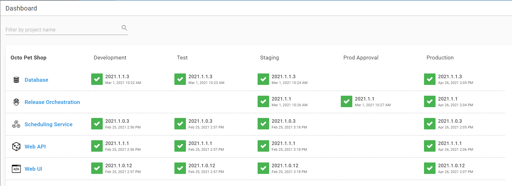

[Lifecycles](/docs/releases/lifecycles/) control the order of promotion of a release through different stages, or environments, in your pipeline.  You can configure a lifecycle to require deployments to **development**, **test**, and **staging** prior to deployments to **production**.  They are also used to set [retention policies](/docs/administration/retention-policies/) (how long releases are saved) at a per environment level.

Lifecycles are shared across an entire space.  A project references lifecycles via [channels](/docs/releases/channels/) and can reference 1 to N lifecycles.

Lifecycles contain 1 to N phases, which represent a stage in your deployment lifecycle.  A phase can have 0 to N environments; for example, you could have a test phase that contains both **development** and **test** environments. Or, you could have a development phase for your **development** environment and a test phase for your **test** environment.  

## Manually set your Phases

A lifecycle with no phases will result in Octopus calculating the phases automatically for you containing all environments.  The order of the phases is dependent on the order of the environments on the environment page.    

:::hint
Every space has a default lifecycle without any phases.  We do this to make it easy to get started with a proof of concept.   
:::

We recommend manually configuring the phases in your lifecycles, including the default lifecycle.  

- No surprises on the order of environments for your release.
- Much more performant, Octopus doesn't have to try to calculate the phases for you.
- Control over which phases are optional and retention policies.

## Number of lifecycles

If you have the typical set of environments, **development**, **test** (or QA), **staging** (or Pre-prod/UAT), and **production**, our recommendation is to have at least two lifecycles.

- Standard lifecycle: {{development,test,staging,production}}
- Emergency lifecycle: {{staging,production}}

Two lifecycles allow you to have your standard workflow, where everything goes to **development** and **test** while having a mechanism to bypass those environments in an emergency bug fix.  

We **_never_** recommend having a lifecycle with only **production**.  Any deployment to **production** must deploy to at least one other environment to verify the fix.  Skipping straight to **production**, especially during an emergency, will make a bad situation worse.

:::hint
A lifecycle with a single phase is an anti-pattern.  Typically we see this when users are strictly adhering to the [gitflow](https://www.atlassian.com/git/tutorials/comparing-workflows/gitflow-workflow) branching strategy.  If you create a new build, that build should be deployed through all environments to ensure it will work in **production**.  
:::

## Production Approval

Octopus Deploy uses the [manual intervention](/docs/projects/built-in-step-templates/manual-intervention-and-approvals/) step for all approvals.  At the time of this writing, that step runs during a deployment.  That requires you to first start the deployment to **production** to approve the deployment in **production**.

We recommend two approaches to **production** approvals.

1. Restrict who can deploy to **production** to your operations or systems admin people.  See [common RBAC scenarios](/docs/getting-started/best-practices/users-roles-and-teams/) on how to set that up.
2. Create a **prod approval** environment and add it to your lifecycle.  An example lifecycle with a **prod approval** environment is {{development,test,staging,prod approval,production}}.

The **prod approval** environment has all the manual intervention steps required for approval.  After the release is "deployed" to the **prod approval** environment, it can then be scheduled for a **production** deployment.  No manual intervention steps will be required in **production** as all approvals happened earlier.

Having a **prod approval** environment for all projects can be a bit tedious.  We recommend creating a release orchestration project with a custom lifecycle.  Only that release orchestration project will go through the **prod approval** environment.

Please refer to this [blog post](https://octopus.com/blog/release-management-with-octopus) for more information about release orchestration projects.

## Automatic and optional phases

Each phase has two different deployment options:

- **Manual:** a release must be manually deployed to this phase.
- **Automatic:** a release is automatically deployed to the phase as soon as it is ready.

An automatic phase is similar to a database trigger; the logic is hidden unless the user knows the visual cue.  If you want to use automatic phases, our recommendation is to make it a standard across all lifecycles.  Or, clearly name the lifecycle to indicate it has automatic phases.  

Each phase can also be required or optional.  

- **Required:** at least one environment must have a successful deployment before the release can proceed.
- **Optional:** the release can skip this phase.

We recommend having at least one required phase before a **production** environment.

:::hint
While possible to configure, you cannot have an optional phase with automatic deployments.  Octopus will ignore the automatic setting, and you will be forced to deploy manually.
:::

## Further reading

For further reading on lifecycles and environments in Octopus Deploy please see:

- [Lifecycles](/docs/releases/lifecycles/)
- [Environments](/docs/infrastructure/environments/)
- [Channels](/docs/releases/channels/)

<a class="btn btn-secondary" href="/docs/getting-started/best-practices/environments-and-deployment-targets-and-roles">Previous</a>&nbsp;&nbsp;&nbsp;&nbsp;&nbsp;<a class="btn btn-success" href="/docs/getting-started/best-practices/worker-configuration">Next</a>
