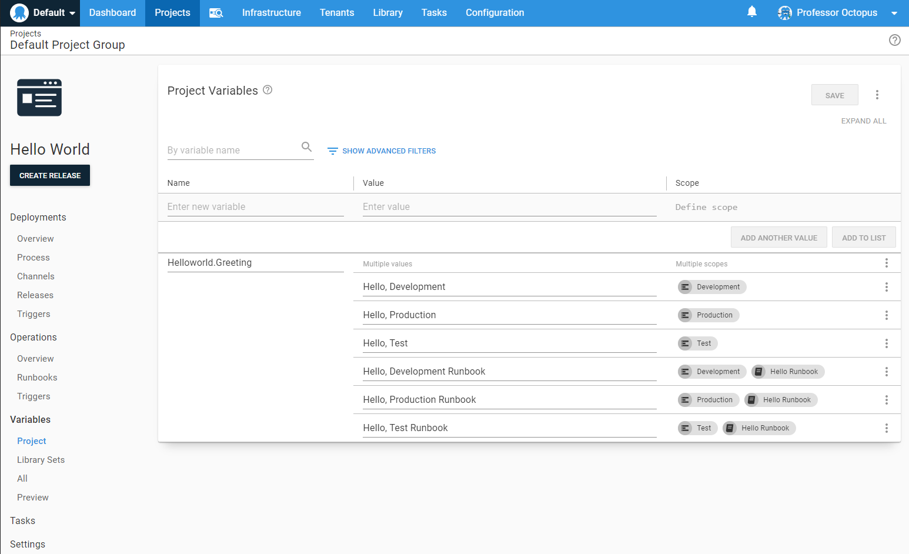
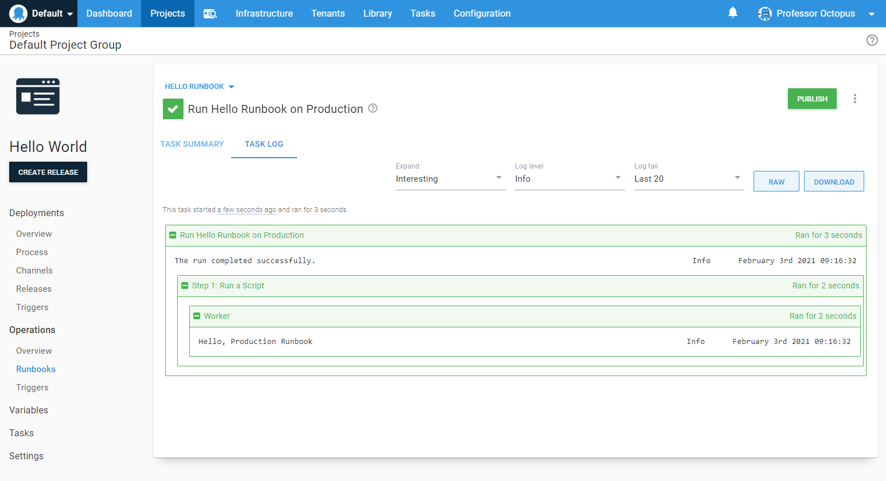

Octopus allows you to define variables and scope them for use in different environments when running a Runbook.  Variables allow you to have a consistent Runbook process across your infrastructure without having to hard-code or manually update configuration settings that differ across environments, deployment targets, channels, or tenants.  In addition to environments, you can scope variables to specific Runbooks.  

1. From the *Hello world* project you created earlier, click **Variables** in the left menu.
1. Enter **Helloworld.Greeting** into the variable name column on the first row of the table.
1. Add **Hello, Development Runbook** into the value column.
1. Click the **Scope** column and select the `Development` environment and *Hello runbook* process.
1. Click **ADD ANOTHER VALUE** button.
1. Add **Hello, Test Runbook** and scope it to the `Test` environment and *Hello runbook* process.
1. Click **ADD ANOTHER VALUE** button.
1. Add **Hello, Production Runbook** and scope it to the `Production` environment and *Hello runbook* process.
1. Click the **SAVE** button.



:::hint
During a runbook run or deployment, Octopus will select the most specifically scoped variable that applies.  In the screenshot above, when running *Hello Runbook* in **Production**, Octopus will select `Hello, Production Runbook`.  When running a different runbook or doing a deployment to **Production**, Octopus will select `Hello, Production`.
:::

Steps in the runbook process can reference the variables.

1. Click **Runbooks** on the left menu.
1. Click *Hello Runbook* in the list of runbooks.
1. Click **Process** in the runbook menu.
1. Select the script step.
1. Change the script in the script step based on your language of choice:

```powershell PowerShell
Write-Host $OctopusParameters["Helloworld.Greeting"]
```
```bash Bash
greeting=$(get_octopusvariable "Helloworld.Greeting")
echo $greeting
```

:::hint
If you are using Octopus Cloud, Bash scripts require you to select the **Hosted Ubuntu** worker pool.  The **Default Worker Pool** is running Windows and doesn't have Bash installed.
:::

6. Click the **SAVE** button.
7. Click the **RUN...** button, select and environment, and run the Runbook.



The next step will [add deployment targets to run runbooks on](/docs/getting-started/first-runbook-run/add-runbook-deployment-targets.md).

**Further Reading**

For further reading on Runbook variables please see:

- [Runbook Variables](/docs/runbooks/runbook-variables/index.md)
- [Runbook Documentation](/docs/runbooks/index.md)
- [Runbook Examples](/docs/runbooks/runbook-examples/index.md)

<span><a class="btn btn-secondary" href="/docs/getting-started/first-runbook-run/running-a-runbook">Previous</a></span>&nbsp;&nbsp;&nbsp;&nbsp;&nbsp;<span><a class="btn btn-success" href="/docs/getting-started/first-runbook-run/add-runbook-deployment-targets">Next</a></span>