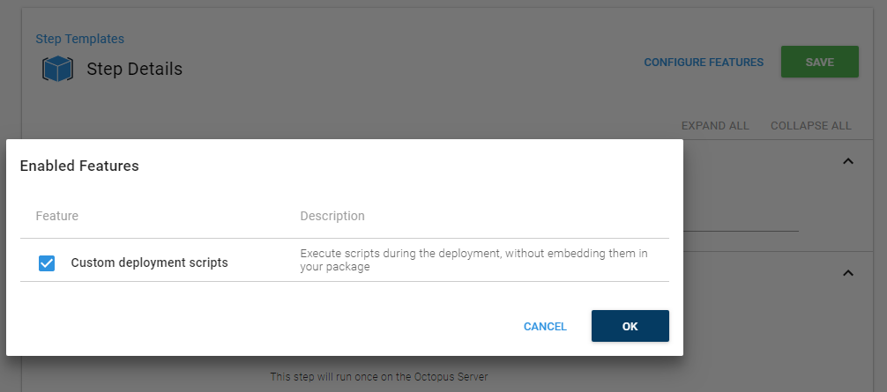

:::hint
Octopus version 2022.1 has support for discovering and cleaning up supported types of deployment targets using tags on cloud resources, please see our documentation on [Cloud Target Discovery](/docs/infrastructure/deployment-targets/cloud-target-discovery/) for more information.
:::

You can use the [Octopus REST API](/docs/octopus-rest-api/) or the Octopus commands below to create Octopus accounts, targets, and workers dynamically. You can make these requests in the same scripts that create your cloud infrastructure or in following steps.

!include <create-deployment-targets-hint>

## Enable dynamic infrastructure

Dynamic infrastructure can be enabled when a new environment is created, or it can be enabled or disabled for existing environments.

1. Navigate to **{{Infrastructure,Environments}}**.
1. Click the ... overflow menu for the environment you want to enable or disable dynamic infrastructure on and select **Edit**.
1. Expand the **Dynamic infrastructure** section and tick or untick the check-box to enable or disable managing dynamic infrastructure.
1. Click **SAVE**.

## Using the Octopus REST API

Octopus comes with a REST API that can be used to register Octopus accounts and deployment targets dynamically:

- [Create an AWS Account](/docs/octopus-rest-api/examples/accounts/create-aws-account/)
- [Create an Azure Service Principal Account](/docs/octopus-rest-api/examples/accounts/create-azure-service-principal/)
- [Add an Azure Web App target](/docs/octopus-rest-api/examples/deployment-targets/add-azure-web-app/)
- [Register a listening Tentacle](/docs/octopus-rest-api/examples/deployment-targets/register-listening-tentacle/)
- [Register a Polling Tentacle](/docs/octopus-rest-api/examples/deployment-targets/register-polling-tentacle/)

To learn more about the things you can do with the API, take a look at our [API examples](/docs/octopus-rest-api/examples/) section.

## Using PowerShell functions

Each of the resource commands is available as a PowerShell function anywhere that a step allows you to run a PowerShell script.

:::hint
Only a subset of account types and deployment targets support being created dynamically using the commands listed below.
:::

### Accounts

- [AWS Account](/docs/infrastructure/deployment-targets/dynamic-infrastructure/aws-accounts/)
- [Azure Service Principal Account](/docs/infrastructure/deployment-targets/dynamic-infrastructure/azure-accounts/)
- [Token Account](/docs/infrastructure/deployment-targets/dynamic-infrastructure/token-accounts/)
- [Username/Password Account](/docs/infrastructure/deployment-targets/dynamic-infrastructure/username-password-accounts/)

### Targets

:::warning
Before you can create dynamic targets in an Environment, the environment needs to be configured to allow it. See [Enabling dynamic infrastructure](/docs/infrastructure/deployment-targets/dynamic-infrastructure/index.md#enable-dynamic-infrastructure) for more information.
:::

- [Azure Web App](/docs/infrastructure/deployment-targets/dynamic-infrastructure/azure-web-app-target/)
- [Azure Service Fabric](/docs/infrastructure/deployment-targets/dynamic-infrastructure/azure-service-fabric-target/)
- [Azure Cloud Service](/docs/infrastructure/deployment-targets/dynamic-infrastructure/azure-cloud-service-target/)
- [Kubernetes Cluster](/docs/infrastructure/deployment-targets/dynamic-infrastructure/kubernetes-target/)
- [AWS ECS Cluster](/docs/infrastructure/deployment-targets/dynamic-infrastructure/new-octopustarget/)
- [Remove Target](/docs/infrastructure/deployment-targets/dynamic-infrastructure/remove-octopustarget/)

### Restrictions

All of the commands will result in an Account or Deployment Target, which will automatically be scoped to the Environment and Tenant (if the deployment is for a tenant).
This cannot be overridden through the commands.

:::warning
These commands are not available in the **Script Console**.
:::

## Using bash functions

Any targets defined by a step package have access to creating that target with a bash script. See the [new-target function documentation](/docs/infrastructure/deployment-targets/dynamic-infrastructure/new-octopustarget/) for further information.

## Examples

### Creating an Azure Web App

Let's say you need to deploy an application to a different Azure Resource Group each time you deploy, one per developer or tester for example. The Resource Group, Application Service Plan, and Web App can all be created through an Azure PowerShell script step, and then the Octopus Target can be created in the same step.

```powershell
# Octopus variables
$environment = $OctopusParameters['Octopus.Environment.Name']
$releaseNumber = $OctopusParameters['Octopus.Release.Number'].Replace(".", "-")
$deploymentId = $OctopusParameters['Octopus.Deployment.Id']

# A unique name based on the Octopus environment, release, and deployment
$uniqueName = "Acme-$environment-$releaseNumber-$deploymentId"

# Create resources in Azure
New-AzureRmResourceGroup -Name $uniqueName -Location "WestUS"
New-AzureRmAppServicePlan -Name $uniqueName -Location "WestUS" -ResourceGroupName $uniqueName -Tier Free
New-AzureRmWebApp -Name $uniqueName -Location "WestUS" -AppServicePlan $uniqueName -ResourceGroupName $uniqueName

# Create new target in Octopus
New-OctopusAzureWebAppTarget -Name $uniqueName -AzureWebApp $uniqueName -AzureResourceGroupName $uniqueName -OctopusAccountIdOrName "my-octopus-azure-serviceprincipal-account" -OctopusRoles "acme-web"
```

### Tearing down a test environment

Building on the Web App example, you may wish to spin up an application and then tear it down at the end of the day. By combining [Recurring Deployments](https://octopus.com/blog/recurring-deployments) and a tear-down script, you can keep your cloud hosting costs down.

Using as little as two lines of PowerShell you can remove all the resources from Azure and Octopus:

```
Remove-AzureRmResourceGroup -Name "AzureWebAppResourceGroup" -Force
Remove-OctopusTarget -targetIdOrName "AzureWebApp"
```

### Deploying an ARM template

You can also use the above PowerShell cmdlets when deploying Azure resources using an ARM template.

Firstly, turn on **Custom deployment scripts** under _Configure Features_ on your _Deploy an Azure Resource Group_ step.



Under the _Features_ section you will have _Pre-deployment_, _Deployment_, and _Post-deployment_ scripts.

In the _Post-deployment_ script section, you can [access the output parameters](/docs/runbooks/runbook-examples/azure/resource-groups/index.md#DeployusinganAzureResourceGroupTemplate-AccessingARMtemplateoutputparameters) and use those output parameters to run any of the cmdlets above.
