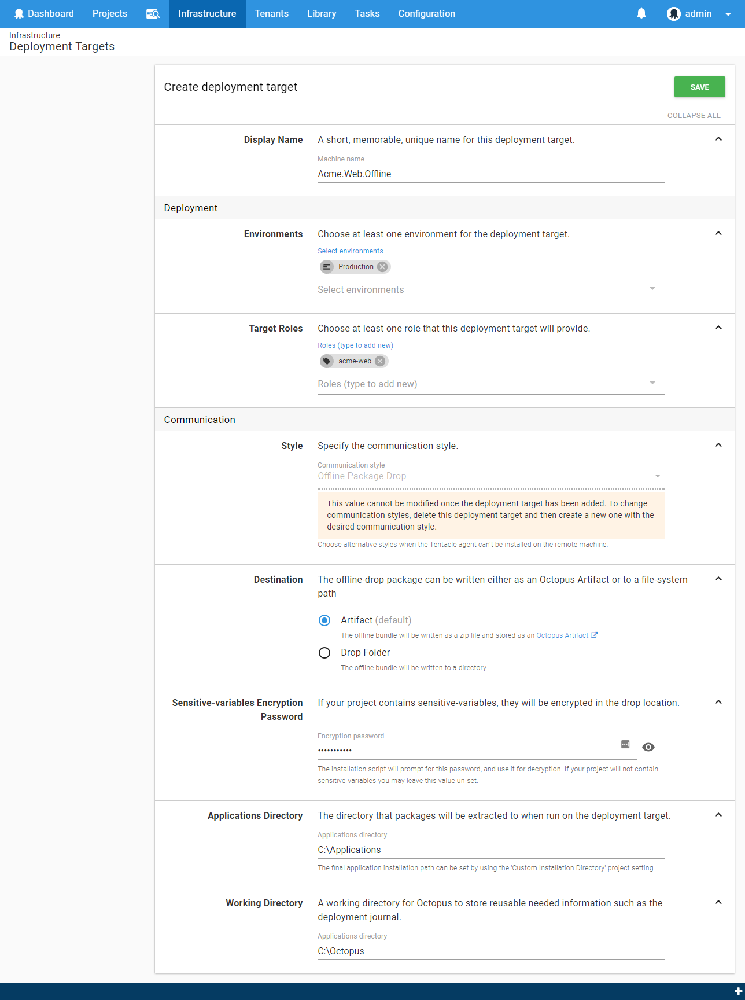

The offline package drop deployment target makes it possible for Octopus to bundle all the files needed to perform a deployment to a deployment target, even when a direct connection to the deployment target isn't always possible, for instance, if a security policy, compliance control, or network topology make a direct connection impossible.

You can treat the offline package drop just like any other target, but instead of the application being deployed Octopus will bundle up all of the files needed to perform the deployment on the *actual* target server.

## Configuring the target {#OfflinePackageDrop-ConfiguringtheTarget}

Offline package drop is available as a deployment target.




### Destination

The executable bundle created when deploying to an offline package drop target can be persisted in one of two modes:

#### Artifact {#OfflinePackageDrop-Artifact}

The bundle can be zipped and attached as an [Octopus Artifact](docs/projects/deployment-process/artifacts.md) to the deployment. It can then be downloaded when required.

:::hint
Octopus Cloud instances will almost certainly want to use _Artifact_ as the destination.
:::

#### Drop folder {#OfflinePackageDrop-Dropfolderpath}

The bundle can alternatively be configured to be written directly to a file-system path.

Configure the drop folder path field with the [UNC path](http://en.wikipedia.org/wiki/Path_%28computing%29#Uniform_Naming_Convention) to the directory you wish your offline packages to be located.

### Sensitive-variables encryption password  {#OfflinePackageDrop-Sensitive-variablesencryptionpasswordSensitive-variablesencryptionpassword}

As a security measure, any sensitive variables are written to a separate file which is then encrypted.  To perform the encryption/decryption, a password is required.  If your project does not contain any sensitive-variables, this field may be left un-set.  If a project is deployed to an offline package drop target which does not have an encryption password set, the deployment will fail with an indicative error.

Please ensure you store your encryption password in a secure location, as you will require it when executing the batch file to perform the deployment on the target server.

### Applications directory {#OfflinePackageDrop-Applicationsdirectory}

The applications directory is the directory your packages will be extracted to, and is the location applications will execute from by default (if no custom-installation-location is set).  On a regular Tentacle, this is set to `C:\Applications` by default.

### Octopus working directory {#OfflinePackageDrop-Octopusworkingdirectory}

The Octopus working directory is a location where some supporting files (e.g. the deployment journal XML file) are stored.

## Building the offline package {#OfflinePackageDrop-BuildingtheOfflinePackage}

When Octopus deploys to an offline package drop target it doesn't actually execute the deployment, but will create a folder structure complete with Packages, Scripts, Variable files, Calamari and a batch file to execute the deployment on the actual target server.

### Naming conventions

#### Artifact destination

When using _Artifact_ for the destination, the zip file will be named

```no format
{{Project Name}}.{{Environment Name}}.{{Offline Drop Target Name}}.{{Release Number}}.zip
```

or if it is a tenanted deployment then

```no format
{{Project Name}}.{{Environment Name}}.{{Tenant Name}}.{{Offline Drop Target Name}}.{{Release Number}}.zip
```

For example

```no format
OctoFX.Production.PWebOffline01.3.3.10827.zip
```

The directory structure inside the zip file will resemble:

```no format
 |   My Offline Drop Target.OctoFX.Deployments-2.cmd
 |   My Offline Drop Target.OctoFX.Deployments-2.ps1
 |   
 +---Calamari
 |   |   Calamari.exe
 |   |   ...
 |           
 +---Packages
 |       OctoFX.TradingWebsite.3.0.298_B47863CDE8E3F24E95873F4B59FE990E.nupkg
 |       
 +---Scripts
 |       Remove from Load Balancer.ps1
 |       Return to load balancer.ps1
 |       
 \---Variables
         My Offline Drop Target.OctoFX.Remove from Load Balancer.variables.json
         My Offline Drop Target.OctoFX.Return to load balancer.variables.json
         My Offline Drop Target.OctoFX.Trading Website.variables.json
```

#### Drop folder destination

An example of the directory structure which will be created when deploying to an offline package drop target configured with a Drop Folder destination is shown below. In this example, the Drop Folder was configured as `\\my-share\octopus-drops`.

```no format
\\my-share
    \---octopus-drops
        \---Development
            \---OctoFX
                \---3.0.298
                    |   My Offline Drop Target.OctoFX.Deployments-2.cmd
                    |   My Offline Drop Target.OctoFX.Deployments-2.ps1
                    |   
                    +---Calamari
                    |   |   Calamari.exe
                    |   |   ...
                    |           
                    +---Packages
                    |       OctoFX.TradingWebsite.3.0.298_B47863CDE8E3F24E95873F4B59FE990E.nupkg
                    |       
                    +---Scripts
                    |       Remove from Load Balancer.ps1
                    |       Return to load balancer.ps1
                    |       
                    \---Variables
                            My Offline Drop Target.OctoFX.Remove from Load Balancer.variables.json
                            My Offline Drop Target.OctoFX.Return to load balancer.variables.json
                            My Offline Drop Target.OctoFX.Trading Website.variables.json

```

The offline package drop will be built and copied into a folder named by this convention:

```no format
    {{YourConfiguredDropFolderPath}}\{{Environment}}\{{ProjectName}}\{{Release}}
```

For example:

```no format
    \\my-share\octopus-drops\Production\Acme.Web\0.1
```

The batch file to execute the deployment will be named with this convention:

```no format
    {{MachineName}}.{{ProjectName}}.{{DeploymentId}}.cmd
```

For example:
`AcmeProductionDrop.Acme.Web.Deployments-1.cmd`

:::success
**Using Sensitive Variables?**
Usually the reason you need to use offline package drop is for some kind of security policy or compliance control. If you indicate any Variables as Sensitive they will be encrypted into a separate variable file so they are protected during transport. When you execute the deployment you will be prompted for the [sensitive-variables password](#OfflinePackageDrop-Sensitive-variablesencryptionpasswordSensitive-variablesencryptionpassword) that will be used to decrypt the sensitive values so they can be used as part of the deployment.
:::

## Deploying the offline package drop {#OfflinePackageDrop-DeployingtheOfflinePackageDrop}

To Deploy the offline package drop simply copy the entire folder for that release to the target server and execute the batch file. This will actually execute the deployment on the target server just like Tentacle would.
