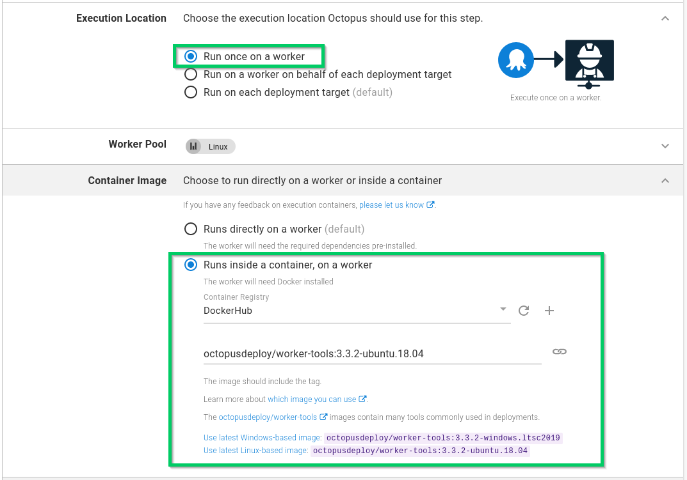

Worker Tools are a set of docker images used as [execution containers for workers](https://octopus.com/docs/projects/steps/execution-containers-for-workers) to run deployment processes. Worker Tools include a wide range of software tools to support most deployment scenarios out of the box. This page focuses on how we create these Worker Tool images, version, cache on workers, and release them.

## Versioning Worker Tools
Worker Tool images follow a semantic versioning (SemVer) approach of `Major.Minor.Patch-Distro` for their tag format. When we release a new version of Worker Tools to the [Worker Tools Docker Hub repository](https://hub.docker.com/r/octopusdeploy/worker-tools/tags), we also add the following image tags, distribution (`ubuntu.22.04` or `windows.ltsc2019`), `Major-Distro` (e.g. `3-Distro`) and `Major.Minor-Distro` (`3.3-Distro`). We recommend using the fully qualified SemVer as patch updates of Worker Tools could result in an updated tool dependency introducing a breaking change.

The Worker Tools Dockerfiles use a combination of tools pinned to specific versions, such as CLI tools and Frameworks, while other tools pull their latest available release. For Ubuntu, these are pulled with apt-get, and for Windows, chocolatey. You can find the full details of these tools in the docker files for [Windows](https://github.com/OctopusDeploy/WorkerTools/blob/master/windows.ltsc2019/Dockerfile) and [Ubuntu](https://github.com/OctopusDeploy/WorkerTools/blob/master/ubuntu.22.04/Dockerfile) Worker Tools.

The tools pulling their latest releases for Ubuntu include `wget`, `python3-pip`, `groff`, `unzip`, `apt-utils`, `curl`, `software-properties-common`, `jq`, `yq`, `openssh-client`, `rsync`, `git`, `augeas-tools`, `maven`, `gradle`, `Node 14`, `istioctl`, `linkerd `, `umoci`.

For Windows these include `chocolatey` and `dotnet 6.0.*`.

If your steps depend on any of these packages, we recommend you target the fully qualified SemVer of Worker Tools. Otherwise, our additional Worker Tools tags may be suitable for your use case. We version our releases as follows:

Major update
* Update of a pinned tools major version
* Any update of a pinned tool with a 0 Major version i.e. `0.*.*`
* Removal of a tool

Minor Update
* Update of a pinned tools minor version
* Addition of a new tool

Patch update
* Update of a pinned tools Patch version
* Any new release, the latest tools will be updated automatically

In short, we recommend using the full `octopusdeploy/worker-tools:Major.Minor.Patch-Distro` tag format. Depending on your use case, the latest releases, `octopusdeploy/worker-tools:ubuntu.22.04` and `octopusdeploy/worker-tools:windows.ltsc2019` respectively or `octopusdeploy/worker-tools:Major-distro`, `octopusdeploy/worker-tools:Major.Minor-Distro` may be suitable for you.

## Caching Worker Tools

Worker Tools are cached on dynamic workers to help improve the performance of deployments. Windows workers cache the latest two sets of Worker Tools while Ubuntu workers cache the latest five.

To understand this cache, it's important to understand a worker's life cycle. Workers are acquired from a dynamic worker pool and leased to a single cloud instance. They are allocated in a round robin fashion to individual deployment steps, storing packages, docker images, and other data on disk. Workers are destroyed after either the worker has been idle for 60 minutes or has existed for 72 hours (3 days). 

When a new worker is acquired, if a new set of Worker Tools has been released, the worker will no longer have the oldest version of Worker Tools, and any other images pulled on the old worker. This is important for the performance of deployments as pull times for uncached Worker Tools are ~1.5 minutes for Ubuntu and ~20 minutes for Windows. We recommend updating to the latest set of Worker Tools available to avoid these pull times. By Caching multiple versions of Worker Tools when using the latest version, any new release of Worker Tools will not result in degraded deployment performance.

To update to the latest set of Worker Tools select the "Use latest Distro-based image" 

## Currently Cached Worker Tools

**Octopus worker-tools cached on Dynamic Workers**
The `octopusdeploy/worker-tools` images provided for the execution containers feature cache the five latest Ubuntu and two latest Windows images on a Dynamic Worker when it's created. This makes them an excellent choice over installing additional software on a Dynamic Worker.

The following Worker Tools images are cached:

**On Linux Workers**:

- `!docker-image <octopusdeploy/worker-tools:ubuntu.22.04>` ([Latest Linux-based image](https://github.com/OctopusDeploy/WorkerTools/blob/master/ubuntu.22.04))
- `!docker-image <octopusdeploy/worker-tools:ubuntu.18.04>` ([Latest Linux-based image](https://github.com/OctopusDeploy/WorkerTools/blob/master/ubuntu.18.04))
- `!docker-image <octopusdeploy/worker-tools:ubuntu.18.04>-1`
- `!docker-image <octopusdeploy/worker-tools:ubuntu.18.04>-2`
- `!docker-image <octopusdeploy/worker-tools:ubuntu.18.04>-3`

**On Windows Workers**:

- `!docker-image <octopusdeploy/worker-tools:windows.ltsc2019>` ([Latest Windows-based image](https://github.com/OctopusDeploy/WorkerTools/blob/master/windows.ltsc2019))
- `!docker-image <octopusdeploy/worker-tools:windows.ltsc2019>-1`

Using non-cached versions of these worker-tools can result in long downloads.

## Learn more

- [Worker blog posts](https://octopus.com/blog/tag/workers)
- [Custom docker images](/docs/projects/steps/execution-containers-for-workers/index.md#custom-docker-images)
