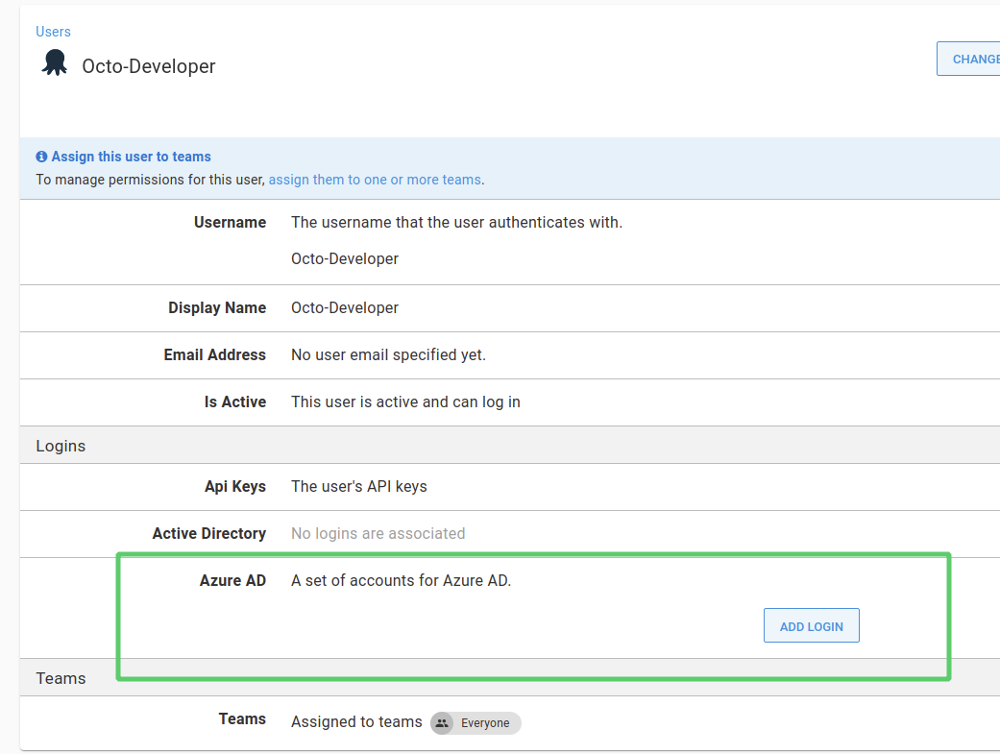

Octopus supports a number of external [authentication providers](/docs/security/authentication/), including [Azure Active Directory Authentication](/docs/security/authentication/azure-ad-authentication.md). If you want to use Azure Active Directory to authenticate but re-use existing Octopus user accounts, the easiest way is to add an Azure AD login:



This script will add Azure Active Directory login details to Octopus user accounts.

## Usage

Provide values for:

- Octopus URL
- Octopus API Key
- A list of users, supplied from either:
    - The path to a CSV file containing user records
    - The Octopus Username, Azure email address and (optionally) Azure display name
- (Optional) whether or not to update the Octopus user's email address
- (Optional) whether or not to update the Octopus user's display name
- (Optional) whether or not to continue to the next user if an error occurs
- (Optional) whether or not to force an update of the Azure AD identity if one already exists
- (Optional) whether or not to perform a dry run (What If?) and not perform any updates
- (Optional) whether or not to toggle debug (Verbose) logging

### Add Azure AD identities to single user

```powershell PowerShell (REST API)
AddAzureADLogins -OctopusURL "https://your.octopus.app/" -OctopusAPIKey "API-KEY" -OctopusUsername "OctoUser" -AzureEmailAddress "octouser@exampledomain.com" -AzureDisplayName "Octo User" -ContinueOnError $False -Force $False -WhatIf $False -DebugLogging $False
```

### Add Azure AD identities for multiple users from CSV file

```powershell PowerShell (REST API)
AddAzureADLogins -OctopusURL "https://your.octopus.app/" -OctopusAPIKey "API-KEY" -Path "/path/to/user_azure_ad_logins.csv" -ContinueOnError $False -Force $False -WhatIf $False -DebugLogging $False
```

### Example CSV file

An example of the expected CSV file format is shown below:

```
OctopusUsername, AzureEmailAddress, AzureDisplayName
OctoUser, octouser@exampledomain.com, Octo User 
```
The first row should be the header row containing the following columns:
 - `OctopusUsername`
 - `AzureEmailAddress`
 - `AzureDisplayName`

### Script

!include <add-azuread-identity-to-users-scripts>
