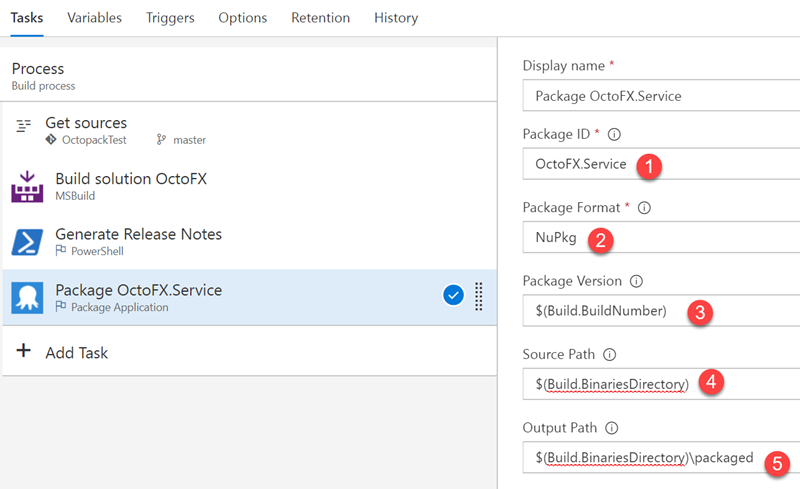
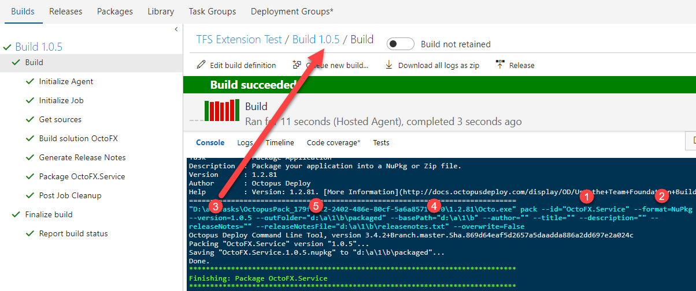

Making your build server work with your deployment server is a key aspect of any successful Continuous Integration (CI) story. For this reason, at Octopus we put a lot of effort in supporting integrations with pretty much any build server technology in the market.

A key player in this story is our command line tool [Octopus CLI](/docs/octopus-rest-api/octopus-cli/). This tool exposes some of the most important functionalities of Octopus through easy commands that can be included in pretty much any process. It was built using `.NET core` so it can be used in Windows, Linux and Mac environments.

If you are reading this doc, odds are you already tried to run an Octopus-related step in your build process and something didn't work the way you expected it. The goal of this document is to explain how all our integration steps work on the background so anyone can troubleshoot them on their own.

## Troubleshooting build steps created by the Octopus Deploy team {#Octopus-Steps}

### What happens when an Octopus Step is executed during the build process {#Octopus-Steps-What-happens-behind}

The Octopus Deploy team supports many of the most popular integration plugins/extensions our there, like the ones for [Azure DevOps/TFS](/docs/packaging-applications/build-servers/tfs-azure-devops/), [Teamcity](/docs/packaging-applications/build-servers/teamcity.md) and [Bamboo](/docs/packaging-applications/build-servers/bamboo/). All the steps provided by these extensions/plugins are nothing but wrappers of the Octopus CLI that provide a UI with fields whose values will be passed to this command line tool during the build.

Lets take for example this TeamCity **Octopus Deploy: Create Release** step:


Each of the values marked on the fields above can be seen in the `octo` call made by the build server later on:


*This is a screenshot of a TeamCity log fragment edited for visual purposes.*

The same holds true for this **Package Application** step in Azure DevOps and its log output:






The bottom line is that every step will in the end call an Octopus CLI command. For the full list of commands [check our documentation](/docs/octopus-rest-api/octopus-cli/).

### Troubleshooting the error {#Octopus-Steps-Troubleshooting-the-error}

As shown in the above screenshots, the exact `octo` command that was executed (and failed) will be printed in the logs. So the best way to troubleshoot that error would be to copy the full command, and try to run it yourself by [downloading the Octopus CLI to your local machine](https://octopus.com/downloads). A few tips and gotchas for this:

- If you are not familiar with the Octopus CLI, then [read our documentation about it](/docs/octopus-rest-api/octopus-cli/). Understanding how the command you are troubleshooting works will be critical for your success.

- Your build server will most likely execute the `octo` command from a build agent machine, which won't be identical to your workstation (mostly network-wise). Keep this in mind when troubleshooting your `octo` command, and if possible always try to run it from the same machine that your build server is using as build agent.

- Each version of our extension/plugin will ship with the latest version of the Octopus CLI at the moment it was created. Perhaps the version of the Octopus CLI used by your current extension version is not the latest, in which case the recommended thing to do would be to upgrade your extension to the latest version available. You can tell which version of the Octopus CLI you are using from the initial line that gets printed by the command:

```
10:38:52     Running command:   octo.exe create-release --server https://demo.octopus.app --apikey SECRET --project OctoFX --enableservicemessages --version 3.3.379 --deployto Dev --progress --packageversion 3.3.379 --releasenotes Release created automatically via TeamCity
10:38:52     Creating Octopus Deploy release
10:38:52     Octopus Deploy Command Line Tool, version 7.4.3264
10:38:52     
10:38:52     Detected automation environment: "TeamCity/2021.1.3"
10:38:52     Space name unspecified, process will run in the default space context
10:38:52     Handshaking with Octopus Server: https://demo.octopus.app
10:38:52     Handshake successful. Octopus version: 2021.2.7660; API version: 3.0.0

```
*In this case we are using `octo` version `7.4.3264` against an Octopus Server version `2021.2.7660`*

- If the version of the Octopus CLI that your build server is using is out of date, and you downloaded that same version and you were able to reproduce the error, try downloading the latest version available of the Octopus CLI and see if you can still reproduce it. You can [download the latest version from the downloads page](https://octopus.com/downloads). It's possible that the bug was already fixed and we only need to ship a new version of the plugin/extension with the fixed Octopus CLI. If that's the case, then [log an issue with our support team](https://octopus.com/support) so we can take care of it.

### Last resource - ask for help {#Octopus-Steps-Ask-for-help}

The Octopus support team will always be there to give you a hand. But do know that the first thing we'll ask you is if you read this guide and followed all the steps on it! If you did and you still couldn't find the error, then [log a ticket in our forum](https://help.octopus.com) and include:

- Version of Octopus Server you are running.
- Name and Version of the build server technology you are using.
- If you can provide the version of the extension/plugin you are using, that'll be great.
- A brief description of the error. We'll be especially interested in knowing what you were expecting from the failed step.
- A full build log that shows the `octo` command.

:::warning
**Keep sensitive info safe!**
Make sure to set the ticket as **private** before attaching any kind of log, as it might contain sensitive info. If you don't know how to set it to **private**, log the ticket without that log and ask us to do it. Once it's done we'll ask you to attach the log.
:::


## Troubleshooting build steps created by non-Octopus-team-members {#Custom-Steps}

If you are using a custom step/plugin/extension to hook up your Build server with Octopus, then all we can recommend you is to know your `octo` game very well.

If you are using a build server technology [that's not in our supported list](/docs/octopus-rest-api/) [share your product feedback](https://roadmap.octopus.com/submit-idea) to let us know how we can help you have happy deployments.
