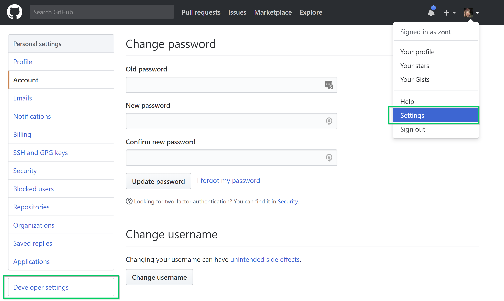
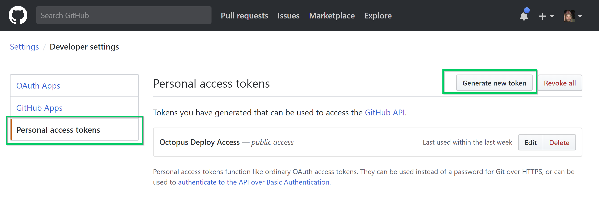
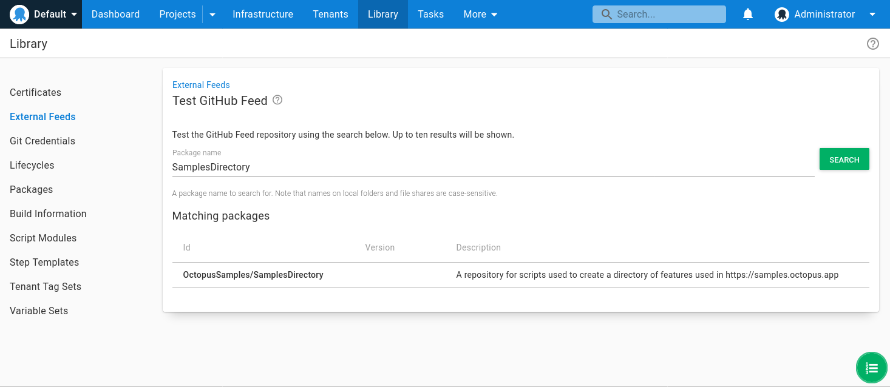
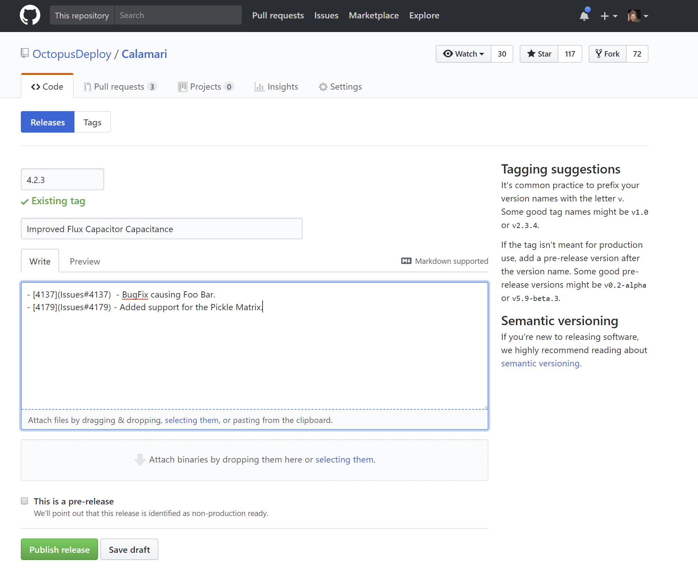
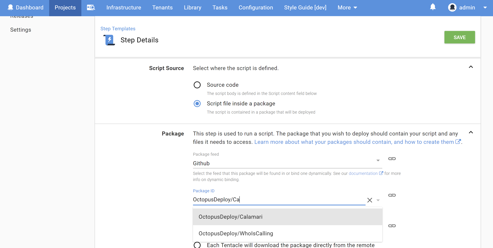

GitHub exposes a set of APIs that allow Octopus to treat it as a feed of packages. In this scenario an Octopus package maps to a specific GitHub repository (e.g the https://github.com/OctopusDeploy/Calamari repository is referred to in Octopus as `OctopusDeploy/Calamari`). Git tags are used to denote [package versions](/docs/packaging-applications/create-packages/versioning.md). Tags that can be parsed as [SemVer 2.0](http://semver.org/spec/v2.0.0.html) can be treated as candidates for an Octopus Deploy release. If a tag is also linked to a specific [GitHub Release](https://help.github.com/articles/about-releases/), then those release notes will be treated as the release notes for the package.

When searching for a package, either through the package selector on a deployment step, or when testing a feed, the package naming scheme allows for several different ways to search through the GitHub repositories.
* `"node"` : Searches for repositories with **any** owner that contain **"node"**.
* `"nodejs/"`: Searches for repositories with **"nodejs"** owner with **any** name.
* `"nodejs/node"`: Searches for repositories with **"nodejs"** owner that contain **"node"**.

## Auth
Only the following authentication methods are supported.
* Anonymous: Under this configuration the username and password fields can be left blank. There are lower request throttle limits when using anonymous authentication so it is generally not recommended.
* Username/Password.
* OAuth2 Token: [Personal access tokens](https://github.com/blog/1509-personal-api-tokens) can be used instead of your password.

If you’re attempting to configure access for your organization, and you would prefer not to use the auth token from a particular user, you can create what GitHub refers to as a [Machine User](https://developer.github.com/v3/guides/managing-deploy-keys/#machine-users). This is effectively a GitHub account configured exclusively for automation.

## Adding a GitHub feed

Create a GitHub package feed through **{{Library,External feeds}}**. You can add as many GitHub feeds as you need. Each can have different credentials if required.

In most cases the `FeedUri` that you will need to provide is the standard public GitHub endpoint `https://api.github.com`. You would only need to provide a different url if you have self hosted GitHub Enterprise (in which case you would provide `https://my-github-repo.com/api/v3`) or if you access GitHub via a proxy.

For authorization, it is recommended that you create a [Personal access tokens](https://github.com/blog/1509-personal-api-tokens) for your account and use this token as the password. Tokens can be created for your GitHub account by logging in to GitHub and navigating to  **{{Settings,Developer Settings,Personal access tokens}}** and click **Generate new token**.





Give the token a meaningful name and enable the **repo** scope if you want to be able to access private repositories from Octopus Deploy.

Copy the token that is generated and use this value as the password for the GitHub feed in Octopus Deploy.

### Testing a GitHub feed

You can check whether the GitHub feed is working by searching for packages. Click the **TEST** button, and you'll be taken to the test page:



:::hint
**Note:** When testing a GitHub Feed, the **Version** field will not be displayed. This is due to the way Octopus queries the GitHub [repository search API](https://docs.github.com/en/rest/reference/search#search-repositories) which doesn't return release tags. This was an intentional decision implemented for performance reasons.
:::

## Using GitHub as a package feed
1. Add your GitHub feed as described above.
2. In the console of your git repository which has a GitHub remote link, create a tag with a SemVer 2.0 compliant version and push this tag to GitHub.

```bash
git tag 1.0.0
git push --tags
```

2. Optionally add release notes to the tagged commit from within GitHub.
(Note additional resources currently do not get included in the Octopus deployment). The pre-release state of a release is also tied to the pre-release component of the tag name.



If Octopus can link a particular version (which in the context of GitHub feeds refers to a tag) to a release, then the release notes will be exposed through the Octopus Deploy portal. At this point in time the `This is a pre-release` check-box on the GitHub Release will be ignored in favor of the pre-release state indicated in the version itself. Additionally, artifacts are not currently retrieved as part of an Octopus deployment, however this may become available in the future.

3. _(Note: Any steps that currently support zips and NuGet packages can also use GitHub as the feed source, but for the purpose of this example we will run a script)_  From within Octopus Deploy, create a project with a [`Run a Script`](/docs/deployments/custom-scripts/run-a-script-step.md#Standalonescripts-Choosingwheretosourcethescript) step. Under `Script Source` check the `Script file inside a package` option. Select the GitHub feed source as the package feed and enter the full name of the repository where the required files are located. In the case of https://github.com/OctopusDeploy/Calamari this would be represented as `OctopusDeploy/Calamari`. Under `Script File` provide the path to the script that you want to run along with any parameters that you want to pass in.

 

 4. When you create a new release Octopus will query the GitHub api to determine the list of tags which can be parsed as SemVer 2 versions. As with standard package feeds the latest version will be selected by default and any [channel version rules](/docs/releases/channels/index.md#Channels-versionrules) will be applied.

5. When the release is deployed and the [package acquisition](/docs/deployments/packages/stage-package-uploads.md) process begins, Octopus will pull down a copy of the repository based on the commit linked to the tag selected as the package version. This artifact is then treated as a zip and is deployed using the standard package deployment rules that applied previously.

## Deployments without a build
This new GitHub feed support is a perfect addition to support your CI processes where a build process to create a package would be unnecessary. It could be a repository that contains just a bunch of scripts or cloud provisioning templates that you want Octopus to execute but that you would prefer to be in source control and where a build process makes no sense. Perhaps you have a simple Node.js project that you just want to deploy directly from your source control without the ceremony of a build and package step. In this case you may want to invoke `npm install` in a [post-deploy script](/docs/deployments/custom-scripts/scripts-in-packages/).
