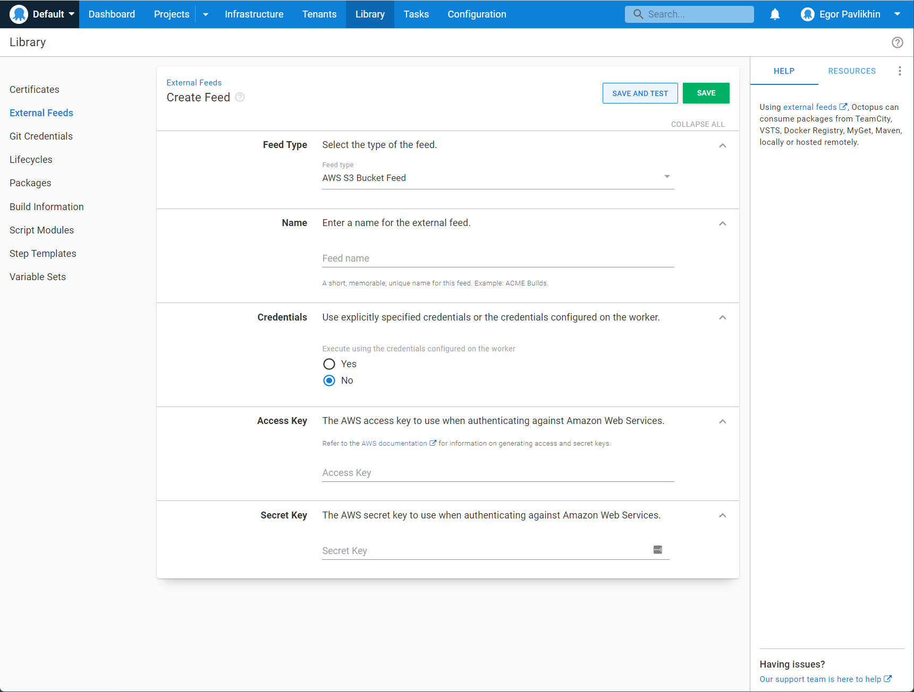
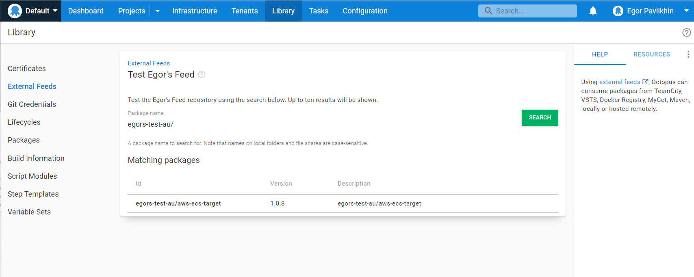

If you are deploying packages located in an S3 bucket you can register them with Octopus and use as part of your deployments. Go to **{{Library,External feeds}}**.

You can add S3 feeds by clicking the **Add feed** button.

You will then need to select if you want to explicitly specify the key and secret to use to connect to your AWS account or to use the account implicitly defined on your Octopus worker (for example in environment variables). Provide a name for the feed then click **Save and test**.

 

The AWS S3 feed will try to connect to the bucket specified as part of the package name. For example, `test-bucket/test-package` will search for the package `test-package` in the `test-bucket` bucket. The account provided as part of the feed configuration must have access to the bucket.

The AWS S3 Bucket feed follows the same [package versioning conventions](/docs/packaging-applications/create-packages/versioning/) as other feeds.

On the test page, you can check whether the feed is working by searching for packages:

## Troubleshooting AWS S3 Bucket feeds

- If you receive an error `Access Denied Exception of type 'Amazon.Runtime.Internal.HttpErrorResponseException' was thrown.` then either:
  - The bucket you are trying to access is not in your AWS account (note that bucket names are globally unique).
  - Your AWS account does not have sufficient permissions to access the bucket.

- Octopus will connect to the bucket via its regional endpoint. If you have a lot of packages in your bucket, consider moving it to the same region where your Octopus Server is located.