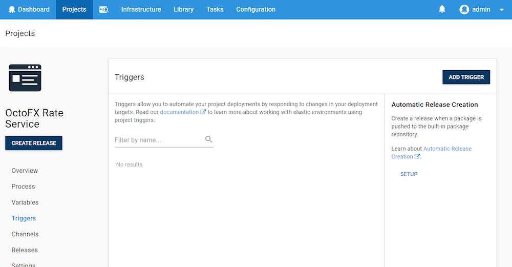
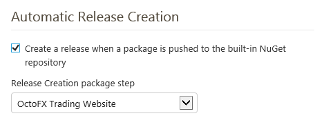

:::hint
**Consider using a build server extension**
We have [extensions/plugins](/docs/packaging-applications/build-servers/index.md) available for the most popular build servers. These extensions will help you [create packages](/docs/packaging-applications/), [push those packages to the built-in repository](/docs/packaging-applications/package-repositories/built-in-repository/index.md#pushing-packages-to-the-built-in-repository), create releases and deploy them to your environments:

 - [AppVeyor](/docs/packaging-applications/build-servers/appveyor/)
 - [Azure DevOps & Team Foundation Server](/docs/packaging-applications/build-servers/tfs-azure-devops/)
 - [Bamboo](/docs/packaging-applications/build-servers/bamboo.md)
 - [BitBucket Pipelines](/docs/packaging-applications/build-servers/bitbucket-pipelines/)
 - [Continua CI](/docs/packaging-applications/build-servers/continua-ci.md)
 - [Jenkins](/docs/packaging-applications/build-servers/jenkins/)
 - [TeamCity](/docs/packaging-applications/build-servers/teamcity.md)

:::

## Getting started {#AutomaticReleaseCreation-Gettingstarted}

If you use the [built-in Octopus package repository](/docs/packaging-applications/package-repositories/), you can now select a package, that when uploaded it will automatically create a release.

:::warning
**Built-in repository only**
External package repositories **cannot be used to automatically create releases**, only the [built-in package repository](/docs/packaging-applications/package-repositories/) is supported.
:::

From the project's trigger tab, under the section called **Automatic Release Creation**, click **Setup**, and then select the package that will trigger the release:

As a project can contain multiple packages you need to select the package that will upload LAST in your build and push CI process. If you have multiple packages, make sure you select the package that is always uploaded last.

When a release is set to be created this way, the audit will tell you that is how the release was created.

If you combine uploading a package with the automatic deployment feature within [Lifecycles phases](/docs/releases/lifecycles/index.md#Lifecycles-LifecyclePhases), you can push a package to the internal repository, create a release, and have it automatically deploy.

:::hint
The release number that is created is guided by the Release Versioning settings under **{{Project,Settings}}**. It will use the rules defined.
:::

## Channels {#AutomaticReleaseCreation-Channels}

You must select the [channels](/docs/releases/channels/) that will be used for any automatically created releases. This means that **only one channel for each project can have an automatic release creation trigger enabled at any one time.** This can be painful, and here are some points you can consider:

- Use one of the [build-server extensions](/docs/packaging-applications/build-servers/), or the [Octopus CLI](/docs/octopus-rest-api/octopus-cli/create-release.md) to create releases instead of using ARC - this will automatically determine the best channel based on the release being created
- Choose the channel that will be used most commonly for automatically creating releases, and create releases manually for the other channels.
- Try creating some releases manually for the selected channel to make sure it works as expected.

## Automatically creating pre-releases {#AutomaticReleaseCreation-Automaticallycreatingpre-releases}

When you push a package to your trigger step, Octopus will look for the latest available package for all other steps **excluding pre-release packages by default** - see [this thread](https://help.octopus.com/t/arc-not-working-with-pre-release-builds/3646) for background.

One way to work around this behavior is to create a Channel with the appropriate version rules so that "latest available package" will be the pre-release packages you expected. The best way to test this is to practice creating releases manually for that channel - the "latest available package" will work the same way for manual and automatically created releases.

## Troubleshooting {#AutomaticReleaseCreation-Troubleshooting}

When you are using automatic release creation there are many reasons why a release may not be created successfully. Take some time to consider the following troubleshooting steps:

1. **Inspect the server logs** for warnings in **{{Configuration,Diagnostics}}** - Octopus will log the reason why automatic release creation failed as errors or warnings.

2. Ensure you are pushing the package to the **built-in package repository** - external package repositories are not supported for automatic release creation.

3. Ensure you have **enabled automatic release creation** for the project based on the **correct package**.

4. When using Channels ensure you have **enabled automatic release creation for the desired Channel**.

5. Ensure you are pushing a **new version** of the package - Octopus will not create a release where the package has already been used for creating a release.

6. Ensure you are pushing a package that Octopus will consider as the **latest available package** - see the section above on [automatically creating pre-releases](#AutomaticReleaseCreation-Automaticallycreatingpre-releases).

7. Ensure the release creation package step **DOES NOT use variables for the PackageId** - Octopus will only create a release where the package is constant.

8. When a release has **multiple packages**, ensure you configure automatic release creation to use the **last package that is pushed to the built-in repository** - otherwise some of the packages required for the release will be missing.

9. When using Channels the package **must satisfy the version rules** for the Channel being used for automatic release creation - try creating some releases manually.

10. Are you pushing **pre-release** packages? See the section above on [automatically creating pre-releases](#AutomaticReleaseCreation-Automaticallycreatingpre-releases).

11. Ensure the account pushing the package has the required permissions for **each** of the **Projects** and **Environments** that will be involved in creating (and potentially deploying) the release. Consider which of the following permissions may be required depending on your circumstances:  

    - `BuiltInFeedPush`  
    - `DeploymentCreate`  
    - `EnvironmentView`  
    - `FeedView`  
    - `LibraryVariableSetView`  
    - `LifecycleView`  
    - `MachineView`  
    - `ProcessView`  
    - `ReleaseCreate`  
    - `VariableView`

## Learn more

Take a look at the [Octopus Guides](https://octopus.com/docs/guides) which covers building and packaging your application, creating releases and deploying to your environments for your CI/CD pipeline.
