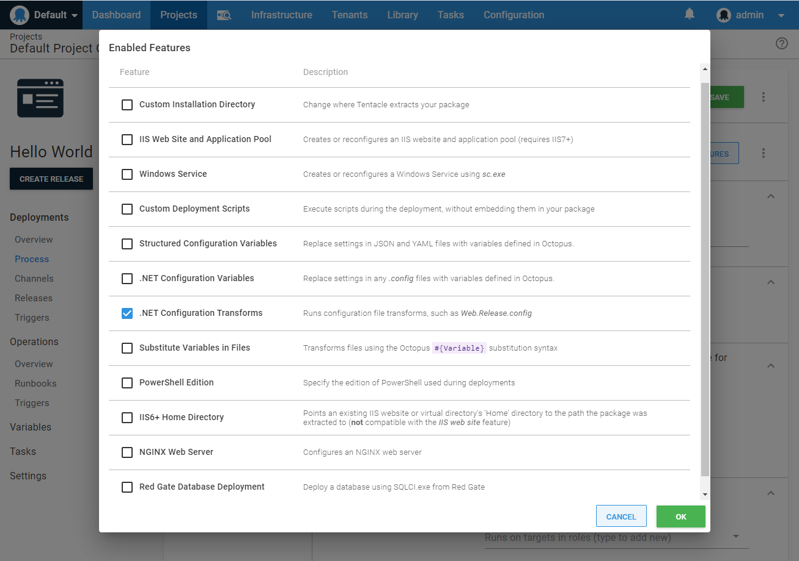
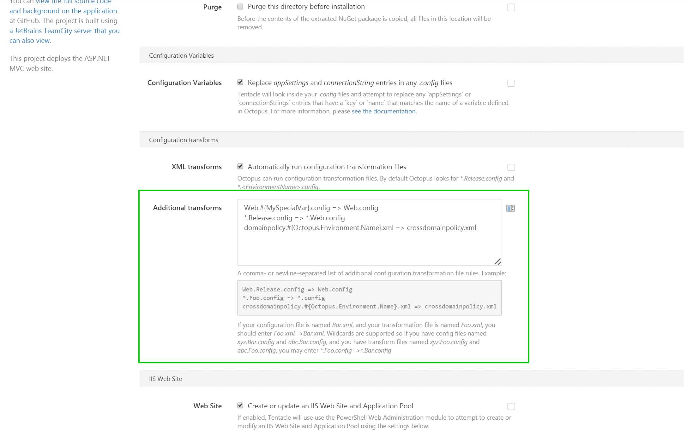

The .NET Configuration Transforms feature is one of the [configuration features](/docs/projects/steps/configuration-features/index.md) you can enable as you define the [steps](/docs/projects/steps/index.md) in your [deployment process](/docs/projects/deployment-process/).

If this feature is enabled, Tentacle will also look for any files that follow the Microsoft [web.config transformation process](https://msdn.microsoft.com/en-us/library/dd465326.aspx) – **even files that are not web.config files!**.



An example web.config transformation that removes the `<compilation debug="true">` attribute is below:

```xml
<?xml version="1.0"?>
<configuration xmlns:xdt="http://schemas.microsoft.com/XML-Document-Transform">
  <system.web>
    <compilation xdt:Transform="RemoveAttributes(debug)" />
  </system.web>
</configuration>
```

:::success
**Testing .NET configuration transforms**
The team at [AppHarbor](https://appharbor.com/) created a useful tool to [help test .NET configuration file transformations](https://webconfigtransformationtester.apphb.com/).
:::

## Naming .NET configuration transform files {#Configurationfiles-Namingconfigurationtransformfiles}

This feature will run your .NET configuration transforms by on looking for transform files named with the following conventions. The .NET configuration transformation files can either be named `*.Release.config`, `*.<Environment>.config`, or `*.<Tenant>.config` and will be executed in this order:

1. `*.Release.config`
2. `*.<Environment>.config`
3. `*.<Tenant>.config`

For an **ASP.NET Web Application**, suppose you have the following files in your package:

- `Web.config`
- `Web.Release.config`
- `Web.Production.config`
- `Web.Test.config`

When deploying to an environment named "**Production**", Octopus will execute the transforms in this order: `Web.Release.config`, followed by `Web.Production.config`.

For **other applications**, like Console or Windows Service applications, suppose you have the following in your package:

- `YourService.exe.config`
- `YourService.exe.Release.config`
- `YourService.exe.Production.config`
- `YourService.exe.Test.config`

When deploying to an environment named "**Test**", Octopus will execute the transforms in this order: `YourService.exe.Release.config`, followed by `YourService.exe.Test.config`.

:::success
You can see how this is actually done by our [open source Calamari project](https://github.com/OctopusDeploy/Calamari/blob/master/source/Calamari.Shared/Deployment/Conventions/ConfigurationTransformsConvention.cs).
:::

## Windows Service and console application .NET configuration transforms need special treatment

Octopus looks for configuration transform files that match your executable's configuration file. Visual Studio has built-in support for this scenario for ASP.NET Web Applications, but it doesn't offer the same support for Windows Services and Console applications, you will need to take care of this yourself.

In Visual Studio your configuration file will be **`app.config`** and is renamed during the build process to match the executable, e.g., The **`app.config`** file for **`YourService.exe`** is renamed to **`YourService.exe.config`**.

To make sure Octopus can run the .NET configuration transforms for your Windows Services and Console Applications:

1. Make sure you name your configuration transform files properly based on the target executable filename e.g., `YourService.exe.Release.config`, `YourService.exe.Production.config`.
2. Set the **Copy to Output Directory** property for the configuration transform files to **Copy If Newer**.
3. Double-check the package you build for deployment actually contains the **`YourService.exe.config`** and all of the expected configuration transform files.


## Additional .NET configuration transforms {#Configurationfiles-AdditionalConfigurationTransforms}

You might have additional transforms to run outside of Debug, Environment or Release. You can define these in the Additional transforms box. If defined, these transforms will run regardless of the state of the `Automatically run .NET configuration transformation files` check-box.



Octopus supports explicit, wildcard and relative path configuration transform definitions on any XML file with any file extension. Octopus will iterate through all files in all directories (ie, recursively) of your deployed application to find any matching files. Your target file also must exist; it will not be created by Octopus.
As a general rule, you should not include the path to the files unless the transform file is in a different directory to the target, in which case it needs to be relative to the target file (as explained below in the relative path scenario). Absolute paths are supported for transform files, but not for target files.

### Explicit {#Configurationfiles-Explicit}

**Explicit .NET configuration transform**

```powershell
Transform.config => Target.config
```

The above transform definition will apply **Transform.config** to **Target.config** when the files are in the same directory.

### Relative path

**Relative path .NET configuration transform**

```powershell
Path\Transform.config => Target.config
```

The above transform definition will apply **Transform.config** to **Target.config** when **Transform.config** is in the directory **Path** relative to **Target.config**.

### Wildcard {#Configurationfiles-Wildcard}

Wildcards can be used to select any matching file. For example, **\*.config** will match **app.config** as well as **web.config**.

They can be used anywhere in the transform filename (the left side), but only at the start of the destination filename (the right side).

**Wildcard .NET configuration transform**

```powershell
*.Transform.config => *.config
```

The above transform definition will apply **foo.Transform.config** to **foo.config** and **bar.Transform.config** to **bar.config**.

**Wildcard .NET configuration transform**

```powershell
*.Transform.config => Target.config
```

The above transform definition will apply **foo.Transform.config** and **bar.Transform.config** to **Target.config**.

**Wildcard .NET configuration transform**

```powershell
Transform.config => Path\*.config
```

The above transform definition will apply **Transform.config** to **foo.config** and **bar.config** when **foo.config** and **bar.config** are in the directory **Path** relative to **Transform.config**.

:::success
If you would like to define the order of all of your transformations, if you list them in the order of transformation inside the Additional transforms feature then Octopus will use that order to run the transforms.
:::

## Suppressing .NET configuration transformation errors {#Configurationfiles-SuppressingConfigurationTransformationErrors}

Exceptions that are thrown by the Microsoft .NET configuration transformation process will be treated as errors by Octopus, failing the deployment. This typically involves explicit transformations for elements that don't exist in the source .config file and will surface with errors similar to the below:

```
Warning    14:56:06
(31:18) Argument 'debug' did not match any attributes
Error    14:56:06
Object reference not set to an instance of an object.
System.NullReferenceException: Object reference not set to an instance of an object.
   at Microsoft.Web.XmlTransform.XmlTransformationLogger.LogWarning(XmlNode referenceNode, String message, Object[] messageArgs)
   at Microsoft.Web.XmlTransform.RemoveAttributes.Apply()
   at Microsoft.Web.XmlTransform.Transform.ApplyOnAllTargetNodes()
Fatal    14:56:06
One or more errors were encountered when applying the .NET XML configuration transformation file: e:\Octopus\Applications\MyEnv\MyApp\1.0.0.1234\Web.Release.config. View the deployment log for more details, or set the special variable Octopus.Action.Package.IgnoreConfigTranformationErrors to True to ignore this error.
```

To suppress these errors and report them as informational only, use the `Octopus.Action.Package.IgnoreConfigTransformationErrors` variable defined in the [System Variables](/docs/projects/variables/system-variables.md) section of the documentation.

## PowerShell {#Configurationfiles-PowerShell}

If these conventions aren’t enough to configure your application, you can always [use PowerShell to perform custom configuration tasks](/docs/deployments/custom-scripts/). Variables will be passed to your PowerShell script, and PowerShell has [rich XML API's](https://www.codeproject.com/Articles/61900/PowerShell-and-XML).
