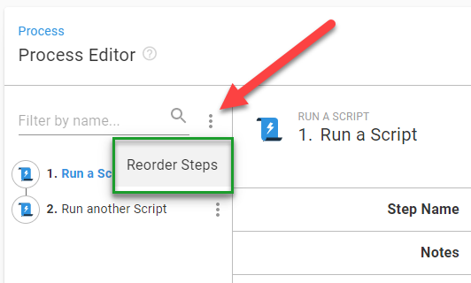
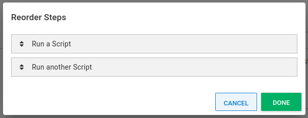
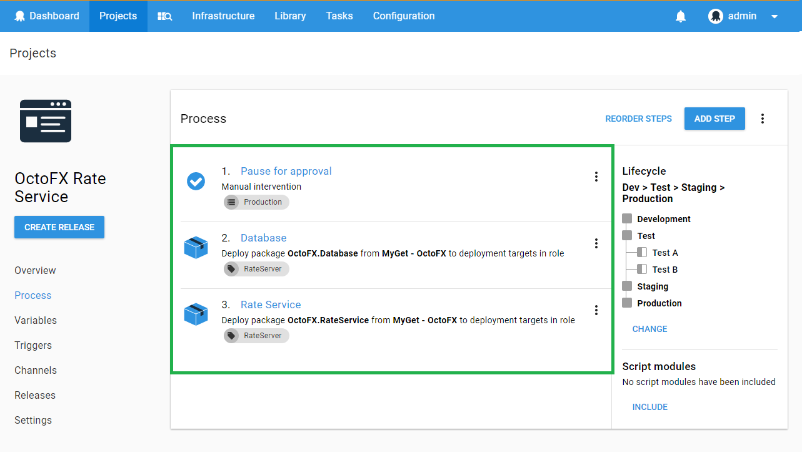

Steps contain the actions your deployment process will execute each time you create a release of your software to be deployed. Steps can contain multiple actions and deployment processes can include multiple steps. Steps are executed in sequence by default or you can configure [conditions](/docs/projects/steps/conditions/) to control where and when steps run.

Octopus includes [built-in step templates](/docs/projects/built-in-step-templates/) that have been developed by the Octopus team to handle the most common deployment scenarios. In addition to the built-in step templates, there are also [Community Step Templates](/docs/projects/community-step-templates.md) that have been contributed by the community. You can also use the built-in step templates as the base to create [custom steps templates](/docs/projects/custom-step-templates/) to use across your projects.

!include <add-step-to-process>

## Reordering steps

To reorder steps in a deployment or runbook process:

1. Click into a step in the process.
1. Click on the overflow menu (...) next to the **Filter by name** text box.
1. Select the **Reorder Steps** option. 

    
1. This will open a drag and drop pane to sort your steps in the desired order.

    

## Example: A simple deployment process

In the example shown below there are three steps that will be executed from top to bottom. The first is a [manual intervention](/docs/projects/built-in-step-templates/manual-intervention-and-approvals.md) which executes on the Octopus Server pausing the deployment until someone intervenes and allow the deployment to continue. This step will only execute when targeting the Production [environment](/docs/infrastructure/environments/index.md). The remaining steps both [deploy a package](/docs/deployments/packages/index.md) and execute [custom scripts](/docs/deployments/custom-scripts/index/) on all of the [deployment targets](/docs/infrastructure/) with the [role](/docs/infrastructure/deployment-targets/index.md#target-roles) **web-server**.

## Example: A rolling deployment process

Let's consider a more complex example like the one shown below. In this example we have configured Octopus to deploy a web application across one or more servers in a web farm behind a load balancer. This process has a single step and three actions which form a [rolling deployment](/docs/deployments/patterns/rolling-deployments/).

