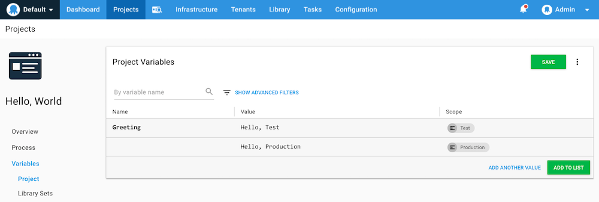
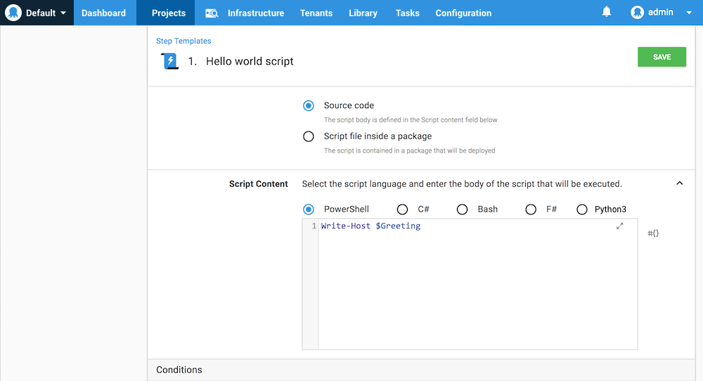
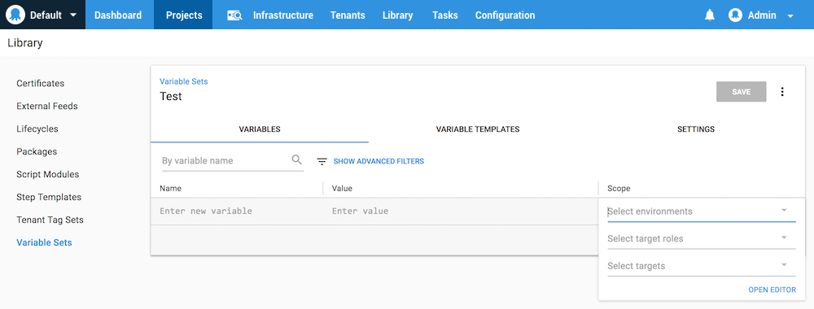
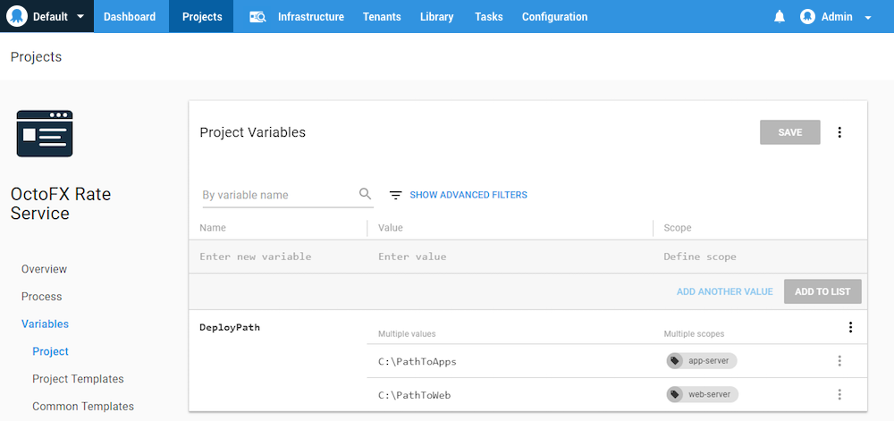
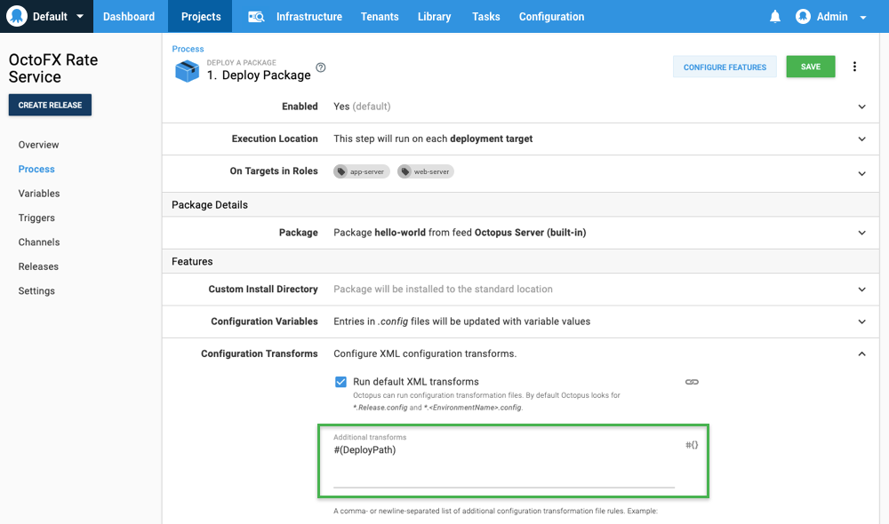

!include <variables>

## Creating hello world variables {#example}

In this example, we'll add a variable to a Hello World project that runs a script to say hello. The project uses the variable to vary the message it displays based on the environment the script is deployed to.

1. To add a variable to your [project](/docs/projects/index.md), navigate to the Project's Overview page, and click **Variables** to access the variable editor.
2. Give the variable a name, for instance, *Greeting*.
3. Enter the first value for the variable, for instance, *Hello, Test*, in the value field.
4. Define the scope for the value, for instance, by selecting the *Test* environment.
5. Click **ADD ANOTHER VALUE** and enter the second value for the variable, for instance, *Hello, Production*.
6. Define the scope for this value, for instance, by selecting the *Production* environment.



7. Save the variable by clicking **SAVE**.
8. In this example, we'll reference this variable from a **Run a Script** step.
9. Define your step (Click **{{Process,ADD STEP,Run A Script}}**) and in the **Script Content** section, enter the following PowerShell script into the script editor:

​```
Write-Host
​```

10. Select the variable *Greeting* from the insert variable tool (**#\{\}**) next to the script editor, and click **SAVE**.



When a release of the project is deployed, the script step will run with the string *Hello, Test* on the Test environment, and with the string *Hello, Production*, on the Production environment.

## Scoping variables {#scoping-variables}

The variables that you define for your projects in Octopus can be scoped in the following ways:

- Environments (most common).
- Deployment targets.
- Target roles.
- Deployment steps.
- Channels.
- Tenants.
- Deployment Process or Runbook Process.

Scoping the values of your variables lets you determine which values will be used in which situations. For example, suppose this variable exists:

| Name | Value | Environment scope |
| --- | --- | --- |
| LogLevel | Info |  |
| LogLevel | Warn | Production, Staging |

During deployment, Octopus will try to select the most specifically scoped variable that applies. For example, when deploying to Production and Staging, the *LogLevel* value will be *Warn*, but to any other environment, it will fall back to the less-specific variable and have a value of *Info* instead.

### Assigning scopes {#Scopingvariables-Assigningscopes}

You can set the scope of a variable values when you are creating or editing your variables, either from the **variable** section of the project, or in the **Variable Sets** section of the Library; however, when you assign scope to variables that are part of a library **variable set**, the variables cannot be scoped to deployment steps or channels.



### Using multiple scopes

You can scope the values of your variables in multiple ways. For instance, you might scope a value to both the **Dev** and **Test** Environments, and to a step within your process.

When the process runs, Octopus will use the scoped value for the **Dev** OR **Test** environments, AND the steps the value was scoped to.

| Variable | Value | Scope |
| -------- | ----- | ----- |
| MyVariable | Scoped | Environment: Dev, Test; Steps: Step 1 |
| MyVariable | unscoped |  |

With the above *MyVariable* variable, the scoped and unscoped values will be implemented as follows:

| | Step 1 | Step 2|
| ---- | ---- | ---- |
| Dev Environment | Scoped | Unscoped |
| Test Environment | Scoped | Unscoped |
| Stage Environment |  Unscoped | Unscoped |

### Scope specificity {#Scopingvariables-Scopespecificity}

Imagine you have one variable scoped to an environment (Production), and another scoped to a machine within the environment. Which value should Octopus choose?

Since variables can be scoped in many different ways, there needs to be a predictable, deterministic order in which they are resolved. The list below is the priority in which variable scopes take precedence. The top items are higher priority than the bottom ones:

1. The current step/action (most specific).
1. The current machine.
1. Roles applied to the current machine and targeted by the current step.
1. Roles applied to the current machine.
1. The target tenant (if tenant-features are enabled).
1. The target tenant-tag (if tenant-features are enabled).
1. The target environment.
1. The target channel (if channels are enabled).
1. The current deployment process or runbook process.
1. The project.
1. No scope (least specific).

For example, a **LogLevel** variable with a value scoped to to a machine role is considered by Octopus to be more specific than a value scoped to an environment. So when two possible values for a variable exist, Octopus will choose the "more specific" scope value over the less specific one.

Variable scoping also works like CSS rules; a value scoped twice is more specific than a value scoped once. For example, a variable scoped to an environment and a role is more specific than a variable scoped to just a role.

If two variables are scoped equally, Octopus will choose project-defined variables ahead of library-defined ones. If this still does not resolve the conflict the result is non-deterministic and you should not depend on a specific value being used. Instead, you should take care when scoping variables so that they are unlikely to conflict.

### Mutually exclusive scopes {#Mutuallyexclusive-scopes}

Scopes of the same type can generally be thought of as a grouping of logical OR expressions while scopes of different types evaluate as AND expressions between the groups of scopes. As an example, a variable scoped to the `Development` environment, `Production` environment as well as the `Default` channel would evaluate as `(Development OR Production) AND (Default)`. This example results in a specific scope which requires a channel in order for the variable to evaluate. This means that the variable will not be usable in the context of a runbook as channels do not apply in this context.

There are two distinct scoping scenarios which need to be explicitly called out, one of which we encountered above, these are:

* Scoping to both a channel as well as a runbook process
* Scoping a deployment process action as well as a runbook process

:::hint
Mutually exclusive scopings can generally be avoided by duplicating variable values and scoping appropriately for each value if needed.
:::

### Scoping variables to target roles

Variables can also be scoped to specific [target roles](docs/infrastructure/deployment-targets/index.md#target-roles). This means that the variable will take the specified value only when it is used on a deployment step that runs on a deployment target with the specified role. This feature can be really handy when you want to use the same variable name multiple times and have their values changed depending on the target they are running on.

Let’s say you have the following targets with their respective roles:

| Target   | Role       |
| ---------- | ---------- |
| Target 1 | app-server |
| Target 2 | web-server |

You want to deploy the same package on each server but the deployment path will be different between servers. In this case you can set the same variable (we’ll call it *DeployPath*) with a different value for each target role:



Then, on your deployment step, you can set the **[Custom Install Directory](/docs/projects/steps/configuration-features/custom-installation-directory.md)** to `#{DeployPath}`.



### Variables and permissions

When applying permissions on variables via scopes, the only options that are checked against permissions are Environments, Targets and Tenants.

## Variable casing

It's important to understand how Octopus treats variables with regard to case sensitivity:
- Variable names are **case insensitive**. 
- Variable contents are by default **case insensitive**. You can alter this behavior by using either the `ToLower` or `ToUpper` [variable filters](/docs/projects/variables/variable-filters.md).

If you are using the [Structured configuration variables](/docs/projects/steps/configuration-features/structured-configuration-variables-feature.md) feature, variable names are matched in a **case insensitive** way.

## Variable Recommendations

### Group variables into Variable Sets

Variables sometimes naturally fit into groups, and often you'll find multiple applications will use these groups.  Octopus has [Variable Sets](/docs/projects/variables/library-variable-sets.md); allowing you to group variables into a reusable set so that they can be used by other projects.

### Namespace variables

We recommend namespacing your variables to make identifying their use clearer.  Examples of how this can work are:

* A project-level variable that holds the value for a SQL Server user's password could be `Project.SQL.Password`.  Then you can have `Project.SQL.Username`.  This adds clarity to the variable's value and has the added advantage that the variables will show next to each other in the list of variables.
* If you are using [Variable Sets](/docs/projects/variables/library-variable-sets.md), use the set name as the first part of the variable name.  A variable that holds an RSS feed URL in the set **Global** can be named `Global.RSSFeed.Url`.  

### Keep variable numbers low 

If you have many configuration settings for your application and are using a variable for each value, it's possible that Octopus may not be the best place for those values. Consider:

- Are most settings relatively static?
- Are the settings safe to be stored in clear text as they don't hold a sensitive value?

If the answer to either of those questions is yes, it might be worth considering an external store for your variables; a source control repository, a configuration management system, or a database.

## Learn more

- [Variable blog posts](https://octopus.com/blog/tag/variables)
- [Using variables in your scripts](/docs/deployments/custom-scripts/index.md) 
