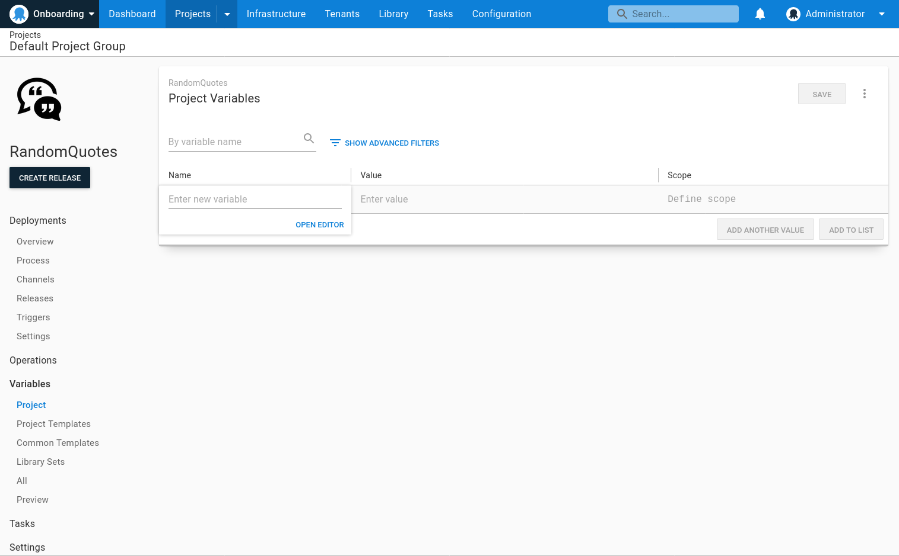
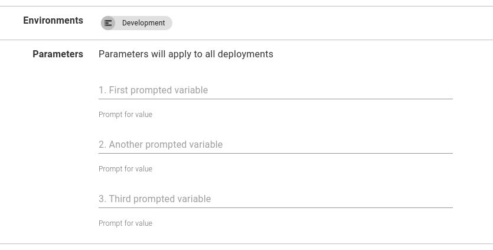

As you work with [variables](/docs/projects/variables/) in Octopus, there may be times when the value of a variable isn't known and you need a user to enter the variable at deployment time. Octopus can handle this using **Prompted variables**.

## Defining a prompted variable {#Promptedvariables-Definingapromptedvariable}

To make a variable a **prompted variable**, enter the variable editor when creating or editing the variable. On any of the variable fields, click **OPEN EDITOR**:



When defining a prompted variable, you can provide a friendly name and description, and specify if the value is required. A required variable must be supplied when the deployment is created and must not be empty or white space.


You can identify prompted variables by looking for the icon next to the value:


:::hint
You can select one of several different data types. This controls the user interface provided to collect the variable value, and determines how the variable value is interpreted. Note the variable values will be stored and interpreted as text. Control type options are:
- Single-line text box
- Multi-line text box
- Drop-down
- Checkbox
:::

## Providing a value for the variable {#Promptedvariables-Providingavalueforthevariable}

When deploying (not creating a release), you'll be prompted to provide a value for the variable:


These variables will be ordered alphabetically by label (or name, if the variable label is not provided).

A value can also be passed to a prompted variable when using the Octopus CLI through the `--variable` parameter of the [Deploy-Release](/docs/octopus-rest-api/octopus-cli/deploy-release.md) command, or the [Create-Release](/docs/octopus-rest-api/octopus-cli/create-release.md) command when also deploying the release with the `--deployto` parameter.

```bash
octo deploy-release ... --variable "Missile launch code:LAUNCH123" --variable "Variable 2:Some value"
```

:::hint
Prompted variables can be combined with [sensitive variables](/docs/projects/variables/sensitive-variables.md). They will appear with a password box when creating the deployment. They can also be combined with [Azure Account variables](/docs/projects/variables/azure-account-variables.md), [AWS Account variables](/docs/projects/variables/aws-account-variables.md), [Certificate variables](/docs/projects/variables/certificate-variables.md), and [Worker Pool variables](/docs/projects/variables/worker-pool-variables.md), passing in the ID, e.g. `WorkerPools-1`.
:::

## Restricting a prompted variable for runbooks

By default, a prompted variable will prompt when deploying a release and when executing any runbooks in the project.

Prompted variables can be [scoped to specific processes](/docs/runbooks/runbook-variables/index.md#prompted-variables), causing them to only be shown when deploying releases, or only when executing runbooks.

## Prompted variable ordering

When Octopus renders prompted variables for a deployment or runbook, they are sorted alphabetically by the prompted variable label. If you want to customize the order in which the variables appear, one option is to include a numerical prefix in the label:



## Learn more

- [Variable blog posts](https://octopus.com/blog/tag/variables)
