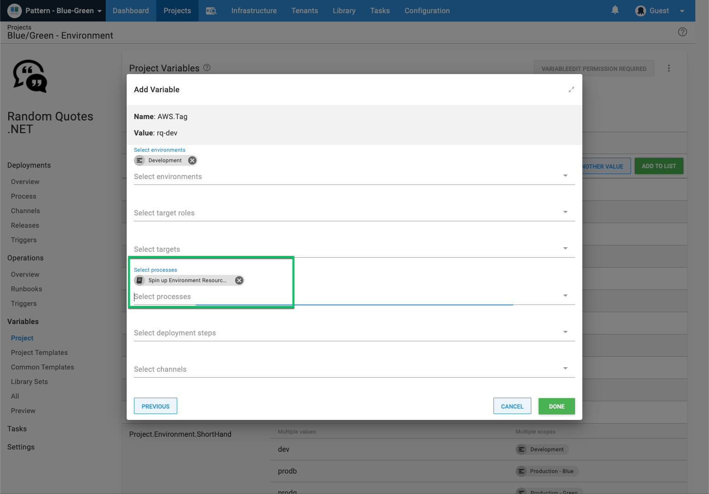

!include <variables>

## Variables in runbooks

A project's variables are available to both the runbooks and the deployment process, and the process for consuming variables is the same (see [an example](/docs/projects/variables/index.md#example)). 

### Variables specific to a runbook 

There are scenarios where a variable may be specific to a runbook, and you don't want it to be available to other runbooks or the project's deployment process (this situation is common for [prompted variables](#prompted-variables)).  

Variables can be scoped to specific runbooks, or to the deployment process, by navigating to **{{Project, Variables}}**, adding a new variable, and defining the scope.  On the scope dialog, there is a **Processes** field, which when populated restricts the variable availability to only the selected runbooks or deployment process.

## Prompted variables in runbooks {#prompted-variables}

[Prompted variables](/docs/projects/variables/prompted-variables.md) can be defined for runbooks. By default, prompted variables will prompt for the value when deploying or when running a runbook.  By [scoping prompted variables](#Variables-specific-to-a-runbook) to one or more processes, they can be restricted to only prompt when deploying or for specific runbooks. 

## Runbooks variables in Git projects
When snapshotting a Runbook in a Git project, the variables will always be taken from the default branch. The Git reference and commit that was used to create the snapshot is shown on the Runbook snapshot page.

To use a different branch to snapshot variables, you will need to change the default branch for the project.