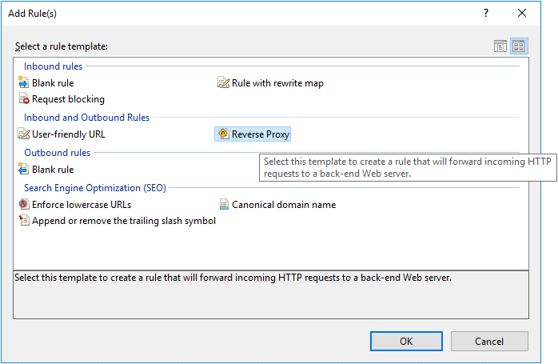
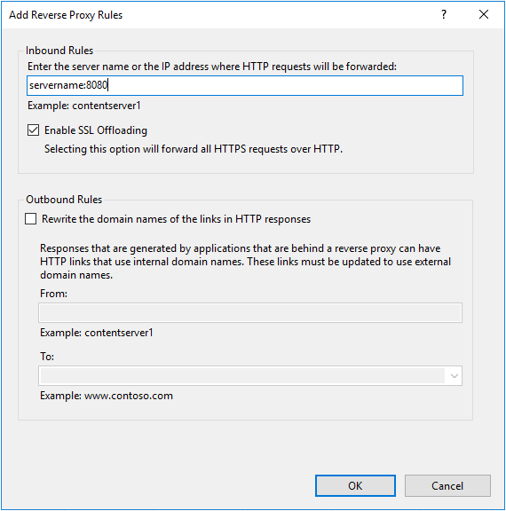

There are scenarios in which you may be required to run Octopus Deploy behind a reverse proxy, such as compliance with specific organization standards, or a need to add custom HTTP headers. This document outlines how to use Microsoft's Internet Information Services (IIS) as that reverse proxy, using [URL Rewrite](https://www.iis.net/downloads/microsoft/url-rewrite) and [Application Request Routing](https://www.iis.net/downloads/microsoft/application-request-routing) (ARR).

This example assumes:

- IIS will terminate your SSL connections.
- [Polling Tentacles](/docs/infrastructure/deployment-targets/tentacle/tentacle-communication.md#polling-tentacles) are not required.

Our starting configuration:

- Octopus Deploy installed and running on <http://servername:8080/>
   For guidance on this topic, see [Installing Octopus](/docs/installation/).
- Valid SSL certificate installed in the Local Certificate store.
   For guidance on this topic, please follow [Importing your SSL certificate](/docs/security/exposing-octopus/expose-the-octopus-web-portal-over-https.md#ExposetheOctopuswebportaloverHTTPS-ImportingyourSSLcertificate).
- IIS Management Console installed.
   For guidance on this topic, please follow [this Microsoft Docs article](https://docs.microsoft.com/en-us/iis/install/installing-iis-85/installing-iis-85-on-windows-server-2012-r2).

At the end of this walk-through, you should be able to:

- Communicate with Octopus Deploy over a secure connection.
- Set and verify a custom HTTP header with IIS.

## Install URLRewrite and ARR

URLRewrite and Application Request Routing are provided by the [Microsoft Web Platform Installer](https://www.microsoft.com/web/downloads/platform.aspx). After installing the Web Platform Installer, search for "URL Rewrite" and "Application Request Routing", and install.

Alternatively, use the following PowerShell snippet:

```powershell
$downloadUrl = "https://download.microsoft.com/download/8/4/9/849DBCF2-DFD9-49F5-9A19-9AEE5B29341A/WebPlatformInstaller_x64_en-US.msi"
$downloadtarget = ([uri]$downloadUrl).segments | select -last 1
Invoke-WebRequest $downloadUrl -OutFile $env:tmp\$downloadtarget
Start-Process $env:tmp\$downloadtarget '/qn' -PassThru | Wait-Process
Set-Location ($env:ProgramFiles + "\Microsoft\Web Platform Installer")
.\WebpiCmd.exe /Install /Products:'UrlRewrite2,ARRv3_0' /AcceptEULA /Log:$env:tmp\WebpiCmd.log
```

## Configure SSL on default web site

1. Open the IIS Management Console (`inetmgr.exe`).
1. Navigate to the Default Web Site.
1. In the action pane, click on **Bindings**.
1. Click **Add**.
1. Select **https**.
1. A drop-down box will appear with your installed certificates displayed.
1. Select your installed certificate. If you don't see your certificate listed, refer back to [this MSDN Article](https://msdn.microsoft.com/en-us/library/ff720335.aspx).
1. Optional: Fill in your correct IP address and/or hostname, and click **OK**.
1. Optional: Remove the HTTP (non-SSL) binding - this is a recommended security practice.

## Verify SSL is correctly configured

In a web browser, navigate to <https://servername> (note the 's').

You should see the IIS default page displayed in your browser.


## Configure URLRewrite

:::success
After installing URLRewrite and ARR, you may need to restart IIS and/or the IIS Management Console to ensure that the URLRewrite icon appears correctly
:::

Open the IIS Management Console (`inetmgr.exe`).

Navigate to the Default Web Site.

Click on the URLRewrite icon to bring up the URLRewrite interface.

In the action pane, click on "Add Rule(s)".

Under "Select a Rule Template", choose "Reverse Proxy".

.

If you have never enabled reverse proxy functionality before, you'll be prompted to enable it.

In the "Add Reverse Proxy Rules" dialog, specify the URL of your backend Octopus Server in "Inbound Rules". In our example, this is `servername:8080`.

Select "Enable SSL offloading".

Click OK.



:::success
There is no need to specify outbound rules, as the Octopus Portal always uses relative links.
:::

Click OK and close down all dialogs.

You should now be able to navigate to https://servername/ in your browser and log in to Octopus Deploy.

:::warning
**Polling Tentacles are not supported with this scenario**
Polling Tentacles communicate with the Octopus Server over an end-to-end encrypted channel. This solution does not currently support polling Tentacles.
:::

## Example: Add a custom HTTP header in IIS

Open the IIS Management Console (`inetmgr.exe`).

Navigate to the Default Web Site.

In the Main window, navigate to "HTTP Response Headers".

In the action pane, click "add".

In the dialog, enter the following.

- Name: `x-octopus-servedby`
- Value: `IIS`

Click OK.

## Verify the custom HTTP header

Open a PowerShell prompt.

Type the following command (replacing 'servername' as appropriate):

```powershell
Invoke-WebRequest https://servername | select -expand Headers
```

You should see your `x-octopus-servedby` header listed in the returned headers.
