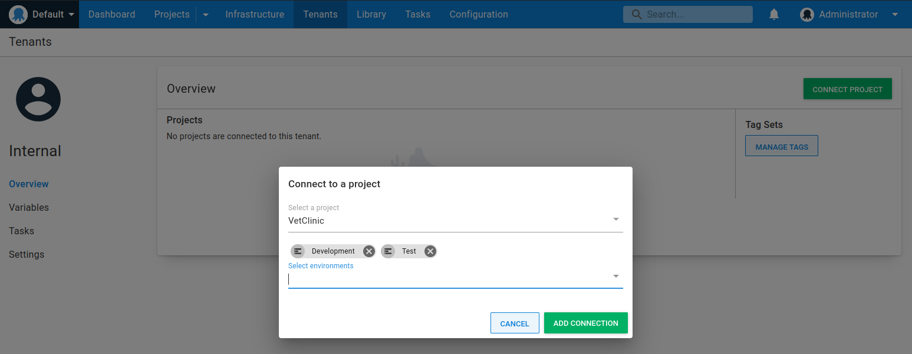
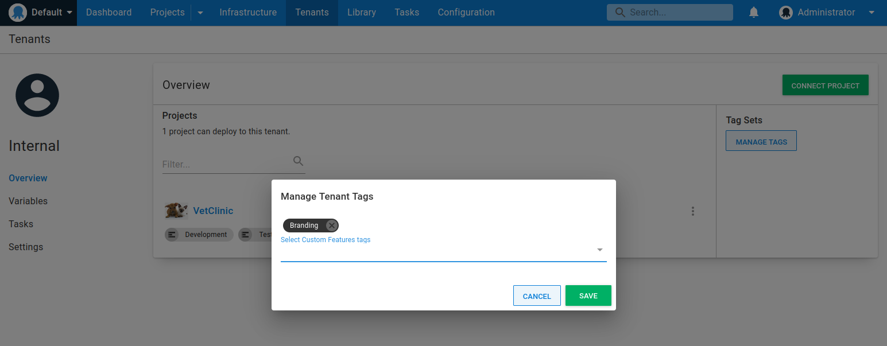

Vet Clinic has four customers; one internal customer used for development and testing, and three external customers

- VetClinic Internal
- Capital Animal Hospital
- Companion Care Vets
- Midland Veterinary

Each customer is modeled as a tenant and has two environments they deploy to. The internal tenant is used to deploy new releases to development and test before they are promoted to the other tenants, who deploy to staging and production.

To create your tenants follow these steps:

!include <tenants-create-tenant>

Once the tenant is created, you need to associate the tenant with a project and environment. Tenants can be connected to many projects and environments. For the internal tenant, we only need to be able to deploy Vet Clinic to the development and test environments. The customer tenants need staging and production but not development and test.

Each customer has the option of applying custom branding. To ensure the deployment process only runs this step for specific tenants, we must associate each tenant with the correct tag.

In the tenant overview, Click on **MANAGE TAGS** to edit which tags are associated to a Tenant and select the branding tag for each tenant.

Repeat this process for each of the tenants. 

The next step will define the [project template variables](/docs/tenants/guides/multi-tenant-saas-application/creating-project-template-variables.md) needed for the application.

<a class="btn btn-secondary" href="/docs/tenants/guides/multi-tenant-saas-application/creating-tenant-tag-set">Previous</a>&nbsp;&nbsp;&nbsp;&nbsp;&nbsp;<a class="btn btn-success" href="/docs/tenants/guides/multi-tenant-saas-application/creating-project-template-variables">Next</a>