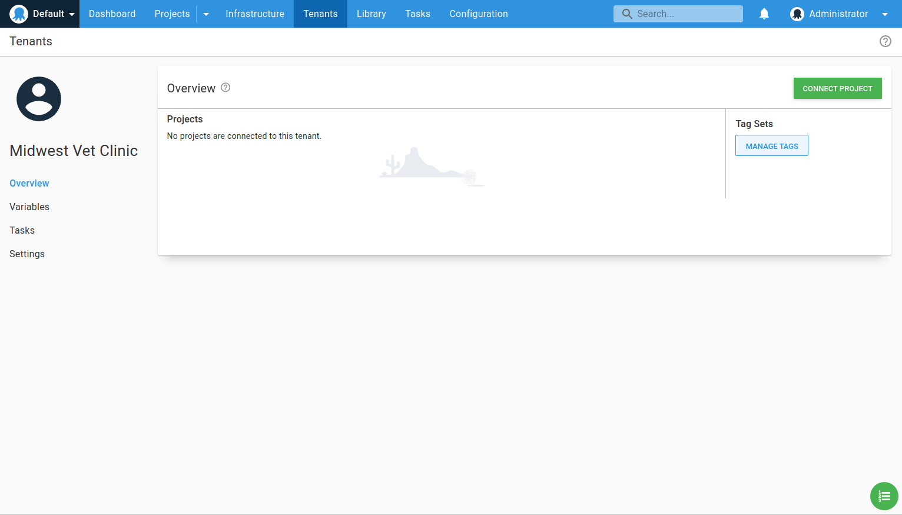

By connecting tenants to projects, you can control which projects will be deployed into which environments for each tenant.

1. Navigate to your tenant.
2. Click on the **CONNECT PROJECT** button.

   

3. Select the project you want to connect to the tenant. If a warning is shown, click the **ENABLE TENANTED DEPLOYMENTS** button, which will enable the multi-tenant deployment features for the project. This will configure the project to allow deployments *with* or *without* a tenant.

   

4. Now select the environments to allow tenanted deployments to, and click the **ADD CONNECTION** button.

   

You can connect each tenant to any number of projects and for each project, any combination of environments that can be targeted by each project. This gives you the most flexibility when designing your multi-tenant deployments.

- You can offer specific projects to some tenants and not to others.
- You can also provide most of your tenants with a single environment while offering specific customers extra environments. For example, you could give particular customers with a test/staging/acceptance environment where they can test new releases before upgrading their production environment.

:::info
Not seeing the environment you want? Make sure at least one lifecycle used by your project includes that environment.
:::